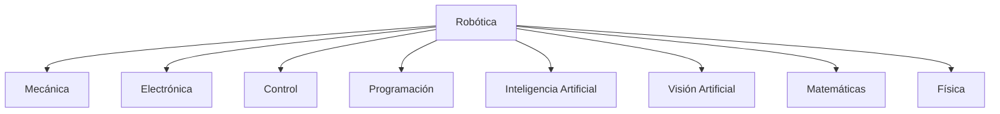
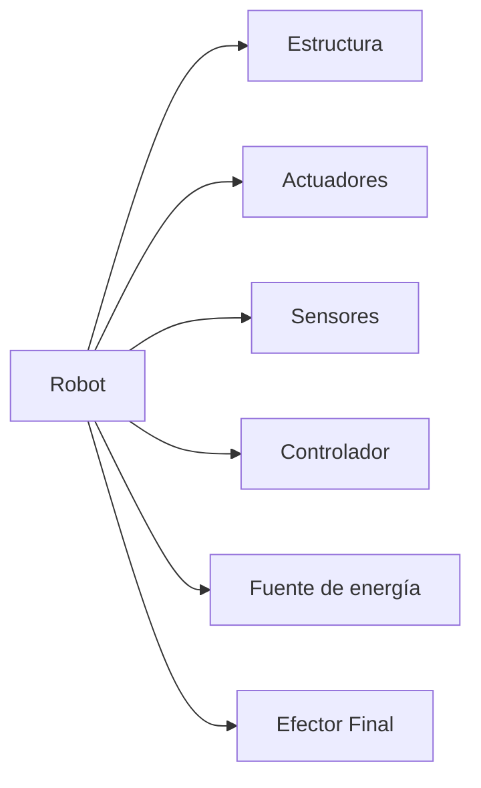
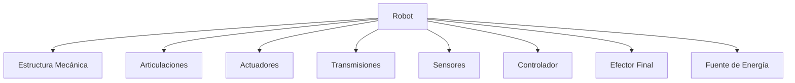
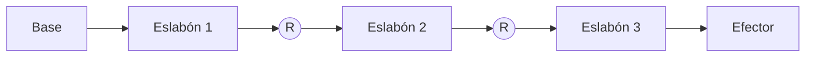
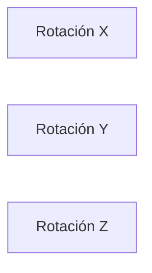
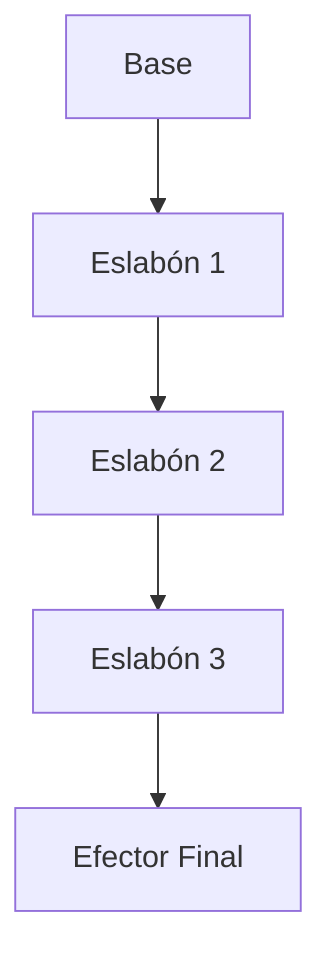
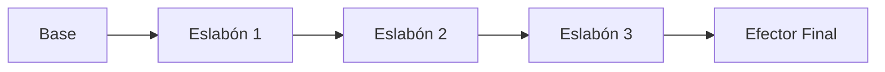

# Robótica Industrial y Cinemática de Robots
## Manual Completo del Método de Denavit-Hartenberg

**Versión:** 1.0

**Autor:** Elaborado a partir de material académico ampliado con investigación técnica.

---

# PARTE I
# Fundamentos de la Robótica

---

# Capítulo 1
# Introducción a la Robótica

> "La robótica es la disciplina que combina ingeniería, matemáticas, informática y electrónica para diseñar máquinas capaces de interactuar con el mundo físico de forma autónoma o semiautónoma."

---

# Objetivos del capítulo

Al finalizar este capítulo el estudiante será capaz de:

- Comprender qué es la robótica y qué la distingue de otras tecnologías.
- Conocer las disciplinas que la conforman y los componentes de un robot.
- Diferenciar un robot de una máquina automática convencional.
- Identificar las principales aplicaciones de los robots modernos.

---

# ¿Qué es la robótica?

La robótica es una disciplina multidisciplinaria que integra ingeniería y ciencias computacionales para diseñar, construir, controlar y programar máquinas capaces de ejecutar tareas de manera automática. Pero un robot no es simplemente una máquina que se mueve: para considerarse como tal, debe poseer cierto grado de percepción, capacidad de decisión y la posibilidad de ser reprogramado para realizar distintas tareas.

Hoy la robótica es uno de los pilares de la automatización industrial, la manufactura inteligente, la medicina moderna, la exploración espacial y la inteligencia artificial aplicada.

La **Federación Internacional de Robótica (IFR)** define un robot industrial como *"una máquina manipuladora automática, reprogramable, multifuncional, con tres o más ejes, capaz de posicionar materiales, piezas, herramientas o dispositivos especiales mediante movimientos programados"*. Esta definición resalta las tres características que distinguen a un robot de una máquina automática cualquiera: es **reprogramable**, **multifuncional** y ejecuta **movimientos controlados**.

## ¿Qué no es un robot?

Es común pensar que cualquier máquina automática es un robot, pero no es así. Una banda transportadora, una prensa hidráulica, un semáforo o una bomba de agua automática funcionan de forma automática, pero no pueden adaptarse a su entorno ni ejecutar múltiples tareas mediante programación. Esa flexibilidad es justamente lo que separa la robótica de la simple automatización.

| Automatización | Robótica |
|----------------|----------|
| Diseñada para una sola tarea | Diseñada para múltiples tareas |
| Difícil de modificar | Fácilmente reprogramable |
| Movimiento limitado | Gran libertad de movimiento |
| Baja flexibilidad | Alta flexibilidad |
| Generalmente sin sensores complejos | Integra múltiples sensores |

---

# Disciplinas que conforman la robótica

La robótica no pertenece a una sola rama de la ingeniería: surge de la integración de varias áreas del conocimiento, cada una aportando una pieza esencial para que un robot funcione.



La **ingeniería mecánica** diseña el cuerpo físico del robot: eslabones, articulaciones, chasis, reductores y transmisiones. La **ingeniería electrónica** se ocupa de los sistemas eléctricos, como drivers, sensores, tarjetas y fuentes de alimentación. La **ingeniería de control** logra que los movimientos sean precisos, mediante técnicas como el control PID o el control predictivo. Las **ciencias de la computación** desarrollan el software que dirige al robot —sistemas operativos como ROS, algoritmos y planificación de trayectorias—, y la **inteligencia artificial** le permite aprender, reconocer objetos, tomar decisiones y navegar. A todo esto lo sostienen las **matemáticas** y la **física**, que dan el lenguaje para describir el movimiento y las fuerzas.

---

# Componentes generales de un robot

Aunque existen robots muy distintos entre sí, casi todos comparten los mismos bloques funcionales.



La **estructura mecánica** es el esqueleto del robot: base, brazos, articulaciones y eslabones. Los **actuadores** son los que producen el movimiento, normalmente motores (DC, servomotores, paso a paso o brushless) o actuadores hidráulicos y neumáticos. Los **sensores** le permiten percibir su entorno y su propio estado, desde cámaras y LIDAR hasta encoders e IMU. El **controlador** es el cerebro que procesa la información y decide qué hacer; puede ser desde un PLC o microcontrolador hasta una computadora industrial o una NVIDIA Jetson. Finalmente, el **efector final** es la herramienta con la que el robot actúa sobre el mundo: una pinza, una ventosa, un soldador o una pistola de pintura, según la tarea.

---

# Aplicaciones de la robótica

Hoy hay robots trabajando en prácticamente todos los sectores. En la **industria** realizan soldadura, pintura, ensamblaje, empaque e inspección. En la **medicina** asisten cirugías, apoyan la rehabilitación y operan en prótesis inteligentes. En la **agricultura** recolectan frutas, detectan enfermedades de los cultivos y aplican fertilizantes de forma selectiva. Y en la **exploración espacial** encontramos los rovers de Marte, los brazos robóticos de las estaciones espaciales y los satélites de mantenimiento.

Esta variedad de aplicaciones, junto con su capacidad de adaptarse y reprogramarse, es lo que convierte a la robótica en una de las tecnologías centrales de la Industria 4.0.

# Capítulo 2
# Historia y Evolución de la Robótica

---

# Objetivos del capítulo

Al finalizar este capítulo el estudiante será capaz de:

- Reconocer los hitos históricos que dieron origen a la robótica.
- Comprender de dónde vienen los términos "robot" y "robótica".
- Ubicar el nacimiento del robot industrial y su importancia.
- Entender por qué el método de Denavit-Hartenberg fue un punto de inflexión.

---

# De los autómatas antiguos al término "robot"

La robótica es joven comparada con otras ramas de la ingeniería, pero la idea de construir máquinas que imiten el comportamiento humano es milenaria. Mucho antes de la electricidad, varias civilizaciones construyeron autómatas que ejecutaban movimientos complejos usando solo principios mecánicos: figuras egipcias, dispositivos hidráulicos griegos, autómatas chinos y muñecos del Renacimiento. No eran robots en el sentido moderno, pero demostraban que una máquina podía actuar sin intervención humana continua.

Entre los pioneros destaca **Herón de Alejandría** (siglo I), que diseñó puertas automáticas para templos, teatros mecánicos y fuentes movidas por vapor, aire comprimido y sistemas hidráulicos. Siglos después, el ingeniero **Al-Jazarí** (1206) describió relojes hidráulicos, sirvientes automáticos y mecanismos musicales en su célebre libro de dispositivos ingeniosos, y es considerado uno de los padres de la ingeniería mecánica. Hacia 1495, **Leonardo da Vinci** diseñó un "caballero mecánico" capaz de sentarse, mover los brazos y girar la cabeza; nunca se construyó en su época, pero estudios modernos comprobaron que el diseño era funcional. Más tarde, la **Revolución Industrial** llevó la automatización a la producción con el telar de Jacquard, las máquinas de vapor y las primeras máquinas herramienta.

La palabra **robot** nació en 1921, en la obra de teatro *R.U.R. (Rossum's Universal Robots)* del escritor checo **Karel Čapek**. Proviene del término eslavo *robota*, que significa trabajo forzado o servidumbre (la idea, de hecho, se la sugirió su hermano Josef). Dos décadas después, el escritor y bioquímico **Isaac Asimov** acuñó el término *robotics* (robótica) y formuló las célebres **Tres Leyes de la Robótica**, a las que más tarde añadió una Ley Cero:

> **Primera Ley.** Un robot no hará daño a un ser humano ni permitirá, por inacción, que sufra daño.
>
> **Segunda Ley.** Un robot obedecerá las órdenes humanas, salvo que entren en conflicto con la Primera Ley.
>
> **Tercera Ley.** Un robot protegerá su propia existencia, mientras ello no entre en conflicto con las dos primeras.
>
> **Ley Cero.** Un robot no puede dañar a la humanidad ni permitir, por inacción, que sufra daño.

Aunque pertenecen a la ciencia ficción, estas leyes influyeron profundamente en la ética de la robótica real.

---

# El nacimiento del robot industrial

El salto de la fantasía a la fábrica ocurrió a mediados del siglo XX. En 1954, **George Devol** patentó el primer manipulador programable, el *Programmed Article Transfer*, precursor del robot industrial moderno. **Joseph Engelberger** reconoció su potencial y juntos fundaron **Unimation**, la primera empresa dedicada a fabricar robots industriales; por ello se conoce a Engelberger como el padre de la robótica industrial.

El resultado de esa colaboración fue **Unimate**, el primer robot industrial de la historia, que comenzó a operar en 1961 en una planta de General Motors. Era hidráulico, programable, con seis grados de libertad, y su tarea era retirar piezas fundidas a altísima temperatura, peligrosas para los operarios humanos. Ese momento marcó oficialmente el nacimiento de la robótica industrial.

Desde entonces, los robots industriales han evolucionado por generaciones: de los primeros robots **secuenciales sin sensores** (1960–1970), se pasó a robots con **sensores y control por computadora** (1970–1985), luego a la **visión artificial y la programación offline** (1985–2000), después a los **robots colaborativos y la IA aplicada** (2000–2020), y hoy a robots que integran aprendizaje automático, visión 3D, gemelos digitales y grandes modelos de lenguaje.

| Año | Acontecimiento |
|------|----------------|
| Siglo I | Autómatas de Herón de Alejandría |
| 1206 | Máquinas automáticas de Al-Jazarí |
| 1495 | Caballero mecánico de Leonardo da Vinci |
| 1804 | Telar de Jacquard |
| 1921 | Karel Čapek introduce la palabra "Robot" |
| 1942 | Isaac Asimov propone las Tres Leyes |
| 1954 | George Devol patenta el primer manipulador programable |
| 1961 | Instalación del robot Unimate |
| 1973 | Primer robot totalmente eléctrico |
| Décadas de 1980–1990 | Expansión industrial y visión artificial |
| Décadas de 2000–2010 | Robots colaborativos y autónomos |
| Década de 2020 | Integración masiva de IA y aprendizaje automático |

---

# El origen del método de Denavit-Hartenberg

Uno de los mayores desafíos de la robótica fue describir matemáticamente la posición y orientación de cada eslabón de un manipulador. En 1955, **Jacques Denavit** y **Richard S. Hartenberg** propusieron una convención que permite representar cualquier cadena cinemática usando solo cuatro parámetros por articulación: θ, d, a y α. Este método simplificó enormemente el análisis cinemático y se convirtió en el estándar de los libros, cursos y simuladores de robótica. Le dedicaremos una parte completa del manual más adelante.

---

# Resumen del capítulo

La robótica es fruto de siglos de avances en mecánica, matemáticas, electrónica e informática. De los autómatas antiguos a los robots inteligentes actuales, cada etapa añadió nuevas capacidades. El nacimiento del robot industrial con Unimate y la creación del método de Denavit-Hartenberg fueron los dos hitos que permitieron formalizar el estudio de la cinemática y el control de manipuladores.

---

## Conceptos clave

- Autómata
- Unimate
- Unimation
- George Devol
- Joseph Engelberger
- Karel Čapek
- Isaac Asimov
- Denavit-Hartenberg
- Robot industrial
- Robot colaborativo

---

## Avance del siguiente capítulo

En el siguiente capítulo estudiaremos la **clasificación de los robots**: sus configuraciones mecánicas, tipos de articulaciones, espacios de trabajo y aplicaciones. Esta clasificación será esencial para comprender después cómo se modelan matemáticamente.

# Capítulo 3
# Clasificación de los Robots

---

# Objetivos del capítulo

Al finalizar este capítulo el estudiante será capaz de:

- Distinguir los principales tipos de robots según su estructura mecánica.
- Reconocer las configuraciones de articulaciones (R y P) de cada tipo.
- Comparar ventajas, desventajas y aplicaciones de cada configuración.
- Relacionar la geometría del robot con su modelado matemático.

---

# ¿Por qué clasificar los robots?

No todos los robots tienen la misma estructura ni se diseñaron para las mismas tareas: algunos destacan por su velocidad, otros por su precisión y otros por su capacidad de carga. Por eso existen varios criterios de clasificación, según su estructura mecánica, su movilidad, su aplicación o su grado de autonomía. El criterio más usado en la industria es la **estructura mecánica**, es decir, la disposición geométrica de sus ejes y articulaciones, que determina su espacio de trabajo, precisión y facilidad de modelado.

Para describir cada configuración usaremos la notación de articulaciones: **R** para una articulación rotacional (giro) y **P** para una prismática (deslizamiento lineal).

---

# Robot cartesiano

<div data-robot-anim="cartesiano"></div>
<div data-robot-esquema="cartesiano"></div>

También llamado robot XYZ, está formado por tres ejes lineales perpendiculares entre sí, con tres articulaciones prismáticas (**PPP**). Ofrece muy alta precisión, gran rigidez y una programación sencilla, sobre un espacio de trabajo en forma de prisma rectangular. A cambio, es poco flexible y ocupa bastante espacio. Es la configuración de las impresoras 3D, las máquinas CNC, los plotters y los sistemas pick and place.

---

# Robot cilíndrico

<div data-robot-anim="cilindrico"></div>
<div data-robot-esquema="cilindrico"></div>

Combina una rotación de base con dos desplazamientos lineales —vertical y radial— en configuración **RPP**. Su espacio de trabajo es cilíndrico y ofrece buena capacidad de carga. Se emplea en manipulación de piezas, carga y descarga de materiales y alimentación de máquinas herramienta.

---

# Robot polar (esférico)

<div data-robot-anim="polar"></div>
<div data-robot-esquema="polar"></div>

En configuración **RRP**, combina dos rotaciones con una extensión lineal, de modo que su efector barre un volumen aproximadamente esférico. Tiene gran alcance y buena cobertura espacial, aunque su control es más complejo y su precisión menor que la de un cartesiano. Es habitual en soldadura, fundición y manipulación pesada.

---

# Robot SCARA

<div data-robot-anim="scara"></div>
<div data-robot-esquema="scara"></div>

SCARA significa *Selective Compliance Assembly Robot Arm*. Sus dos primeras articulaciones son rotacionales y la tercera prismática (**RRP**): el brazo se mueve rápido en el plano horizontal y la herramienta baja en vertical. Es muy rápido, preciso y ocupa poco espacio, lo que lo hace ideal para el ensamblaje, aunque con un espacio de trabajo limitado. Domina el ensamblaje electrónico, la inserción de componentes, el pick and place y la industria farmacéutica.

---

# Robot articulado

<div data-robot-anim="articulado"></div>
<div data-robot-esquema="articulado"></div>

Es el robot industrial más conocido y su apariencia recuerda a un brazo humano. Usa únicamente articulaciones rotacionales (típicamente **RRR** en sus primeros ejes, con 4 a 7 grados de libertad en total). Es muy flexible, con gran alcance y excelente control de la orientación del efector. Se usa en soldadura, pintura, paletizado, pulido y manufactura en general.

---

# Robot paralelo

A diferencia de los anteriores, su efector final está sostenido por **varias cadenas cinemáticas simultáneamente** —el robot Delta es el ejemplo clásico—. Esto le da muy alta velocidad, muy baja masa móvil y gran precisión, a costa de un espacio de trabajo reducido. Es el favorito para empaque, clasificación e industria alimentaria.

---

# Comparación entre configuraciones

| Tipo | GDL típicos | Espacio de trabajo | Precisión | Velocidad | Complejidad |
|------|-------------|-------------------|------------|------------|-------------|
| Cartesiano | 3 | Prismático | Muy alta | Media | Baja |
| Cilíndrico | 3 | Cilíndrico | Alta | Media | Media |
| Polar | 3 | Esférico | Media | Media | Alta |
| SCARA | 4 | Cilíndrico | Muy alta | Muy alta | Media |
| Articulado | 6 | Irregular | Alta | Alta | Muy alta |
| Paralelo | 3–6 | Limitado | Muy alta | Muy alta | Muy alta |

---

# Otras formas de clasificar

Más allá de la estructura, los robots se clasifican también por su **movilidad**: los fijos permanecen anclados (como los robots de soldadura industrial), mientras que los móviles se desplazan por tierra (ruedas, orugas o patas), aire (drones y UAV) o agua (vehículos submarinos ROV y AUV).

Por su **aplicación** encontramos robots industriales (procesos repetitivos), médicos (cirugía, rehabilitación, prótesis), de servicio (limpieza, atención al cliente), educativos (LEGO Mindstorms, plataformas Arduino) y espaciales (rovers, brazos orbitales).

Y por su **tipo de control** van desde los teleoperados —dirigidos por un humano, como los robots de desactivación de explosivos— a los semiautónomos, que combinan decisiones propias con supervisión, hasta los autónomos, que operan largos periodos sin intervención usando IA, visión artificial, SLAM y planeación de trayectorias.

Un caso especial son los **robots colaborativos (cobots)**, diseñados para compartir el espacio de trabajo con personas. Gracias a sus sensores de fuerza, detección de colisiones y programación intuitiva, se integran fácilmente y son muy populares en pequeñas y medianas empresas.

---

# Relación con el método de Denavit-Hartenberg

Todas estas configuraciones —cartesiana, SCARA, articulada o cualquier otra— pueden describirse con el mismo método: el de **Denavit-Hartenberg**. Consiste en asignar un sistema de coordenadas a cada articulación y definir cuatro parámetros por eslabón (θ, d, a y α). Comprender la estructura mecánica del robot facilita enormemente construir su tabla DH y desarrollar su modelo cinemático, como veremos más adelante.

---

# Resumen del capítulo

Vimos las principales clasificaciones de los robots según su estructura, movilidad, aplicación y control. Cada configuración tiene ventajas que la hacen idónea para ciertas tareas, y todas comparten un mismo lenguaje de modelado matemático a través del método de Denavit-Hartenberg.

---

## Conceptos clave

- Robot cartesiano
- Robot cilíndrico
- Robot polar
- Robot SCARA
- Robot articulado
- Robot paralelo
- Robot colaborativo
- Grados de libertad
- Espacio de trabajo

---

## Avance del siguiente capítulo

En el próximo capítulo estudiaremos la **morfología del robot**: eslabones, articulaciones, grados de libertad, actuadores, transmisiones, sensores y efectores finales. Serán la base para comprender cómo se modelan matemáticamente los manipuladores.

# Capítulo 4
# Morfología del Robot

---

# Objetivos del capítulo

Al finalizar este capítulo el estudiante será capaz de:

- Identificar los componentes mecánicos y electrónicos de un robot.
- Distinguir los tipos de articulaciones y su variable asociada.
- Comprender qué es una cadena cinemática y un grado de libertad.
- Relacionar la morfología del robot con su modelado matemático.

---

# ¿Qué es la morfología de un robot?

La morfología describe cómo está construido un robot y cómo se relacionan todos sus componentes. Igual que el cuerpo humano combina huesos, articulaciones y músculos, un robot integra una serie de elementos que trabajan juntos para producir movimientos controlados: estructura mecánica, eslabones, articulaciones, actuadores, transmisiones, sensores, controlador y efector final. Comprender esta organización es indispensable antes de analizar la cinemática y la dinámica.



---

# Eslabones y articulaciones

La estructura mecánica es el esqueleto del robot. Está formada por piezas rígidas llamadas **eslabones**, unidas por **articulaciones** que permiten el movimiento relativo entre ellas. Un buen diseño busca rigidez, precisión, resistencia y bajo peso, y para ello se emplean materiales como acero, aluminio, titanio, fibra de carbono y polímeros de ingeniería.

Un **eslabón** es un elemento rígido que conecta dos articulaciones consecutivas —el equivalente a los huesos del brazo—. Cada uno tiene propiedades propias: longitud, masa, centro de gravedad e inercia. En el método de Denavit-Hartenberg, a cada eslabón se le asociará un sistema de referencia.

Una **articulación**, por su parte, es el punto donde dos eslabones tienen movimiento relativo, y su tipo determina qué movimiento podrá realizar el robot.

---

# Tipos de articulaciones

Las dos articulaciones fundamentales en robótica son la rotacional y la prismática. La **articulación rotacional** (o revoluta, símbolo **R**) permite un giro y es la más usada en robots industriales —el hombro, el codo o la muñeca son ejemplos—; su variable asociada es un ángulo $\theta$. La **articulación prismática** (símbolo **P**) permite un desplazamiento lineal, como en los cilindros neumáticos o los robots cartesianos, y su variable es una distancia $d$.

Existen otras articulaciones menos frecuentes en manipuladores industriales —helicoidales, esféricas, universales o cilíndricas—, reservadas para robots especializados o mecanismos más complejos.

---

# Cadena cinemática

Una cadena cinemática es el conjunto de eslabones y articulaciones que transmiten el movimiento desde la base hasta el efector final.



Hay dos tipos. En una **cadena abierta** existe un único camino entre la base y el efector; es el caso de los brazos industriales y los robots SCARA. En una **cadena cerrada** hay múltiples caminos cinemáticos —como en el robot Delta o las plataformas Stewart—, lo que aporta mayor rigidez y precisión a cambio de un análisis matemático más complejo.

Dos partes de la cadena tienen nombre propio. La **base** es el punto fijo del manipulador, desde el cual se establece el sistema de coordenadas principal, que en el método DH se denota $\{0\}$; todas las posiciones se calculan respecto a él. La **muñeca** comprende las últimas articulaciones y su función es orientar el efector: suele tener tres grados de libertad —giro (yaw), inclinación (pitch) y rotación (roll)—, lo que permite apuntar la herramienta en cualquier dirección.

---

# Efectores finales

El efector final es el componente que interactúa directamente con el entorno, y puede intercambiarse según la aplicación. Los más comunes son las **pinzas mecánicas** (para piezas rígidas), las **ventosas** (para vidrio, cartón o láminas), las **herramientas** montadas como taladros, fresadoras o soldadores, y a veces los propios **sensores**, como cámaras o escáneres usados para inspección.

---

# Actuadores, transmisiones y sensores

Los **actuadores** generan el movimiento, transformando energía eléctrica, hidráulica o neumática en movimiento mecánico. Los **motores eléctricos** (DC, brushless, servomotores y paso a paso) son los más usados por su precisión, fácil control y bajo mantenimiento. Los **actuadores hidráulicos** usan aceite a presión y entregan grandes fuerzas, a costa de más mantenimiento y posibles fugas. Los **neumáticos**, con aire comprimido, sirven para movimientos rápidos y sencillos.

Como los motores rara vez se conectan directo a las articulaciones, se usan **sistemas de transmisión**: engranajes, tornillos de bolas, correas dentadas, cadenas y reductores planetarios o armónicos.

Los **sensores** permiten al robot conocer su estado y su entorno. Los **internos** miden variables del propio robot (encoders, tacómetros, sensores de corriente y temperatura), mientras que los **externos** captan información del exterior (cámaras, LIDAR, ultrasonido, infrarrojos, IMU y sensores de fuerza). Todo lo coordina el **controlador**, que lee los sensores, calcula trayectorias, ejecuta los algoritmos de control, coordina los motores y detecta fallos. La energía puede provenir de corriente alterna o continua, baterías, sistemas hidráulicos o aire comprimido.

---

# Grados de libertad

Un **grado de libertad (GDL)** es un movimiento independiente que puede realizar un mecanismo. Tanto una articulación rotacional como una prismática aportan 1 GDL cada una. Un brazo industrial típico tiene 6 GDL, justo los necesarios para controlar por completo la **posición** y la **orientación** del efector en el espacio. Así, una cadena con tres articulaciones aporta 3 GDL, y cada articulación añadida suma uno más.

---

# Relación con Denavit-Hartenberg

Cada articulación del robot se representará con un sistema de coordenadas, y entre dos eslabones consecutivos se definirán cuatro parámetros: θ, d, a y α. Estos describen por completo la relación entre un eslabón y el siguiente. Por eso, comprender la morfología es el primer paso antes de construir una tabla de Denavit-Hartenberg.

---

# Resumen del capítulo

Estudiamos los componentes de un robot manipulador —eslabones, articulaciones, actuadores, transmisiones, sensores, controlador y efector final— y los conceptos de cadena cinemática y grados de libertad. Todo ello es la base para el análisis cinemático y para asignar los sistemas de referencia del método de Denavit-Hartenberg.

---

## Conceptos clave

- Morfología
- Eslabón
- Articulación
- Cadena cinemática
- Grado de libertad
- Actuador
- Transmisión
- Sensor
- Efector final

---

## Avance del siguiente capítulo

En el próximo capítulo estudiaremos en profundidad los **grados de libertad** y el **espacio de trabajo** del robot: cómo cada articulación contribuye al movimiento y cómo se determina el volumen que el efector puede alcanzar.

# Capítulo 5
# Grados de Libertad y Espacio de Trabajo

---

# Objetivos del capítulo

Al finalizar este capítulo el estudiante será capaz de:

- Comprender qué es un grado de libertad y por qué un cuerpo libre tiene seis.
- Calcular la movilidad de un mecanismo con el criterio de Grübler-Kutzbach.
- Reconocer la redundancia y las singularidades.
- Identificar el espacio de trabajo de cada tipo de robot.

---

# ¿Qué es un grado de libertad?

Un **grado de libertad (GDL, o DOF en inglés)** es un movimiento independiente que puede realizar un cuerpo o mecanismo. La cantidad de grados de libertad determina la flexibilidad de un robot, su capacidad de alcanzar posiciones y orientaciones, y también la dificultad de su control y de su modelo matemático: a más grados de libertad, más versatilidad, pero también más complejidad.

En un espacio tridimensional, un cuerpo rígido completamente libre posee **seis grados de libertad**: tres traslaciones (en X, Y y Z) y tres rotaciones (roll, pitch y yaw). Con estos seis movimientos se puede ubicar y orientar cualquier objeto en el espacio.

| Movimiento | Descripción |
|------------|-------------|
| Tx | Adelante y atrás |
| Ty | Izquierda y derecha |
| Tz | Arriba y abajo |
| Roll | Giro sobre X |
| Pitch | Giro sobre Y |
| Yaw | Giro sobre Z |

En un robot, cada articulación aporta grados de libertad: tanto la **revoluta (R)**, cuya variable es el ángulo $\theta$, como la **prismática (P)**, cuya variable es la distancia $d$, contribuyen con 1 GDL cada una. Así, un robot con una articulación tiene 1 GDL, un brazo RR tiene 2, un RRR tiene 3, y un brazo industrial típico tiene 6.

---

# ¿Por qué seis grados de libertad?

Para posicionar **completamente** una herramienta hay que controlar tanto su posición (X, Y, Z) como su orientación (roll, pitch, yaw). Esos son seis valores independientes, y por eso la mayoría de los robots industriales tienen exactamente seis grados de libertad.

Sin embargo, no todas las tareas requieren controlar la orientación. Una **impresora 3D** (configuración PPP) solo necesita posicionar la boquilla en X, Y y Z, sin orientarla. Un **robot SCARA** (RRPR) tiene 4 grados de libertad, suficientes para el ensamblaje. En el otro extremo, un robot es **redundante** cuando tiene más grados de libertad de los estrictamente necesarios —por ejemplo, 7 GDL—, lo que le permite evitar obstáculos, reducir singularidades y alcanzar una misma posición de varias formas. El brazo humano es el ejemplo perfecto de redundancia:

| Articulación | DOF |
|--------------|----:|
| Hombro | 3 |
| Codo | 1 |
| Antebrazo | 1 |
| Muñeca | 3 |

En conjunto, entre 7 y 8 grados de libertad que hacen posibles sus movimientos tan naturales.

---

# Movilidad: el criterio de Grübler-Kutzbach

Contar articulaciones no siempre basta, porque algunos mecanismos tienen restricciones adicionales. Para estimar su **movilidad** ($M$, el número de grados de libertad reales) se usa el criterio de Grübler-Kutzbach. Para mecanismos espaciales:

$$
M = 6(n-1-j)+\sum_{i=1}^{j} f_i
$$

y para mecanismos planos, la versión simplificada:

$$
M=3(n-1)-2j_1-j_2
$$

donde $n$ es el número de eslabones, $j$ el de articulaciones, $f_i$ los grados de libertad de cada articulación, y $j_1$, $j_2$ las articulaciones de uno y dos grados de libertad respectivamente.

Por ejemplo, para un **robot RR plano** con 3 eslabones y 2 articulaciones de 1 GDL:

$$
M=3(3-1)-2(2)=6-4=2
$$

que coincide con la intuición: 2 grados de libertad.

> **Nota:** esta fórmula estima la movilidad, pero hay mecanismos con restricciones especiales que requieren un análisis más detallado.

---

# Singularidades

Una **singularidad** es una configuración en la que el robot pierde uno o más grados de movimiento efectivos. El caso típico ocurre cuando varios eslabones quedan completamente alineados: en esa postura, ciertas direcciones de movimiento dejan de estar disponibles. Las singularidades provocan pérdida de precisión, velocidades articulares muy altas, inestabilidad numérica y dificultades para la cinemática inversa. Les dedicaremos un capítulo completo más adelante.

---

# Espacio de trabajo

El **espacio de trabajo** (*workspace*) es el conjunto de todas las posiciones que el efector final puede alcanzar, y cada arquitectura tiene el suyo característico: el robot **cartesiano** abarca un prisma rectangular; el **cilíndrico**, un cilindro; el **polar**, un volumen esférico; el **SCARA**, una región anular o cilíndrica; y el **articulado**, una geometría irregular determinada por la longitud de sus eslabones y los límites de sus articulaciones.

Conviene distinguir dos conceptos. El **espacio alcanzable** incluye todos los puntos que el efector puede tocar, aunque no en cualquier orientación. El **espacio útil** son las posiciones donde el robot puede trabajar cumpliendo a la vez los requisitos de posición y de orientación; en la práctica industrial suele ser menor que el alcanzable. El espacio de trabajo depende de la longitud de los eslabones, los límites articulares, las posibles colisiones entre eslabones, los obstáculos externos y las restricciones de seguridad.

---

# Relación con Denavit-Hartenberg

Cada grado de libertad se representa con un sistema de coordenadas local. Al construir una tabla DH, cada articulación aporta una variable ($\theta$ o $d$) y cada eslabón aporta sus parámetros geométricos ($a$ y $\alpha$); el conjunto describe por completo la geometría del manipulador. Comprender los grados de libertad y el espacio de trabajo facilita interpretar las transformaciones homogéneas que veremos a continuación.

---

# Resumen del capítulo

Introdujimos el grado de libertad y su papel en la movilidad de un robot, la diferencia entre traslaciones y rotaciones, el criterio de Grübler-Kutzbach, la redundancia cinemática y las singularidades. Finalmente vimos el espacio de trabajo y cómo la estructura mecánica condiciona las capacidades del manipulador.

---

## Conceptos clave

- Grado de libertad (DOF)
- Movilidad
- Redundancia cinemática
- Singularidad
- Espacio de trabajo
- Espacio alcanzable
- Espacio útil
- Grübler-Kutzbach

---

## Avance del siguiente capítulo

En el siguiente capítulo comenzaremos con los **fundamentos matemáticos de la robótica**: los sistemas de coordenadas, los marcos de referencia y las transformaciones entre sistemas, punto de partida para las matrices homogéneas y el método de Denavit-Hartenberg.


# PARTE II
# Fundamentos Matemáticos para la Robótica

---

# Capítulo 6
# Sistemas de Coordenadas y Marcos de Referencia

---

# Objetivos del capítulo

Al finalizar este capítulo el estudiante será capaz de:

- Comprender por qué toda posición en robótica es relativa a un sistema de referencia.
- Diferenciar un punto de un vector.
- Entender qué es un marco de referencia y la regla de la mano derecha.
- Distinguir el sistema global de los sistemas locales de un robot.

---

# Toda posición es relativa

Todo problema de robótica comienza con una pregunta aparentemente sencilla: *¿dónde está el robot?* Si alguien dice "la herramienta está en la posición (1.5, 0.8, 0.4)", la información está incompleta, porque falta responder: **¿respecto a qué sistema de referencia?** En robótica no existe la posición absoluta: toda posición es relativa a un sistema de coordenadas. Precisamente por eso el método de Denavit-Hartenberg consiste en asignar un sistema de coordenadas a cada eslabón del robot.

Un **sistema de coordenadas** es un conjunto de ejes que permite describir matemáticamente la posición de un punto en el espacio, dando una referencia común para medir posiciones, orientaciones y movimientos. En dos dimensiones, un punto se define con dos valores, $P=(x, y)$; en las tres dimensiones en las que trabajan los robots se añade un tercer eje, y el punto pasa a ser $P=(x, y, z)$. Por convención, X suele ir de izquierda a derecha, Y de adelante hacia atrás y Z de arriba abajo, aunque lo esencial es mantener la consistencia durante todo el análisis. Todo sistema tiene un **origen** $O=(0,0,0)$, el punto desde el cual se miden todas las posiciones.

---

# Punto y vector

Aunque se escriban de forma parecida, un punto y un vector son cosas distintas. Un **punto** representa únicamente una posición —un lugar en el espacio— y no tiene dirección ni longitud. Un **vector**, en cambio, representa dirección, sentido y magnitud, y suele dibujarse como una flecha:

$$
\vec{v}=
\begin{bmatrix}
x\\
y\\
z
\end{bmatrix}
$$

| Punto | Vector |
|--------|---------|
| Indica una posición | Indica un desplazamiento |
| No posee dirección | Tiene dirección |
| No posee sentido | Tiene sentido |
| Se expresa con coordenadas | Se expresa con componentes |

Esta diferencia será muy importante al estudiar las matrices homogéneas.

---

# Marcos de referencia

En robótica no basta con hablar de ejes sueltos: se usa un concepto más completo, el **marco de referencia** (*frame*), formado por un origen y tres ejes (X, Y, Z). Cada marco es un sistema de coordenadas completo.

¿Por qué usar varios? Porque un robot tiene muchas piezas móviles, y conviene que cada una —la base, cada articulación, el efector— tenga su propio marco, para describir su movimiento de forma independiente.

```mermaid
graph TD

A[{0} Base]

A --> B[{1} Primer eslabón]

B --> C[{2} Segundo eslabón]

C --> D[{3} Tercer eslabón]

D --> E[Efector Final]
```

Normalmente se distinguen dos clases. El **sistema global** (también llamado base, mundo o *world frame*), denotado $\{0\}$, es fijo y nunca cambia. Los **sistemas locales** $\{1\}, \{2\}, \{3\}, \dots$ pertenecen a cada eslabón y sí se mueven con el robot. Es como un automóvil: respecto a la carretera el automóvil se mueve, pero respecto al propio automóvil el conductor permanece inmóvil. Ambas afirmaciones son correctas; todo depende del sistema de referencia.

---

# Orientación y regla de la mano derecha

Conocer la posición del origen no es suficiente: también hay que saber cómo están orientados los ejes. Dos marcos pueden compartir origen y, aun así, tener orientaciones distintas.

Para garantizar la coherencia, en robótica casi todas las convenciones usan la **regla de la mano derecha**: si el índice apunta hacia X y el dedo medio hacia Y, el pulgar señala automáticamente el sentido positivo de Z. Esta regla mantiene la consistencia en las rotaciones y en los productos vectoriales.

La notación que usaremos en todo el libro es la habitual: $\{i\}$ para el sistema del eslabón $i$, con $O_i$ su origen y $X_i, Y_i, Z_i$ sus ejes.

---

# Importancia en Denavit-Hartenberg

El método DH consiste justamente en asignar un marco a cada articulación siguiendo reglas específicas, y luego calcular la transformación entre marcos consecutivos:

$$
\{0\}\rightarrow\{1\}\rightarrow\{2\}\rightarrow\cdots\rightarrow\{n\}
$$

Estas transformaciones permitirán conocer la posición y orientación del efector final respecto a la base. Conviene evitar algunos errores comunes: confundir un punto con un vector, cambiar arbitrariamente la orientación de los ejes, no aplicar la regla de la mano derecha, o mezclar coordenadas de distintos sistemas sin indicar a qué marco pertenecen.

Por ejemplo, si la herramienta de un robot está en $P=(400, 250, 150)$ mm respecto a la base, esas cifras son 400 mm sobre X, 250 sobre Y y 150 sobre Z. Si definimos un nuevo marco en el extremo del primer eslabón, las coordenadas de ese mismo punto cambiarán, aunque la herramienta no se haya movido ni un milímetro. Esa idea es la base de las transformaciones homogéneas.

---

# Resumen del capítulo

Introdujimos los sistemas de coordenadas y los marcos de referencia, fundamentales para describir la posición y orientación de un robot. Diferenciamos punto y vector, vimos la importancia de la regla de la mano derecha y comprobamos que un mismo objeto puede tener coordenadas distintas según el marco usado. Es el fundamento geométrico del método de Denavit-Hartenberg.

---

## Conceptos clave

- Sistema de coordenadas
- Marco de referencia (frame)
- Origen
- Punto
- Vector
- Sistema global
- Sistema local
- Regla de la mano derecha

---

## Avance del siguiente capítulo

En el próximo capítulo estudiaremos los **vectores y el álgebra vectorial**: suma, resta, producto escalar y producto vectorial, y su aplicación para describir movimientos, fuerzas y orientaciones. Serán indispensables para las matrices de rotación y las transformaciones homogéneas.

# Capítulo 7
# Vectores y Álgebra Vectorial Aplicada a la Robótica

---

# Objetivos del capítulo

Al finalizar este capítulo el estudiante será capaz de:

- Diferenciar escalares de vectores y operar con estos últimos.
- Calcular magnitud, vector unitario, suma, resta y producto por escalar.
- Comprender el producto escalar y el producto vectorial y sus aplicaciones.
- Relacionar los vectores unitarios de un marco con las matrices de rotación.

---

# Escalares y vectores

La robótica moderna se construye sobre el álgebra vectorial: cuando un robot mueve su efector, orienta una herramienta o aplica una fuerza, está operando con vectores. Por eso, antes de las matrices de rotación, conviene dominar este lenguaje.

Un **escalar** es una cantidad que solo tiene magnitud, sin dirección ni sentido: la masa, la temperatura, el tiempo o el voltaje son escalares (una temperatura de 25 °C no apunta a ningún lado). Un **vector**, en cambio, tiene magnitud, dirección y sentido a la vez, y se dibuja como una flecha. En robótica se usan vectores para representar posición, velocidad, aceleración, fuerza, torque, orientación y gravedad; casi todo movimiento puede expresarse con ellos.

Matemáticamente, un vector tridimensional se escribe como una columna:

$$
\vec{v}=
\begin{bmatrix}
x\\
y\\
z
\end{bmatrix}
$$

y representa un desplazamiento desde el origen hasta un punto del espacio.

---

# Magnitud, vector unitario y vectores base

La **magnitud** de un vector es su longitud, y se calcula con el teorema de Pitágoras:

$$
|\vec{v}|=\sqrt{x^2+y^2+z^2}
$$

Por ejemplo, para $\vec{v}=(3, 4, 0)$, la magnitud es $\sqrt{3^2+4^2}=5$.

Un **vector unitario** tiene magnitud 1 y se obtiene dividiendo el vector por su magnitud, $\hat{u}=\dfrac{\vec{v}}{|\vec{v}|}$. Para el mismo ejemplo, $\hat{u}=(0.6,\ 0.8,\ 0)$. Los tres **vectores base** son los unitarios que apuntan a lo largo de los ejes X, Y y Z:

$$
\hat{i}=\begin{bmatrix}1\\0\\0\end{bmatrix}\quad
\hat{j}=\begin{bmatrix}0\\1\\0\end{bmatrix}\quad
\hat{k}=\begin{bmatrix}0\\0\\1\end{bmatrix}
$$

---

# Operaciones básicas

La **suma** y la **resta** se hacen componente por componente:

$$
\vec{A}+\vec{B}=
\begin{bmatrix}
A_x+B_x\\
A_y+B_y\\
A_z+B_z
\end{bmatrix}
\qquad
\vec{A}-\vec{B}=
\begin{bmatrix}
A_x-B_x\\
A_y-B_y\\
A_z-B_z
\end{bmatrix}
$$

Por ejemplo, $(2,1,3)+(1,4,2)=(3,5,5)$. La resta es útil para calcular el desplazamiento entre dos puntos. La **multiplicación por un escalar** $k\vec{v}$ mantiene la dirección pero cambia la longitud: $2\cdot(1,2,3)=(2,4,6)$.

---

# Producto escalar (producto punto)

El producto escalar combina dos vectores y devuelve un número:

$$
\vec{A}\cdot\vec{B}=A_xB_x+A_yB_y+A_zB_z = |A||B|\cos\theta
$$

Mide qué tan alineados están dos vectores: positivo si apuntan en direcciones similares, negativo si son opuestas, y **cero si son perpendiculares**. Por ejemplo, $(2,1,0)\cdot(3,2,0)=6+2+0=8$. En robótica se usa para calcular ángulos, detectar perpendicularidad, proyectar vectores y calcular trabajo mecánico.

Una aplicación frecuente es la **proyección** de un vector sobre otro, que indica cuánto de $A$ apunta en la dirección de $B$:

$$
\mathrm{proj}_B(A)=\frac{A\cdot B}{|B|^2}\,B
$$

---

# Producto vectorial (producto cruz)

El producto vectorial $\vec{A}\times\vec{B}$ devuelve **otro vector**, perpendicular a los dos originales, cuya magnitud equivale al área del paralelogramo que forman. Se calcula como un determinante:

$$
\vec{A}\times\vec{B}=
\begin{vmatrix}
\hat{i}&\hat{j}&\hat{k}\\
A_x&A_y&A_z\\
B_x&B_y&B_z
\end{vmatrix}
$$

La dirección del resultado se obtiene con la regla de la mano derecha (índice hacia $A$, medio hacia $B$, pulgar hacia $A\times B$). A diferencia del producto escalar, **el orden importa**:

$$
\vec{A}\times\vec{B}=-(\vec{B}\times\vec{A})
$$

Este producto aparece continuamente en el cálculo del torque, la velocidad angular, los jacobianos y la dinámica. El **torque**, por ejemplo, es el producto vectorial del brazo de palanca por la fuerza:

$$
\vec{\tau}=\vec{r}\times\vec{F}
$$

---

# Vectores y marcos de referencia

Cada sistema de referencia de un robot se describe con tres vectores unitarios ortogonales entre sí: precisamente sus ejes X, Y y Z. En el próximo capítulo veremos que estos tres vectores forman las columnas de una **matriz de rotación**, que es como la orientación de un marco se representa matemáticamente.

Conviene evitar errores comunes: confundir un punto con un vector, olvidar normalizar cuando se necesita un unitario, invertir el orden del producto vectorial, o usar el producto escalar cuando se requiere el vectorial.

---

# Resumen del capítulo

Estudiamos el álgebra vectorial aplicada a la robótica: la diferencia entre escalares y vectores, sus magnitudes, vectores unitarios y operaciones básicas, y los productos escalar y vectorial. Estas herramientas son esenciales para describir fuerzas, velocidades, orientaciones y movimientos.

---

## Conceptos clave

- Escalar
- Vector
- Magnitud
- Vector unitario
- Producto escalar
- Producto vectorial
- Torque
- Proyección
- Regla de la mano derecha

---

## Avance del siguiente capítulo

En el próximo capítulo estudiaremos el **álgebra matricial**: cómo construir y multiplicar matrices y por qué son el lenguaje para describir las transformaciones y orientaciones de los robots, paso previo a las matrices de rotación y las transformaciones homogéneas.

# Capítulo 8
# Álgebra Matricial Aplicada a la Robótica

---

# Objetivos del capítulo

Al finalizar este capítulo el estudiante será capaz de:

- Reconocer los tipos de matrices más usados en robótica.
- Operar con matrices: suma, producto, transpuesta, determinante e inversa.
- Comprender por qué el producto matricial no es conmutativo.
- Resolver sistemas lineales de la forma AX = B.

---

# ¿Qué es una matriz?

Los robots no solo necesitan posiciones: deben rotar objetos, cambiar de sistema de referencia y resolver ecuaciones cinemáticas, y todas esas operaciones se hacen con **matrices**. Una matriz es un arreglo rectangular de números organizados en filas y columnas, que se nombra con una letra mayúscula:

$$
A=
\begin{bmatrix}
1 & 2 & 3\\
4 & 5 & 6
\end{bmatrix}
$$

Su **dimensión** se expresa como $m\times n$, donde $m$ es el número de filas y $n$ el de columnas; la matriz anterior es $2\times 3$. Cada elemento se identifica con dos índices, $a_{ij}$ (fila $i$, columna $j$): en una matriz $\begin{bmatrix}2&5\\7&1\end{bmatrix}$, tenemos $a_{11}=2$, $a_{12}=5$, $a_{21}=7$ y $a_{22}=1$.

---

# Tipos de matrices

En robótica aparecen varios tipos. Una **matriz fila** tiene una sola fila ($1\times n$) y una **matriz columna** una sola columna ($m\times 1$) —esta última es como un vector—. La **matriz cuadrada** tiene igual número de filas y columnas, y es la más usada.

Entre las cuadradas destacan algunas especiales. La **matriz identidad** $I$ tiene unos en la diagonal y ceros en el resto; es el equivalente al número 1, porque $AI=IA=A$:

$$
I=
\begin{bmatrix}
1&0&0\\
0&1&0\\
0&0&1
\end{bmatrix}
$$

La **matriz diagonal** solo tiene valores no nulos en la diagonal principal; la **matriz nula** tiene todos sus elementos en cero; y la **matriz simétrica** es igual a su transpuesta ($A=A^T$).

La **transpuesta** $A^T$ se obtiene intercambiando filas por columnas:

$$
A=\begin{bmatrix}1&2\\3&4\end{bmatrix}
\quad\Rightarrow\quad
A^T=\begin{bmatrix}1&3\\2&4\end{bmatrix}
$$

---

# Operaciones básicas

La **suma** y la **resta** solo son posibles entre matrices de la misma dimensión, y se hacen elemento por elemento. Por ejemplo:

$$
\begin{bmatrix}1&2\\3&4\end{bmatrix}+
\begin{bmatrix}5&1\\2&0\end{bmatrix}=
\begin{bmatrix}6&3\\5&4\end{bmatrix}
$$

La **multiplicación por un escalar** multiplica cada elemento por ese número: $3A$ triplica cada entrada de $A$.

---

# Producto de matrices

Es probablemente la operación más importante de toda la robótica. Dos matrices pueden multiplicarse solo si **el número de columnas de A es igual al número de filas de B**; las dimensiones internas desaparecen y quedan las externas:

$$
(2\times 3)\cdot(3\times 4) = (2\times 4)
$$

Por ejemplo:

$$
\begin{bmatrix}1&2\\3&4\end{bmatrix}
\begin{bmatrix}5&6\\7&8\end{bmatrix}=
\begin{bmatrix}19&22\\43&50\end{bmatrix}
$$

La diferencia más importante respecto a los números es que el producto matricial **no es conmutativo**: en general $AB\neq BA$. Sí cumple, en cambio, la propiedad asociativa $A(BC)=(AB)C$ y la distributiva $A(B+C)=AB+AC$.

---

# Determinante e inversa

El **determinante** es un número asociado a una matriz cuadrada, escrito $|A|$. Para una matriz $2\times 2$:

$$
A=\begin{bmatrix}a&b\\c&d\end{bmatrix}
\quad\Rightarrow\quad
|A|=ad-bc
$$

Por ejemplo, $\begin{vmatrix}2&3\\1&5\end{vmatrix}=10-3=7$. En robótica el determinante sirve para verificar si una matriz es invertible, detectar singularidades y validar matrices de rotación.

La **matriz inversa** $A^{-1}$ cumple $AA^{-1}=I$, y solo existe cuando $|A|\neq 0$. Para una matriz $2\times 2$ se obtiene intercambiando la diagonal, cambiando el signo de los otros dos elementos y dividiendo todo por el determinante. Por ejemplo, para $A=\begin{bmatrix}2&1\\5&3\end{bmatrix}$ el determinante es $2\cdot 3 - 1\cdot 5 = 1$, así que:

$$
A^{-1}=\frac{1}{|A|}
\begin{bmatrix}3&-1\\-5&2\end{bmatrix}=
\begin{bmatrix}3&-1\\-5&2\end{bmatrix}
$$

La inversa se usa para cambiar de sistema de referencia, resolver la cinemática inversa y en la localización y navegación.

---

# Sistemas de ecuaciones lineales

Muchas ecuaciones de la robótica se escriben en forma matricial $AX=B$:

$$
\begin{bmatrix}2&1\\1&3\end{bmatrix}
\begin{bmatrix}x\\y\end{bmatrix}=
\begin{bmatrix}5\\7\end{bmatrix}
$$

Si existe la inversa de $A$, la solución es $X=A^{-1}B$. Este procedimiento es habitual en cinemática y control.

---

# Las matrices en robótica

Las matrices aparecen en casi todas las áreas, cada aplicación con su tamaño característico:

| Aplicación | Tipo de matriz |
|------------|----------------|
| Rotaciones | 3×3 |
| Transformaciones homogéneas | 4×4 |
| Jacobiano | 6×n |
| Matriz de inercia | n×n |
| Matriz DH | 4×4 |
| Calibración | 3×3 o 4×4 |

El método de Denavit-Hartenberg, en particular, usa una matriz homogénea de **4×4** para describir la transformación entre dos marcos consecutivos, obtenida a partir de cuatro parámetros geométricos. Por eso dominar el álgebra matricial es indispensable antes de las matrices de rotación y las transformaciones homogéneas.

Conviene evitar errores comunes: sumar matrices de dimensiones distintas, multiplicar ignorando la compatibilidad de dimensiones, asumir que $AB=BA$, intentar invertir una matriz con determinante cero, o confundir la transpuesta con la inversa.

---

# Resumen del capítulo

Presentamos las matrices como herramienta fundamental del modelado robótico: sus tipos, las operaciones básicas, el producto matricial, la transpuesta, el determinante y la inversa, y cómo se usan para resolver sistemas lineales y representar transformaciones.

---

## Conceptos clave

- Matriz
- Dimensión
- Matriz identidad
- Transpuesta
- Producto matricial
- Determinante
- Matriz inversa
- Sistema lineal

---

## Avance del siguiente capítulo

En el siguiente capítulo estudiaremos las **matrices de rotación**, uno de los conceptos más importantes de la robótica: cómo representar rotaciones en 2D y 3D, cómo construirlas alrededor de los ejes X, Y y Z, y por qué preservan distancias y ángulos. Serán la base de las transformaciones homogéneas y del método de Denavit-Hartenberg.

# Capítulo 9
# Matrices de Rotación

---

# Objetivos del capítulo

Al finalizar este capítulo el estudiante será capaz de:

- Distinguir posición de orientación.
- Construir y aplicar la matriz de rotación en 2D.
- Conocer las matrices de rotación alrededor de X, Y y Z en 3D.
- Comprender las propiedades de las matrices de rotación y por qué el orden importa.

---

# Posición no es lo mismo que orientación

Hasta ahora describíamos la **posición** de un objeto con coordenadas, pero eso no basta. Imagina un robot que sostiene un destornillador: puede estar en exactamente el mismo punto del espacio y, sin embargo, apuntar en direcciones completamente distintas. La posición responde a *¿dónde está el objeto?* y la **orientación** a *¿cómo está girado?* En robótica siempre necesitamos ambas. Este capítulo trata de cómo representar matemáticamente la orientación.

Una **rotación** consiste en girar un objeto alrededor de un eje: la distancia al origen no cambia, solo cambia la orientación.

---

# Rotación en dos dimensiones

Empecemos por el caso más simple: un punto que gira un ángulo $\theta$ alrededor del origen. Si parte de $(x, y)$ y llega a $(x', y')$, la trigonometría da:

$$
x'=x\cos\theta-y\sin\theta
\qquad
y'=x\sin\theta+y\cos\theta
$$

Escrito en forma matricial, esto define la **matriz de rotación 2D**:

$$
R(\theta)=
\begin{bmatrix}
\cos\theta&-\sin\theta\\
\sin\theta&\cos\theta
\end{bmatrix}
$$

Por ejemplo, para rotar $P=(1, 0)$ un ángulo de 90° (donde $\cos 90°=0$ y $\sin 90°=1$), la matriz queda $\begin{bmatrix}0&-1\\1&0\end{bmatrix}$, y al multiplicar obtenemos $P'=(0, 1)$: el vector que apuntaba a la derecha ahora apunta hacia arriba, justo como esperábamos.

---

# Propiedades de las matrices de rotación

Las matrices de rotación tienen propiedades muy especiales que las hacen ideales para la robótica. **Preservan distancias** (un objeto no cambia de tamaño al girar) y **preservan ángulos** (los ángulos entre vectores se mantienen). Son **ortogonales**, lo que significa que:

$$
R^TR=I \qquad\Rightarrow\qquad R^{-1}=R^T
$$

Esta última igualdad es enormemente útil: invertir una rotación es tan simple como transponerla. Además, toda matriz de rotación válida cumple $|R|=1$; si su determinante es distinto de 1, no representa una rotación pura.

---

# Rotaciones en tres dimensiones

En el espacio, el giro puede hacerse alrededor de tres ejes distintos. Cada matriz mantiene fijo su eje y modifica los otros dos.

La **rotación alrededor de X** deja fijo ese eje y gira Y y Z:

$$
R_x(\theta)=
\begin{bmatrix}
1&0&0\\
0&\cos\theta&-\sin\theta\\
0&\sin\theta&\cos\theta
\end{bmatrix}
$$

La **rotación alrededor de Y** deja fijo Y y gira X y Z:

$$
R_y(\theta)=
\begin{bmatrix}
\cos\theta&0&\sin\theta\\
0&1&0\\
-\sin\theta&0&\cos\theta
\end{bmatrix}
$$

Y la **rotación alrededor de Z**, la más usada en robótica, deja fijo Z y gira X e Y:

$$
R_z(\theta)=
\begin{bmatrix}
\cos\theta&-\sin\theta&0\\
\sin\theta&\cos\theta&0\\
0&0&1
\end{bmatrix}
$$



Todas siguen la regla de la mano derecha: si el pulgar apunta en la dirección positiva del eje, el cierre natural de los dedos indica el sentido positivo del giro.

---

# El orden de las rotaciones importa

Cuando un robot encadena varias rotaciones, el orden no es indiferente. Si primero gira con $R_x$ y luego con $R_z$, la orientación final es $R = R_z R_x$ (la última rotación se escribe a la izquierda). Y, en general, las rotaciones **no conmutan**:

$$
R_x R_y \neq R_y R_x
$$

Girar primero alrededor de X y luego de Y da un resultado distinto que hacerlo al revés. Esta propiedad es fundamental para entender las cadenas cinemáticas.

---

# Qué significan las columnas

Cada columna de una matriz de rotación representa la dirección de uno de los ejes del sistema rotado, expresada respecto al sistema original: la primera columna es el nuevo eje X', la segunda el Y' y la tercera el Z'. Esta interpretación será esencial en el método de Denavit-Hartenberg.

Por ejemplo, si una herramienta de soldadura debe inclinarse 45° alrededor del eje Y, su orientación queda completamente descrita por:

$$
R_y(45°)=
\begin{bmatrix}
0.707&0&0.707\\
0&1&0\\
-0.707&0&0.707
\end{bmatrix}
$$

Las matrices de rotación aparecen por todas partes en robótica: en la cinemática directa e inversa, los jacobianos, la planeación de trayectorias, el control y la visión artificial.

---

# Resumen del capítulo

Vimos cómo representar la orientación mediante matrices de rotación, desde el caso 2D hasta las tres rotaciones fundamentales en 3D. Estudiamos sus propiedades —preservan distancias y ángulos, son ortogonales, tienen determinante 1— y por qué el orden de las rotaciones importa. Cada columna describe un eje del sistema rotado, idea clave para los capítulos siguientes.

---

## Conceptos clave

- Orientación
- Rotación
- Matriz de rotación
- Ortogonalidad
- No conmutatividad
- Regla de la mano derecha

---

## Avance del siguiente capítulo

En el próximo capítulo uniremos posición y orientación en una sola estructura: la **transformación homogénea**, una matriz 4×4 que describe simultáneamente dónde está y cómo está orientado un objeto. Es el corazón del método de Denavit-Hartenberg.

# Capítulo 10
# Transformaciones Homogéneas

---

# Objetivos del capítulo

Al finalizar este capítulo el estudiante será capaz de:

- Comprender por qué se unen posición y orientación en una sola matriz 4×4.
- Construir e interpretar una matriz de transformación homogénea.
- Transformar puntos, componer transformaciones y calcular su inversa.
- Relacionar las transformaciones homogéneas con el método de Denavit-Hartenberg.

---

# Una sola herramienta para posición y orientación

Ya sabemos representar posiciones con vectores y orientaciones con matrices de rotación. Pero cuando un robot mueve una herramienta, cambian ambas cosas a la vez. ¿Existe una única herramienta matemática capaz de representar posición y orientación simultáneamente? Sí: la **transformación homogénea**, el lenguaje universal de prácticamente todos los algoritmos modernos de robótica.

Trabajar por separado con un vector de posición y una matriz de rotación es poco práctico. La idea de las transformaciones homogéneas es unir ambos en una sola matriz. Para lograrlo, se añade una cuarta coordenada a los puntos: si antes un punto era $(x, y, z)$, ahora se escribe en **coordenadas homogéneas** como $(x, y, z, 1)$. Ese "1" no es una nueva dimensión física, sino un truco matemático —heredado de la geometría proyectiva— que permite expresar rotación y traslación con una única multiplicación de matrices.

---

# La matriz homogénea

Una transformación homogénea tiene siempre esta forma:

$$
T=
\begin{bmatrix}
R & t\\
0 & 1
\end{bmatrix}
=
\begin{bmatrix}
r_{11}&r_{12}&r_{13}&d_x\\
r_{21}&r_{22}&r_{23}&d_y\\
r_{31}&r_{32}&r_{33}&d_z\\
0&0&0&1
\end{bmatrix}
$$

donde $R$ es una matriz de rotación $3\times 3$ y $t$ un vector de traslación $3\times 1$. Cada parte tiene un significado físico claro: el bloque $3\times 3$ describe la **orientación** del nuevo sistema, la última columna describe la **posición** de su origen, y la última fila siempre vale $0\ 0\ 0\ 1$. Visto por columnas, las tres primeras son las direcciones de los ejes X, Y y Z del nuevo sistema, y la cuarta es la posición de su origen. En otras palabras, una matriz homogénea **describe completamente un sistema de referencia**.

---

# Transformar un punto

Para transformar un punto $P_H = (x, y, z, 1)$ basta una multiplicación:

$$
P'_H = T\,P_H
$$

que aplica la rotación y la traslación de una sola vez. Por ejemplo, una traslación pura ($R=I$) de $t=(2, 3, 1)$ da la matriz:

$$
T=
\begin{bmatrix}
1&0&0&2\\
0&1&0&3\\
0&0&1&1\\
0&0&0&1
\end{bmatrix}
$$

y al aplicarla al punto $(1, 2, 1, 1)$ obtenemos $(3, 5, 2, 1)$, justo el punto desplazado.

---

# Composición y cambio de referencia

La notación ${}^{0}T_{1}$ se lee como "la transformación que expresa coordenadas del sistema $\{1\}$ respecto al sistema $\{0\}$". Lo más potente es que las transformaciones se **encadenan multiplicándolas**. Si tenemos tres sistemas y queremos pasar directamente del $\{0\}$ al $\{2\}$:

$$
{}^{0}T_{2} = {}^{0}T_{1}\,{}^{1}T_{2}
$$

Esta propiedad es la que hace que las transformaciones homogéneas sean ideales para modelar robots articulados. En un robot de seis articulaciones, la transformación total desde la base hasta el efector es simplemente el producto de las seis:

$$
T = T_1 T_2 T_3 T_4 T_5 T_6
$$

Como con las rotaciones, **el orden importa**: $T_1 T_2 \neq T_2 T_1$. Exactamente este procedimiento se usa en el método de Denavit-Hartenberg.

---

# Inversa de una transformación

A menudo necesitamos volver del sistema nuevo al anterior. La inversa de una transformación homogénea tiene una forma cerrada muy cómoda:

$$
T^{-1}=
\begin{bmatrix}
R^T & -R^T t\\
0 & 1
\end{bmatrix}
$$

es decir, la rotación se transpone (porque las rotaciones son ortogonales) y la traslación se recalcula a partir de ella. Esto evita tener que invertir una matriz 4×4 completa. Toda transformación homogénea válida es invertible, conserva distancias y ángulos, se compone por multiplicación y describe por completo un sistema de referencia.

---

# Transformaciones activas y pasivas

Una misma transformación admite dos lecturas equivalentes. En la interpretación **activa**, el objeto se mueve y el sistema permanece fijo. En la **pasiva**, el objeto se queda quieto y lo que cambia es el sistema de referencia desde el que lo observamos. Matemáticamente son idénticas, aunque conceptualmente distintas.

Las transformaciones homogéneas aparecen en casi toda la robótica: cinemática directa e inversa, planeación de trayectorias, jacobianos, dinámica, control, calibración, visión artificial, SLAM y simulación.

---

# Relación con Denavit-Hartenberg

Cada articulación de un robot se describe con una transformación homogénea. El método de Denavit-Hartenberg ofrece una forma sistemática de construir esa matriz usando solo cuatro parámetros (θ, d, a y α): cada fila de la tabla DH genera exactamente una matriz homogénea, y todas se multiplican para obtener la posición y orientación del efector respecto a la base.

En Python con NumPy, transformar un punto es tan directo como multiplicar la matriz por el vector:

```python
import numpy as np

T = np.array([
    [1, 0, 0, 2],
    [0, 1, 0, 3],
    [0, 0, 1, 1],
    [0, 0, 0, 1]
])

P = np.array([[1], [2], [1], [1]])

P_prima = T @ P
print(P_prima)   # -> [[3] [5] [2] [1]]
```

---

# Resumen del capítulo

Introdujimos las transformaciones homogéneas como herramienta para representar a la vez posición y orientación. Vimos la construcción de la matriz 4×4, el significado de cada bloque, cómo transformar puntos, cómo componer transformaciones encadenándolas y cómo calcular su inversa. Es el fundamento inmediato del método de Denavit-Hartenberg.

---

## Conceptos clave

- Transformación homogénea
- Coordenadas homogéneas
- Matriz 4×4
- Composición de transformaciones
- Cambio de referencia
- Inversa de una transformación

---

## Ejercicios propuestos

1. Construya una matriz homogénea que represente una traslación de 150 mm en X, 50 mm en Y y 25 mm en Z, sin rotación.
2. Aplique esa transformación al punto $P=(100, 20, 30, 1)$ y determine su nueva posición.
3. Construya una matriz homogénea que represente una rotación de 90° alrededor de Z seguida de una traslación de 100 mm sobre X.
4. Calcule la inversa de la matriz anterior y verifique que $T^{-1}T=I$.

---

## Avance del siguiente capítulo

En el siguiente capítulo estudiaremos la **composición de transformaciones y los cambios de referencia**, encadenando varias transformaciones para describir sistemas cinemáticos complejos. Es el último paso matemático antes de la **cinemática directa** y el **método de Denavit-Hartenberg**.

# Capítulo 11
# Composición de Transformaciones y Cambios de Referencia

---

# Objetivos del capítulo

Al finalizar este capítulo el estudiante será capaz de:

- Encadenar transformaciones homogéneas para modelar un robot completo.
- Usar la notación de marcos y la regla de cancelación de índices.
- Calcular transformaciones relativas entre sistemas intermedios.
- Distinguir premultiplicación de postmultiplicación.

---

# Un robot es una cadena de transformaciones

Una sola transformación homogénea describe la posición y orientación de un sistema de referencia, pero un robot rara vez tiene un único movimiento: un manipulador está formado por varios eslabones unidos por articulaciones, y cada articulación introduce una transformación. Por eso la posición del efector no depende de una matriz, sino de la **composición** de muchas transformaciones consecutivas. Este principio es la base matemática de toda la cinemática.

Si conocemos ${}^{0}T_{1}$ (cómo se ubica el marco $\{1\}$ respecto al $\{0\}$) y ${}^{1}T_{2}$, la transformación del $\{0\}$ al $\{2\}$ es simplemente el producto:

$$
{}^{0}T_{2} = {}^{0}T_{1}\;{}^{1}T_{2}
$$

Probablemente sea la ecuación más usada de toda la robótica: al multiplicar las matrices vamos "recorriendo" la cadena cinemática eslabón por eslabón.

---

# Notación y regla de cancelación

Una transformación ${}^{A}T_{B}$ se interpreta como "el sistema B expresado respecto al sistema A": el superíndice indica el marco de referencia y el subíndice el marco que se describe. Una ayuda visual muy útil es la **regla de cancelación**: cuando se multiplican transformaciones, el índice repetido "desaparece".

$$
{}^{0}T_{1}\;{}^{1}T_{2}\;{}^{2}T_{3} = {}^{0}T_{3}
$$

Para transformar un punto conocido en el sistema $\{2\}$ y expresarlo respecto a la base, se aplica la transformación correspondiente: ${}^{0}P = {}^{0}T_{2}\;{}^{2}P$. La regla fundamental es que las matrices deben multiplicarse **en el orden físico de la cadena**, nunca reordenarse arbitrariamente.

---

# El orden importa: premultiplicar y postmultiplicar

La composición de transformaciones no es conmutativa: $T_1 T_2 \neq T_2 T_1$. La razón es intuitiva: no es lo mismo girar un objeto y luego trasladarlo que trasladarlo primero y después girarlo; la posición final será distinta.

Esto da lugar a dos formas de aplicar una nueva transformación. La **premultiplicación** ($T_{\text{nuevo}}\,T$) aplica la transformación respecto al sistema **global**. La **postmultiplicación** ($T\,T_{\text{nuevo}}$) la aplica respecto al sistema **local**. Esta distinción es muy útil al estudiar robots móviles y manipuladores.

---

# La cadena cinemática completa

La mayoría de los manipuladores industriales tienen una estructura en serie:



Cada enlace aporta una transformación, y la del efector respecto a la base es el producto de todas:

$$
{}^{0}T_{n} = {}^{0}T_{1}\,{}^{1}T_{2}\cdots{}^{n-1}T_{n}
$$

Esta expresión es la base de la cinemática directa. Algunos robots no tienen una cadena simple sino estructuras ramificadas (árboles cinemáticos), como los humanoides o los manipuladores cooperativos, donde cada rama tiene su propia cadena de transformaciones.

---

# Transformaciones relativas

A veces queremos la transformación entre dos sistemas intermedios, por ejemplo ${}^{2}T_{4}$, conociendo solo ${}^{0}T_{2}$ y ${}^{0}T_{4}$. Se obtiene invirtiendo y multiplicando:

$$
{}^{2}T_{4} = ({}^{0}T_{2})^{-1}\;{}^{0}T_{4}
$$

Esta operación es constante en calibración y visión artificial. De hecho, el sistema **TF (Transform Frames)** de ROS funciona exactamente con estas reglas: cada nodo publica transformaciones entre marcos, y el árbol completo permite conocer en todo momento la posición relativa de sensores, herramientas y actuadores.

Conviene evitar errores frecuentes: multiplicar en un orden distinto al de la cadena, confundir el marco en que están expresadas las coordenadas, interpretar una transformación activa como pasiva, o mezclar unidades (metros y milímetros) dentro de una misma cadena.

---

# Ejemplo en Python

Combinar una traslación y una rotación es tan simple como multiplicar sus matrices:

```python
import numpy as np

T1 = np.array([
    [1, 0, 0, 100],
    [0, 1, 0,   0],
    [0, 0, 1,   0],
    [0, 0, 0,   1]
])

T2 = np.array([
    [0, -1, 0, 0],
    [1,  0, 0, 0],
    [0,  0, 1, 0],
    [0,  0, 0, 1]
])

T = T1 @ T2
print(T)
```

Para un brazo de tres articulaciones con matrices $T_1, T_2, T_3$, la posición del efector respecto a la base es $T = T_1 T_2 T_3$; si se añade una herramienta, basta con sumar su transformación al final de la cadena.

---

# Resumen del capítulo

Estudiamos cómo encadenar transformaciones homogéneas para modelar robots complejos: la notación entre marcos, la regla de cancelación de índices, la composición de transformaciones, las transformaciones relativas y la diferencia entre premultiplicar y postmultiplicar. Es el fundamento directo de la cinemática.

---

## Conceptos clave

- Composición de transformaciones
- Cambio de referencia
- Cadena cinemática
- Premultiplicación
- Postmultiplicación
- Transformación relativa
- Árbol cinemático

---

## Ejercicios propuestos

1. Dadas dos transformaciones ${}^{0}T_{1}$ y ${}^{1}T_{2}$, calcule ${}^{0}T_{2}$ mediante multiplicación matricial.
2. Explique con un ejemplo por qué $T_1 T_2 \neq T_2 T_1$.
3. Dadas ${}^{0}T_{2}$ y ${}^{0}T_{4}$, obtenga la transformación relativa ${}^{2}T_{4}$.
4. Implemente en Python una función que reciba una lista de matrices homogéneas y devuelva la transformación total del efector respecto a la base.

---

## Avance del siguiente capítulo

En el próximo capítulo comenzaremos el estudio formal de la **cinemática directa**: cómo determinar la posición y orientación del efector a partir de los valores de las articulaciones, usando todas las herramientas desarrolladas hasta aquí y preparando el terreno para el método de Denavit-Hartenberg.


# PARTE III
# Cinemática de Manipuladores Robóticos

---

# Capítulo 12
# Cinemática Directa

---

# Objetivos del capítulo

Al finalizar este capítulo el estudiante será capaz de:

- Definir la cinemática directa y diferenciarla de la dinámica.
- Calcular la posición del efector de un brazo plano con ecuaciones geométricas.
- Modelar la cinemática directa mediante transformaciones homogéneas.
- Relacionar la cinemática directa con el método de Denavit-Hartenberg.

---

# ¿Dónde está el efector final?

Uno de los problemas fundamentales de la robótica es responder a una pregunta aparentemente sencilla: *¿dónde está el efector final del robot?* Responderla implica considerar a la vez la geometría del manipulador, la longitud de sus eslabones, el tipo de articulaciones, el valor de cada variable articular y la orientación de cada sistema de referencia. La disciplina que resuelve este problema es la **cinemática directa**.

La cinemática es la rama de la mecánica que estudia el movimiento sin considerar las fuerzas que lo producen; analiza el manipulador desde un punto de vista puramente geométrico. No se pregunta qué fuerza ejerce un motor ni cuánto torque se necesita —eso pertenece a la dinámica—.

| Cinemática | Dinámica |
|------------|----------|
| Estudia el movimiento | Estudia las causas del movimiento |
| No considera fuerzas | Considera fuerzas y torques |
| Analiza posición, velocidad y aceleración | Analiza masa, inercia y energía |
| Se basa en geometría | Se basa en las leyes de Newton y Euler |

En concreto, la **cinemática directa** determina la posición y orientación del efector a partir de los valores conocidos de las articulaciones. Sus entradas son los ángulos articulares, los desplazamientos lineales y las dimensiones del robot; su salida es la posición y orientación del efector. La variable de cada articulación depende de su tipo: un ángulo $\theta$ para las rotacionales, un desplazamiento $d$ para las prismáticas.

---

# Cinemática directa de un brazo plano

Empecemos con el ejemplo más conocido de la robótica: un brazo plano de dos articulaciones rotacionales, con eslabones de longitud $L_1$ y $L_2$ y ángulos $\theta_1$ y $\theta_2$. La posición del efector es:

$$
x = L_1\cos\theta_1 + L_2\cos(\theta_1+\theta_2)
$$

$$
y = L_1\sin\theta_1 + L_2\sin(\theta_1+\theta_2)
$$

## Ejemplo numérico

Con $L_1=300$ mm, $L_2=200$ mm, $\theta_1=30°$ y $\theta_2=45°$:

$$
x = 300\cos 30° + 200\cos 75° \approx 311.2\text{ mm}
$$

$$
y = 300\sin 30° + 200\sin 75° \approx 343.2\text{ mm}
$$

de modo que el efector se encuentra aproximadamente en $P=(311.2,\ 343.2)$ mm. Puedes comprobarlo en el simulador interactivo, ajustando ángulos y longitudes.

---

# Del enfoque geométrico al matricial

Las ecuaciones geométricas funcionan bien para robots sencillos, pero al aumentar el número de articulaciones se vuelven larguísimas, llenas de términos trigonométricos y difíciles de mantener. Por eso se usan **transformaciones homogéneas**: cada articulación se representa con una matriz, y la transformación total es su producto. Para un robot de tres grados de libertad:

$$
{}^{0}T_{3} = {}^{0}T_{1}\,{}^{1}T_{2}\,{}^{2}T_{3}
$$

Cada matriz responde a "¿cómo está ubicado un eslabón respecto al anterior?", y al multiplicarlas sucesivamente obtenemos la ubicación del efector respecto a la base.



Esa matriz final lo contiene todo: en la última columna, la posición del origen del efector; en el bloque $3\times 3$, su orientación. El enfoque matricial permite modelar cualquier número de articulaciones, reutilizar cálculos, implementar algoritmos eficientes e integrar fácilmente sensores y herramientas. Se usa en robots industriales y colaborativos, brazos quirúrgicos, impresoras 3D, máquinas CNC, simuladores y visión artificial.

---

# Implementación en código

En Python, cada eslabón se construye combinando rotaciones y traslaciones:

```python
import numpy as np

def rot_z(theta):
    c, s = np.cos(theta), np.sin(theta)
    return np.array([
        [c, -s, 0, 0],
        [s,  c, 0, 0],
        [0,  0, 1, 0],
        [0,  0, 0, 1]
    ])

def trans_x(a):
    return np.array([
        [1, 0, 0, a],
        [0, 1, 0, 0],
        [0, 0, 1, 0],
        [0, 0, 0, 1]
    ])

theta = np.deg2rad(30)
T = rot_z(theta) @ trans_x(300)
print(T)
```

El mismo cálculo en MATLAB usando la Robotics Toolbox:

```matlab
theta = deg2rad(30);
R = trotz(theta);
T = transl(300,0,0);
A = R*T;
disp(A)
```

Conviene evitar errores frecuentes: confundir la cinemática directa con la inversa, usar grados donde se esperan radianes, multiplicar las matrices en orden incorrecto, o mezclar metros y milímetros en un mismo modelo.

---

# Relación con Denavit-Hartenberg

El método de Denavit-Hartenberg ofrece una forma sistemática de construir las matrices homogéneas de cada articulación; una vez construidas, la cinemática directa se obtiene multiplicándolas. Por eso ambos conceptos están estrechamente ligados: la cinemática directa es la puerta de entrada al método DH.

---

# Resumen del capítulo

Introdujimos la cinemática directa como el problema de hallar la posición y orientación del efector a partir de las variables articulares. Vimos el ejemplo geométrico del brazo plano, justificamos el uso de transformaciones homogéneas para modelar manipuladores complejos y mostramos su implementación en código. Es la puerta de entrada al método de Denavit-Hartenberg.

---

## Conceptos clave

- Cinemática
- Cinemática directa
- Variables articulares
- Efector final
- Cadena cinemática
- Transformación homogénea
- Modelo geométrico

---

## Ejercicios propuestos

1. Calcule la posición del efector de un manipulador plano de dos eslabones con $L_1=250$ mm, $L_2=150$ mm, $\theta_1=40°$ y $\theta_2=35°$.
2. Represente con transformaciones homogéneas un manipulador de tres articulaciones rotacionales y escriba la expresión matricial de su cinemática directa.
3. Implemente en Python una función que reciba una lista de matrices homogéneas y devuelva la posición del efector.
4. Explique las ventajas de las transformaciones homogéneas frente a las ecuaciones trigonométricas cuando aumentan los grados de libertad.

---

## Avance del siguiente capítulo

En el próximo capítulo estudiaremos los **tipos de articulaciones y los grados de libertad**: cómo los distintos mecanismos condicionan el movimiento, cómo se calculan los grados de libertad de un manipulador y cómo influyen en su capacidad de alcanzar posiciones y orientaciones.

# Capítulo 13
# Tipos de Articulaciones y Grados de Libertad

---

# Objetivos del capítulo

Al finalizar este capítulo el estudiante será capaz de:

- Identificar los cinco tipos principales de articulaciones y su variable.
- Relacionar las combinaciones de articulaciones con la arquitectura del robot.
- Comprender la movilidad y la redundancia de un manipulador.
- Conectar las variables articulares con el método de Denavit-Hartenberg.

---

# Articulaciones: el origen del movimiento

Todo robot está formado por cuerpos rígidos —los **eslabones**— unidos por **articulaciones**. Los eslabones aportan la estructura; las articulaciones aportan el movimiento. Una articulación es un mecanismo que conecta dos cuerpos y permite uno o varios movimientos relativos entre ellos: rotación, traslación o una combinación de ambas.

Recordemos que un **grado de libertad (GDL)** es un movimiento independiente. Una puerta solo rota (1 GDL); un cajón solo se desliza (1 GDL); y un cuerpo libre en el espacio tiene 6 GDL (tres traslaciones y tres rotaciones). Lo que distingue a cada robot es cómo combina sus articulaciones para controlar algunos o todos esos movimientos.

---

# Los cinco tipos de articulaciones

En robótica existen cinco tipos fundamentales de articulaciones. La **revoluta (R)** permite solo rotación, con variable $\theta$; es la más usada por su precisión y facilidad de control, y aparece en robots antropomórficos, SCARA, colaborativos y humanoides. La **prismática (P)** permite solo movimiento lineal, con variable $d$; ofrece movimiento rectilíneo, gran rigidez y excelente precisión, típica de robots cartesianos, CNC, impresoras 3D y sistemas pick and place.

Las otras tres son menos frecuentes en manipuladores industriales. La **cilíndrica (C)** combina una rotación y una traslación sobre el mismo eje (2 GDL); la **esférica (S)** permite rotación alrededor de varios ejes, como una rótula (3 GDL), y se usa en muñecas robóticas y humanoides; y la **helicoidal (H)** acopla rotación y traslación mediante una rosca, como un tornillo (1 GDL).

| Articulación | Movimiento | Variable | GDL |
|--------------|------------|----------|-----|
| Revoluta (R) | Rotación | $\theta$ | 1 |
| Prismática (P) | Traslación | $d$ | 1 |
| Cilíndrica (C) | Rotación + Traslación | $\theta, d$ | 2 |
| Esférica (S) | Tres rotaciones | Tres ángulos | 3 |
| Helicoidal (H) | Rotación + Traslación acopladas | Paso de rosca | 1 |

---

# Arquitecturas según las articulaciones

La combinación de articulaciones define la arquitectura del manipulador. Las más comunes son la **RRR** (brazo antropomórfico), la **RRP** (SCARA), la **PPP** (cartesiano), la **RPR** (cilíndrico) y la **RRRRRR** (robot industrial de seis ejes). Un robot de 6 GDL puede controlar por completo la posición y la orientación del efector, ubicándolo en cualquier orientación alcanzable dentro de su espacio de trabajo.

Cuando un robot tiene **más grados de libertad de los necesarios** para una tarea —por ejemplo 7 GDL— se dice que es **redundante**: puede alcanzar una misma posición con distintas configuraciones articulares. Esto le permite evitar obstáculos y singularidades, mejorar la maniobrabilidad y optimizar el gasto energético, a costa de un control más complejo y una cinemática inversa que ya no tiene solución única.

---

# Movilidad

La movilidad es el número total de movimientos independientes que permite un mecanismo; en manipuladores de cadena abierta suele coincidir con el número de grados de libertad. Para mecanismos más complejos (cerrados o paralelos) se usa la fórmula de Grübler-Kutzbach:

$$
M=6(n-1)-\sum_{i=1}^{j}(6-f_i)
$$

donde $M$ es la movilidad, $n$ el número de eslabones (incluida la base), $j$ el de articulaciones y $f_i$ los grados de libertad de cada una. Por ejemplo, un manipulador con base, dos eslabones y dos articulaciones revolutas (cada una de 1 GDL) tiene una movilidad de 2 GDL, como cabía esperar.

---

# Relación con la cinemática y con Denavit-Hartenberg

Cada articulación introduce una variable articular, y cada variable genera una transformación homogénea: a más articulaciones, más matrices y más compleja la cinemática. En el método de Denavit-Hartenberg, **cada articulación genera exactamente una fila** de la tabla DH, donde la variable será $\theta$ para las revolutas y $d$ para las prismáticas. Por eso comprender las articulaciones es esencial antes de construir una tabla DH.

En software, un modelo simple de articulación puede representarse así:

```python
class Joint:
    def __init__(self, joint_type, value):
        self.joint_type = joint_type
        self.value = value

j1 = Joint("Revoluta", 30)     # grados
j2 = Joint("Prismatica", 150)  # mm

print(j1.joint_type, j1.value)
print(j2.joint_type, j2.value)
```

Conviene evitar errores comunes: confundir los grados de libertad con el número de motores, suponer que todos los robots de seis ejes tienen el mismo espacio de trabajo, creer que una articulación prismática usa un ángulo como variable, o asumir que más grados de libertad siempre implican mejor desempeño.

---

# Resumen del capítulo

Estudiamos los cinco tipos de articulaciones y su variable, cómo sus combinaciones definen la arquitectura del robot (RRR, RRP, PPP…), y los conceptos de movilidad y redundancia. Vimos también cómo cada articulación se traduce en una fila de la tabla DH, conectando este capítulo con el método de Denavit-Hartenberg.

---

## Conceptos clave

- Articulación
- Grado de libertad (GDL)
- Movilidad
- Articulación revoluta
- Articulación prismática
- Redundancia
- Variable articular
- Arquitectura robótica

---

## Ejercicios propuestos

1. Clasifique según su secuencia de articulaciones: robot cartesiano, SCARA, cilíndrico y brazo antropomórfico de seis ejes. Indique la notación (PPP, RRP, RPR, RRRRRR…) y justifique.
2. Un manipulador tiene dos articulaciones revolutas y dos prismáticas. Indique las variables articulares y el número total de grados de libertad.
3. Explique dos ventajas y dos desventajas de añadir un séptimo grado de libertad a un brazo industrial.
4. Investigue un robot industrial comercial y describa su tipo de articulaciones, sus grados de libertad y sus aplicaciones.

---

## Avance del siguiente capítulo

En el próximo capítulo estudiaremos el **espacio de trabajo, las configuraciones y las singularidades**: cómo las dimensiones y articulaciones de un robot determinan las regiones que puede alcanzar, qué son las configuraciones singulares y por qué representan un reto para el control y la planificación de trayectorias.

# Capítulo 14
# Espacio de Trabajo, Configuraciones y Singularidades

---

# Objetivos del capítulo

Al finalizar este capítulo el estudiante será capaz de:

- Distinguir el espacio alcanzable del espacio útil.
- Comprender que una misma posición admite varias configuraciones.
- Identificar las singularidades y sus consecuencias.
- Relacionar el análisis del espacio de trabajo con el método de Denavit-Hartenberg.

---

# ¿Puede el robot llegar ahí?

Ya sabemos calcular la posición y orientación del efector, pero queda una pregunta aún más importante: *¿puede realmente el robot alcanzar esa posición?* La respuesta depende de la longitud de los eslabones, el número de articulaciones, los límites mecánicos, la configuración y la presencia de singularidades. El conjunto de todas las posiciones que un manipulador puede alcanzar es su **espacio de trabajo**, y no todos los puntos del espacio son accesibles: la geometría del robot impone restricciones.

El tamaño y la forma del espacio de trabajo dependen del número y longitud de los eslabones, el tipo de articulaciones, los límites articulares, los obstáculos físicos y la herramienta instalada.

---

# Espacio alcanzable y espacio útil

Conviene distinguir dos conceptos. El **espacio alcanzable** (*reachable workspace*) incluye todas las posiciones que el efector puede tocar, aunque no necesariamente con cualquier orientación. El **espacio útil** (*dexterous workspace*) son las posiciones donde el efector puede adoptar **cualquier orientación** permitida. El útil siempre está contenido en el alcanzable, y suele ser menor.

Pensemos en un brazo humano: podemos tocar muchos puntos, pero no en todos podemos colocar la mano con cualquier orientación. En un robot ocurre lo mismo.

La arquitectura determina la geometría del espacio: aproximadamente prismático en el cartesiano, cilíndrico en el cilíndrico, esférico en el polar, e irregular y complejo en el antropomórfico. Además, los **límites articulares** lo reducen: aunque en teoría una revoluta podría girar indefinidamente, en la práctica hay topes mecánicos, por ejemplo $-170°\le\theta\le 170°$. También hay regiones físicamente inaccesibles porque un eslabón colisionaría con otro o con la base.

---

# Configuraciones

Una **configuración** es un conjunto específico de valores articulares, por ejemplo $(\theta_1,\theta_2,\theta_3)=(30°, 45°, 15°)$, y cada una produce una posición y orientación determinadas. Lo interesante es que **una misma posición puede alcanzarse con distintas configuraciones**. El ejemplo clásico es el brazo plano de dos articulaciones, que llega a un punto con el codo "arriba" o con el codo "abajo".

La elección de la configuración no es trivial: influye en el consumo energético, el tiempo de movimiento, la evitación de obstáculos, la cercanía a singularidades y el desgaste mecánico.

---

# Singularidades

Una **singularidad** es una configuración en la que el robot pierde uno o más grados efectivos de movimiento. En ella, algunos movimientos dejan de ser posibles, pequeñas velocidades articulares producen grandes velocidades del efector, y el control puede volverse inestable. Para sentirlo: extiende del todo un brazo y trata de mover solo el codo; algunas direcciones de movimiento prácticamente desaparecen. En un robot plano, esto ocurre cuando los dos eslabones quedan completamente alineados.

En robots industriales de seis ejes hay tres tipos típicos. La **singularidad de muñeca** ocurre cuando dos o más ejes de la muñeca se alinean, perdiendo temporalmente un grado de libertad rotacional. La **de codo** aparece cuando los eslabones intermedios quedan totalmente extendidos o plegados. Y la **de hombro** se produce cuando los primeros ejes se alinean de forma particular, reduciendo la capacidad de orientar el brazo.

Matemáticamente, una singularidad se detecta cuando el **Jacobiano** pierde rango, es decir, cuando $\det(J)=0$ (tema que se desarrolla en el capítulo del Jacobiano). Los sistemas de control modernos las evitan modificando la trayectoria, eligiendo otra configuración, aprovechando la redundancia, limitando velocidades o replanificando el movimiento.

No todas las zonas del espacio rinden igual: las **regiones de alta destreza** permiten movimientos suaves, alta precisión y buena capacidad de orientación. Para evaluarlas se usan métricas como la manipulabilidad de Yoshikawa, el número de condición del Jacobiano y los elipsoides de velocidad.

---

# Cálculo del espacio de trabajo

Una vez construida la tabla DH y obtenida la cinemática directa, se puede calcular el espacio de trabajo evaluando muchas configuraciones articulares: se varían sistemáticamente los ángulos entre sus límites y se calcula la posición del efector. Este procedimiento, habitual en simuladores y programación offline, genera un mapa del espacio alcanzable:

```python
import numpy as np
import matplotlib.pyplot as plt

L1, L2 = 300, 200
theta1 = np.linspace(0, np.pi, 100)
theta2 = np.linspace(0, np.pi, 100)
x, y = [], []

for t1 in theta1:
    for t2 in theta2:
        x.append(L1*np.cos(t1) + L2*np.cos(t1+t2))
        y.append(L1*np.sin(t1) + L2*np.sin(t1+t2))

plt.scatter(x, y, s=1)
plt.axis("equal")
plt.title("Espacio de trabajo de un manipulador plano de 2 GDL")
plt.xlabel("X (mm)"); plt.ylabel("Y (mm)")
plt.show()
```

---

# Ingeniería en la práctica

Antes de adquirir un robot, los ingenieros verifican que su espacio de trabajo cubra todas las posiciones de la aplicación. En una línea de soldadura automotriz, el robot debe alcanzar todos los puntos de la carrocería sin entrar en singularidades; en una celda de paletizado, cubrir el área de recepción y el pallet completo; en robótica quirúrgica, adaptarse al área anatómica minimizando movimientos innecesarios. Un robot con espacio insuficiente o singularidades frecuentes aumenta los tiempos de ciclo, reduce la precisión e incluso puede impedir la ejecución segura de la tarea.

Conviene evitar errores comunes: suponer que el robot alcanza cualquier punto, ignorar los límites articulares, confundir el espacio alcanzable con el útil, programar trayectorias que atraviesan singularidades, o pensar que una singularidad es un fallo —en realidad es una propiedad geométrica del mecanismo—.

---

# Resumen del capítulo

Estudiamos el espacio de trabajo, las configuraciones y las singularidades de los manipuladores: cómo la geometría determina las posiciones alcanzables, la diferencia entre espacio alcanzable y útil, las múltiples configuraciones para una misma posición, y las consecuencias de las singularidades sobre el control. Son conceptos esenciales antes de construir el modelo DH.

---

## Conceptos clave

- Espacio de trabajo
- Espacio alcanzable
- Espacio útil (dexterous workspace)
- Configuración
- Singularidad
- Región de destreza
- Manipulabilidad
- Límites articulares

---

## Ejercicios propuestos

1. Represente gráficamente el espacio de trabajo de un manipulador plano de 2 GDL y analice cómo cambia al modificar la longitud de los eslabones.
2. Explique por qué un robot antropomórfico puede alcanzar un punto con "codo arriba" y "codo abajo", y discuta ventajas y desventajas de cada configuración.
3. Investigue un robot comercial e identifique sus posibles configuraciones singulares y cómo el fabricante recomienda evitarlas.
4. Con un modelo de dos articulaciones, identifique una configuración singular y explique geométricamente la pérdida de movilidad.

---

## Avance del siguiente capítulo

En el próximo capítulo estudiaremos la **asignación de marcos de referencia**: cómo colocar correctamente los sistemas de coordenadas sobre cada eslabón. Es el paso previo e indispensable para construir la tabla del método de Denavit-Hartenberg.

# Capítulo 15
# Asignación de Marcos de Referencia

---

# Objetivos del capítulo

Al finalizar este capítulo el estudiante será capaz de:

- Comprender por qué la asignación de marcos precede a la tabla DH.
- Aplicar las reglas para definir los ejes Z, X, Y y el origen de cada marco.
- Resolver los casos de ejes secantes, paralelos y coincidentes.
- Reconocer los marcos especiales: base, efector y herramienta.

---

# El verdadero primer paso del método DH

Un error frecuente es pensar que el método de Denavit-Hartenberg empieza con la tabla de parámetros. En realidad, el primer paso —y el más importante— es **definir correctamente los sistemas de referencia**. Si los marcos se asignan mal, la tabla DH será incorrecta, las matrices homogéneas serán incorrectas y la cinemática completa será incorrecta. Por eso, antes de aprender el método DH es imprescindible dominar la asignación de marcos.

Cada eslabón puede trasladarse, rotar y cambiar de orientación, así que necesita su propio sistema de coordenadas, y cada transformación homogénea describirá la relación entre dos marcos consecutivos. Una aclaración que suele confundir: en la convención DH clásica se asigna **un marco por cada articulación**, no por cada eslabón.

---

# Paso 1: el eje Z es el eje de movimiento

La regla más importante de todo el procedimiento es: **el eje $Z_i$ siempre coincide con el eje de movimiento de la articulación**. En una articulación revoluta, $Z$ apunta en la dirección del eje de rotación; en una prismática, en la dirección del desplazamiento. Identificar cómo se mueve cada articulación define automáticamente su eje Z.

---

# Paso 2: el eje X y la normal común

Para definir el eje X hay que estudiar la relación geométrica entre dos ejes Z consecutivos, $Z_i$ y $Z_{i+1}$, que pueden encontrarse en tres situaciones. Si son **secantes**, se cruzan en un punto y su distancia mínima es cero. Si son **paralelos**, nunca se cruzan y su distancia es constante (caso muy frecuente en SCARA y cartesianos). Y si son **coincidentes**, son exactamente el mismo eje, lo que requiere un tratamiento especial.

Cuando los ejes no coinciden, se traza la **normal común**: la línea perpendicular a ambos. Esta línea determina la dirección del eje $X_i$, que debe apuntar **desde $Z_i$ hacia $Z_{i+1}$** siguiendo la normal común. Los casos particulares se resuelven así: si los ejes se cortan, no hay normal común única y $X$ se elige perpendicular al plano que forman ambos ejes; si son paralelos, la normal es única y $X$ la sigue exactamente; y si coinciden, hay infinitas normales posibles, por lo que $X$ se elige libremente manteniendo la ortogonalidad y facilitando el modelado.

---

# Pasos 3 y 4: origen y eje Y

Una vez definidos Z y X, se elige el **origen**, normalmente en la intersección entre el eje Z y la normal común. Finalmente, el eje **Y nunca se elige directamente**: se obtiene aplicando la regla de la mano derecha para garantizar un sistema ortogonal de orientación positiva:

$$
Y = Z \times X
$$

En resumen, el procedimiento es: identificar Z, encontrar la normal común, definir X, elegir el origen y obtener Y con la regla de la mano derecha.

---

# Ejemplos por tipo de robot

El procedimiento se adapta a cada arquitectura. En un **robot de una articulación revoluta**, Z coincide con el eje de giro, X se elige perpendicular a Z, e Y se obtiene con la mano derecha. En un **robot SCARA**, los ejes son paralelos, así que la normal común los une y X la sigue. En un **robot antropomórfico**, los ejes de las primeras articulaciones suelen cortarse, por lo que X se define perpendicular al plano que forman. Y en un **robot cartesiano**, con ejes paralelos, la asignación resulta especialmente sencilla.

Algunos marcos son especiales. El sistema $\{0\}$ se fija a la **base** y es la referencia global del manipulador. Si hay una **herramienta**, se añade un marco adicional $\{T\}$. Y el último sistema, el del **efector**, suele colocarse en el centro de la herramienta o TCP (*Tool Center Point*).

---

# En la práctica y errores comunes

Los simuladores robóticos —RoboDK, MATLAB Robotics Toolbox, ROS con RViz o CoppeliaSim— requieren una correcta definición de los marcos para que el modelo coincida con el robot físico. Un error en la orientación de un solo eje puede generar trayectorias imposibles, colisiones o posiciones incorrectas del efector, por lo que en la práctica profesional se revisa cuidadosamente cada marco antes de validar el modelo. En Python, un marco se representa con su origen y una matriz cuyas columnas son los ejes X, Y y Z:

```python
import numpy as np

origin = np.array([100, 50, 0])
x_axis = np.array([1, 0, 0])
y_axis = np.array([0, 1, 0])
z_axis = np.array([0, 0, 1])

frame = np.column_stack((x_axis, y_axis, z_axis))
print("Origen:", origin)
print("Orientación:\n", frame)
```

Conviene evitar errores típicos: colocar Z en una dirección distinta al movimiento de la articulación, elegir un X que no sea perpendicular a los Z consecutivos, no respetar la regla de la mano derecha, cambiar arbitrariamente el origen, o confundir la convención DH clásica con la modificada.

---

# Relación con Denavit-Hartenberg

Una vez definidos correctamente todos los marcos, cada transformación entre marcos consecutivos podrá describirse con solo cuatro parámetros: $\theta_i$, $d_i$, $a_i$ y $\alpha_i$. Precisamente esos parámetros formarán la tabla de Denavit-Hartenberg del siguiente capítulo.

---

# Resumen del capítulo

Estudiamos cómo asignar marcos de referencia a un manipulador: las reglas para definir los ejes Z (el de movimiento), X (la normal común), el origen e Y (con la mano derecha), y cómo resolver los casos de ejes paralelos, secantes y coincidentes. Es el paso previo indispensable para construir la tabla DH.

---

## Conceptos clave

- Marco de referencia
- Eje Z (eje de movimiento)
- Eje X (normal común)
- Normal común
- Regla de la mano derecha
- TCP (Tool Center Point)
- Convención clásica y modificada

---

## Ejercicios propuestos

1. Asigne los marcos de referencia a un manipulador plano de dos articulaciones revolutas y justifique la orientación de cada eje.
2. Repita el procedimiento para un robot SCARA e identifique los casos de ejes paralelos.
3. Considere un robot cartesiano de tres ejes prismáticos y determine sus marcos según la convención clásica.
4. Analice un manipulador de seis ejes (real o simulado) y dibuje los sistemas de referencia de cada articulación antes de construir la tabla DH.

---

## Avance del siguiente capítulo

En el próximo capítulo estudiaremos el **método de Denavit-Hartenberg**: su origen, el significado de sus cuatro parámetros ($\theta$, $d$, $a$ y $\alpha$), la construcción sistemática de la tabla DH y la obtención de las matrices homogéneas de cada articulación, aplicándolo paso a paso a distintos manipuladores.

# Capítulo 16
# El Método de Denavit-Hartenberg

---

# Objetivos del capítulo

Al finalizar este capítulo el estudiante será capaz de:

- Comprender la idea fundamental del método de Denavit-Hartenberg.
- Interpretar físicamente los cuatro parámetros DH (θ, d, a, α).
- Construir la tabla DH y la matriz homogénea de cada articulación.
- Obtener la cinemática directa multiplicando las matrices.

---

# ¿Cómo modelar un robot completo de forma sistemática?

Ya sabemos representar posiciones y orientaciones, usar transformaciones homogéneas, asignar marcos y analizar el espacio de trabajo. Ahora respondemos a la pregunta clave: *¿cómo describir matemáticamente un robot completo de manera sistemática?* En lugar de construir a mano una transformación para cada articulación, el **método de Denavit-Hartenberg** establece un procedimiento estandarizado que modela cualquier manipulador serial usando solo **cuatro parámetros por articulación**.

El método fue publicado en 1955 por **Jacques Denavit** y **Richard S. Hartenberg**, y simplificó tanto el análisis de mecanismos que sigue siendo, hasta hoy, una de las herramientas más usadas en robótica industrial y académica. Su ventaja es ofrecer un lenguaje común, una representación compacta, fácil de implementar, escalable a manipuladores complejos y compatible con simuladores y bibliotecas de robótica.

---

# Los cuatro parámetros DH

La idea fundamental es que la transformación entre dos marcos consecutivos puede lograrse con **cuatro transformaciones elementales** aplicadas en este orden: rotación alrededor de $Z$, traslación a lo largo de $Z$, traslación a lo largo de $X$ y rotación alrededor de $X$. Cada una corresponde a un parámetro:

- $\theta_i$: rotación alrededor de $Z_i$. Es la rotación que alinea los ejes $X$; en una articulación **revoluta** es la variable, en una prismática es constante.
- $d_i$: traslación sobre $Z_i$. En una articulación **prismática** es la variable, en una revoluta es constante.
- $a_i$: longitud del eslabón, la distancia entre dos ejes consecutivos medida sobre $X_i$ (la longitud de la normal común). Siempre es un parámetro geométrico fijo.
- $\alpha_i$: ángulo de torsión, el ángulo entre $Z_i$ y $Z_{i+1}$ medido alrededor de $X_i$. Describe cómo cambia la orientación entre articulaciones; también es fijo.

| Parámetro | Símbolo | Variable/Fijo | Descripción |
|------------|----------|---------------|-------------|
| Ángulo articular | $\theta$ | Variable en R | Rotación alrededor de $Z$ |
| Desplazamiento | $d$ | Variable en P | Traslación sobre $Z$ |
| Longitud | $a$ | Fijo | Distancia entre ejes |
| Torsión | $\alpha$ | Fijo | Ángulo entre ejes $Z$ |

---

# La matriz DH

Cada una de las cuatro transformaciones elementales es una matriz homogénea 4×4. Al multiplicarlas en orden se obtiene la matriz DH general:

$$
{}^{i-1}T_i = R_z(\theta_i)\,T_z(d_i)\,T_x(a_i)\,R_x(\alpha_i)
$$

cuyo resultado es la ecuación más importante del modelado cinemático mediante DH:

$$
{}^{i-1}T_i=
\begin{bmatrix}
\cos\theta_i & -\sin\theta_i\cos\alpha_i & \sin\theta_i\sin\alpha_i & a_i\cos\theta_i\\
\sin\theta_i & \cos\theta_i\cos\alpha_i & -\cos\theta_i\sin\alpha_i & a_i\sin\theta_i\\
0 & \sin\alpha_i & \cos\alpha_i & d_i\\
0 & 0 & 0 & 1
\end{bmatrix}
$$

Este orden de transformaciones es fundamental y no debe alterarse en la convención clásica.

---

# Construir la tabla DH

Cada articulación aporta una fila a la tabla. Para un manipulador de tres articulaciones:

| i | $\theta_i$ | $d_i$ | $a_i$ | $\alpha_i$ |
|---|------------|-------|-------|------------|
| 1 | θ₁ | d₁ | a₁ | α₁ |
| 2 | θ₂ | d₂ | a₂ | α₂ |
| 3 | θ₃ | d₃ | a₃ | α₃ |

Puedes practicar con el **constructor de tablas DH** interactivo: edita los cuatro parámetros de cada fila y observa cómo se calcula la matriz total y se dibuja el brazo.

Como ejemplo, un **brazo plano RR** con $a_1=L_1$, $a_2=L_2$ y el resto de parámetros nulos tiene esta tabla:

| i | θ | d | a | α |
|---|---|---|---|---|
| 1 | θ₁ | 0 | L₁ | 0 |
| 2 | θ₂ | 0 | L₂ | 0 |

y su transformación total es ${}^{0}T_2 = {}^{0}T_1\,{}^{1}T_2$. En un **robot SCARA**, la tabla refleja dos articulaciones revolutas (donde varía θ) y una prismática (donde varía d), lo que muestra la flexibilidad del método.

---

# Convención clásica y modificada

Existen dos variantes muy usadas. La **convención clásica (Craig)** es la más difundida en textos introductorios y cursos universitarios. La **convención modificada (MDH)** es empleada por varios fabricantes y simuladores, y cambia el orden de las transformaciones y la asignación de los marcos. Conviene conocer ambas; este libro desarrolla primero la clásica.

---

# Obtener la cinemática directa

Una vez construidas las matrices individuales, la cinemática directa es su producto:

$$
{}^{0}T_n = {}^{0}T_1\,{}^{1}T_2\cdots{}^{n-1}T_n
$$

La matriz resultante contiene la orientación, la posición y el sistema de referencia completo del efector. Antes de confiar en un modelo DH conviene verificar que las unidades sean consistentes, que las matrices de rotación sean ortogonales, que $\det(R)=1$ y que las posiciones obtenidas coincidan con la geometría esperada.

En Python, la matriz DH se implementa directamente a partir de la fórmula general:

```python
import numpy as np

def dh(theta, d, a, alpha):
    ct, st = np.cos(theta), np.sin(theta)
    ca, sa = np.cos(alpha), np.sin(alpha)
    return np.array([
        [ct, -st*ca,  st*sa, a*ct],
        [st,  ct*ca, -ct*sa, a*st],
        [0,      sa,     ca,    d],
        [0,       0,      0,    1]
    ])

A1 = dh(np.deg2rad(30), 0, 300, 0)
A2 = dh(np.deg2rad(45), 0, 200, 0)
T = A1 @ A2
print(T)
```

El mismo cálculo en MATLAB con la Robotics Toolbox:

```matlab
A1 = trotz(deg2rad(30)) * transl(300,0,0);
A2 = trotz(deg2rad(45)) * transl(200,0,0);
T = A1 * A2;
disp(T)
```

El método DH se usa para construir modelos que luego se incorporan a simuladores, controladores y planificadores. Algunos fabricantes lo complementan con representaciones alternativas (coordenadas de tornillo, o URDF en ROS) cuando necesitan más flexibilidad, pero comprender DH sigue siendo fundamental porque da una base geométrica clara y facilita validar modelos más avanzados.

Conviene evitar errores comunes: intercambiar el orden de las transformaciones, asignar mal los parámetros, confundir la convención clásica con la modificada, mezclar grados y radianes, o no verificar la orientación de los marcos antes de construir la tabla.

---

# Resumen del capítulo

Presentamos el método de Denavit-Hartenberg como herramienta sistemática para modelar manipuladores seriales: su origen, el significado físico de los cuatro parámetros, la construcción de la tabla, la derivación de la matriz homogénea general y la obtención de la cinemática directa multiplicando las matrices de cada articulación. Con esto se cierra el recorrido desde los fundamentos hasta el modelado completo de un robot.

---

## Conceptos clave

- Método de Denavit-Hartenberg
- Parámetros DH (θ, d, a, α)
- Tabla DH
- Matriz homogénea
- Convención clásica y modificada
- Cinemática directa
- Longitud del eslabón
- Ángulo de torsión

---

## Ejercicios propuestos

1. Construya la tabla DH de un manipulador plano RR y obtenga su matriz de transformación total.
2. Modele con DH un robot cartesiano PPP e identifique qué parámetros son variables y cuáles constantes.
3. Implemente en Python una función que reciba los parámetros DH de una articulación y devuelva su matriz homogénea.
4. Compare la cinemática obtenida con ecuaciones geométricas y con el método DH para un manipulador de 2 GDL.

---

## Cierre del manual

Has recorrido el camino completo: desde qué es un robot y cómo se clasifica, pasando por los fundamentos matemáticos (vectores, matrices, rotaciones y transformaciones homogéneas), hasta la cinemática de manipuladores y el método de Denavit-Hartenberg. Con estas herramientas puedes describir matemáticamente cualquier manipulador serial y calcular la posición y orientación de su efector final. El siguiente paso natural en tu formación sería la cinemática inversa, el Jacobiano y la dinámica de robots.
