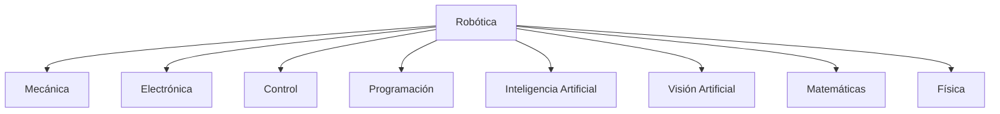
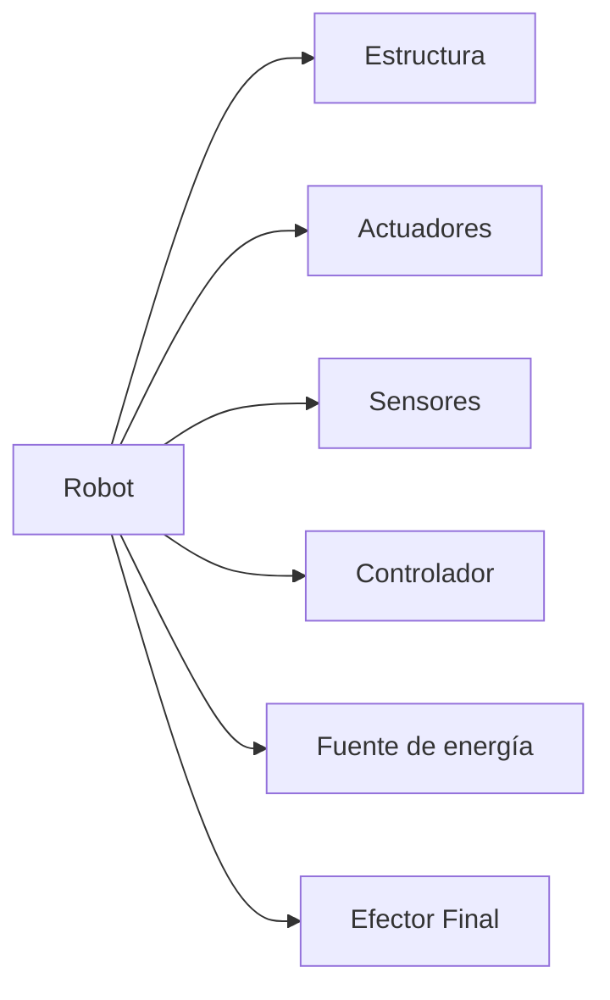
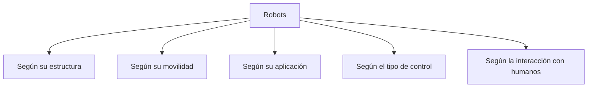
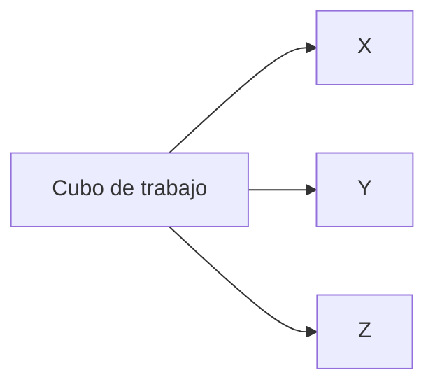
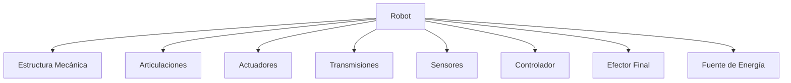
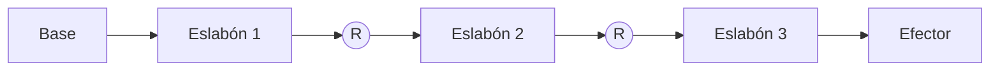
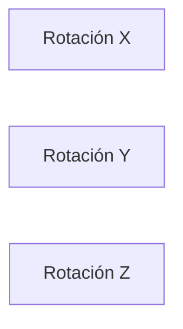
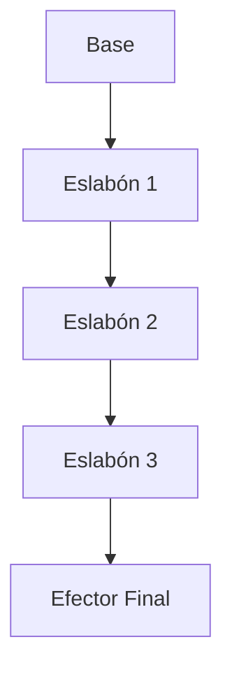
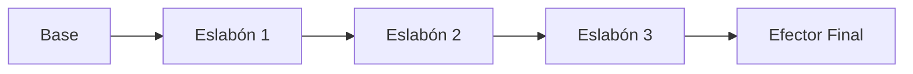

# Robótica Industrial y Cinemática de Robots
## Manual Completo del Método de Denavit-Hartenberg

**Versión:** 1.0

**Autor:** Elaborado a partir de material académico ampliado con investigación técnica.

---

# PARTE I
# Fundamentos de la Robótica

---

# Capítulo 1
# Introducción a la Robótica

> "La robótica es la disciplina que combina ingeniería, matemáticas, informática y electrónica para diseñar máquinas capaces de interactuar con el mundo físico de forma autónoma o semiautónoma."

---

# Objetivos del capítulo

Al finalizar este capítulo el estudiante será capaz de:

- Comprender qué es la robótica.
- Conocer las ramas que conforman esta disciplina.
- Entender por qué la robótica es una de las tecnologías más importantes de la Industria 4.0.
- Diferenciar un robot de una máquina automática convencional.
- Identificar las principales aplicaciones de los robots modernos.

---

# ¿Qué es la Robótica?

La robótica es una disciplina multidisciplinaria que integra conocimientos provenientes de diversas áreas de la ingeniería y las ciencias computacionales con el objetivo de diseñar, construir, controlar y programar máquinas capaces de ejecutar tareas de manera automática.

Un robot no solamente es una máquina que puede moverse. Para ser considerado un robot debe poseer cierto grado de percepción, capacidad de decisión y posibilidad de ser programado para realizar diferentes tareas.

En la actualidad, la robótica constituye uno de los pilares fundamentales de la automatización industrial, la manufactura inteligente, la medicina moderna, la exploración espacial y la inteligencia artificial aplicada.

---

## Definición según la Federación Internacional de Robótica (IFR)

Un robot industrial es:

> "Una máquina manipuladora automática, reprogramable, multifuncional, con tres o más ejes, capaz de posicionar materiales, piezas, herramientas o dispositivos especiales mediante movimientos programados para realizar diversas tareas."

Esta definición resalta tres características esenciales:

- Reprogramable.
- Multifuncional.
- Capaz de realizar movimientos controlados.

Estas características diferencian claramente a un robot de una máquina automática convencional.

---

# ¿Qué NO es un robot?

Es común pensar que cualquier máquina automática es un robot.

Sin embargo, esto no es correcto.

Por ejemplo:

- Una banda transportadora.
- Una prensa hidráulica.
- Un semáforo.
- Una bomba de agua automática.

Aunque estos sistemas funcionan automáticamente, no poseen capacidad de adaptación ni pueden ejecutar múltiples tareas mediante programación.

---

# Diferencia entre Automatización y Robótica

| Automatización | Robótica |
|----------------|----------|
| Diseñada para una sola tarea | Diseñada para múltiples tareas |
| Difícil de modificar | Fácilmente reprogramable |
| Movimiento limitado | Gran libertad de movimiento |
| Baja flexibilidad | Alta flexibilidad |
| Generalmente sin sensores complejos | Integra múltiples sensores |

---

# Disciplinas que conforman la Robótica

La robótica es una ciencia multidisciplinaria.

Está formada por la integración de varias áreas del conocimiento.



Cada una de estas disciplinas aporta elementos fundamentales para el funcionamiento de un robot.

---

## Ingeniería Mecánica

Se encarga del diseño físico del robot.

Incluye:

- Eslabones
- Articulaciones
- Chasis
- Reductores
- Transmisiones
- Materiales

---

## Ingeniería Electrónica

Diseña todos los sistemas eléctricos del robot.

Por ejemplo:

- Drivers
- Sensores
- Tarjetas electrónicas
- Fuentes de alimentación
- Encoders

---

## Ingeniería de Control

Permite que el robot ejecute movimientos precisos.

Algunos temas importantes son:

- Control PID
- Espacio de estados
- Control adaptativo
- Control robusto
- Control predictivo

---

## Ciencias de la Computación

Desarrolla el software encargado de controlar el robot.

Incluye:

- Sistemas operativos
- ROS
- Algoritmos
- Planificación de trayectorias
- Interfaces de usuario

---

## Inteligencia Artificial

Hace posible que el robot pueda:

- Aprender.
- Reconocer objetos.
- Tomar decisiones.
- Navegar.
- Detectar personas.
- Comprender lenguaje.

Actualmente la IA está revolucionando completamente la robótica moderna.

---

# Componentes generales de un robot

Un robot moderno suele estar compuesto por los siguientes elementos.



---

## Estructura Mecánica

Es el "esqueleto" del robot.

Está formada por:

- Base
- Brazos
- Articulaciones
- Soportes
- Eslabones

---

## Actuadores

Son los dispositivos responsables del movimiento.

Los más utilizados son:

- Motores DC
- Servomotores
- Motores paso a paso
- Motores Brushless
- Actuadores hidráulicos
- Actuadores neumáticos

---

## Sensores

Permiten al robot conocer el estado del entorno.

Ejemplos:

- Cámaras
- LIDAR
- Ultrasonido
- Encoders
- IMU
- Sensores de fuerza
- Sensores táctiles

---

## Controlador

Es el "cerebro" del robot.

Puede ser:

- PLC
- Microcontrolador
- Computadora industrial
- FPGA
- Raspberry Pi
- NVIDIA Jetson

---

## Efector Final

Es el elemento que interactúa directamente con el entorno.

Ejemplos:

- Pinza
- Ventosa
- Soldador
- Herramienta de corte
- Cámara
- Pistola de pintura

---

# Aplicaciones de la Robótica

Actualmente existen robots trabajando en prácticamente todos los sectores.

## Industria

- Soldadura
- Pintura
- Ensamblaje
- Empaque
- Inspección

---

## Medicina

- Cirugías asistidas
- Rehabilitación
- Prótesis inteligentes
- Robots de farmacia

---

## Agricultura

- Recolección de frutas
- Detección de enfermedades
- Aplicación de fertilizantes
- Monitoreo de cultivos

---

## Exploración espacial

- Mars Rovers
- Brazos robóticos en estaciones espaciales
- Satélites de mantenimiento

---

## Defensa

- Robots EOD
- Drones
- Vehículos autónomos
- Robots submarinos

---

## Educación

- Plataformas de aprendizaje
- Competencias de robótica
- Investigación universitaria

---

# ¿Por qué estudiar Robótica?

La robótica representa una de las áreas con mayor crecimiento tecnológico.

Su estudio permite comprender disciplinas fundamentales como:

- Álgebra lineal
- Física
- Electrónica
- Programación
- Inteligencia Artificial
- Control automático
- Manufactura avanzada

Además, constituye una competencia altamente demandada en sectores industriales, médicos y científicos.

---

# Resumen del capítulo

En este capítulo se introdujeron los conceptos fundamentales de la robótica, diferenciándola de la automatización convencional. Se describieron las principales disciplinas que la integran, los componentes básicos de un robot y algunas de sus aplicaciones más relevantes. Estos conceptos servirán como base para comprender la cinemática, el modelado mediante el método de Denavit-Hartenberg y los temas avanzados que se desarrollarán en los siguientes capítulos.

---

# Conceptos clave

- Robótica
- Robot industrial
- Automatización
- Actuador
- Sensor
- Efector final
- Controlador
- Reprogramabilidad
- Industria 4.0

---

# Preguntas de autoevaluación

1. ¿Qué características distinguen a un robot de una máquina automática convencional?
2. ¿Por qué se considera que la robótica es una disciplina multidisciplinaria?
3. ¿Cuál es la función de un actuador dentro de un robot?
4. ¿Qué papel desempeñan los sensores?
5. ¿Qué ventajas ofrece un robot reprogramable frente a un sistema automatizado fijo?

---

# Avance del siguiente capítulo

En el siguiente capítulo estudiaremos la historia de la robótica, desde los primeros autómatas de la antigüedad hasta los robots colaborativos actuales, analizando los hitos tecnológicos que han marcado la evolución de esta disciplina.

# Capítulo 2
# Historia y Evolución de la Robótica

---

# Objetivos del capítulo

Al finalizar este capítulo el estudiante será capaz de:

- Comprender el origen histórico de la robótica.
- Conocer los principales hitos tecnológicos de la evolución de los robots.
- Diferenciar las distintas generaciones de robots industriales.
- Identificar los acontecimientos que impulsaron el desarrollo de la robótica moderna.
- Comprender el contexto histórico en el que surgió el método de Denavit-Hartenberg.

---

# Introducción

La robótica es una disciplina relativamente joven si se compara con otras ramas de la ingeniería. Sin embargo, la idea de construir máquinas capaces de imitar el comportamiento humano existe desde hace miles de años.

Desde los primeros autómatas mecánicos hasta los robots dotados de inteligencia artificial, la evolución de la robótica ha estado impulsada por el deseo de automatizar tareas repetitivas, peligrosas o de alta precisión.

Hoy en día los robots participan en prácticamente todos los sectores de la sociedad, desde la manufactura industrial hasta la exploración espacial, la medicina, la agricultura y la educación.

---

# Los primeros autómatas

Mucho antes de que existiera la electricidad, diversas civilizaciones construyeron mecanismos capaces de realizar movimientos automáticos utilizando únicamente principios mecánicos.

Entre los ejemplos más conocidos se encuentran:

- Figuras mecánicas egipcias.
- Dispositivos hidráulicos griegos.
- Autómatas chinos.
- Relojes astronómicos medievales.
- Muñecos mecánicos del Renacimiento.

Aunque estos mecanismos no eran robots en el sentido moderno, demostraban que era posible construir máquinas capaces de ejecutar movimientos complejos sin intervención humana continua.

---

## Herón de Alejandría (siglo I)

Uno de los pioneros de la automatización fue **Herón de Alejandría**, matemático e ingeniero griego.

Diseñó mecanismos capaces de funcionar mediante:

- Vapor.
- Aire comprimido.
- Poleas.
- Contrapesos.
- Sistemas hidráulicos.

Entre sus inventos destacan:

- Puertas automáticas para templos.
- Teatros mecánicos.
- Máquinas expendedoras primitivas.
- Fuentes automáticas.

Estos dispositivos constituyen algunos de los primeros ejemplos documentados de automatización.

---

## Al-Jazarí (1206)

El ingeniero musulmán **Al-Jazarí** diseñó numerosas máquinas automáticas descritas en su obra *El libro del conocimiento de los ingeniosos dispositivos mecánicos*.

Entre ellas destacan:

- Relojes hidráulicos.
- Sirvientes automáticos.
- Mecanismos musicales.
- Sistemas automáticos de lavado de manos.

Muchos historiadores lo consideran uno de los padres de la ingeniería mecánica moderna.

---

# Leonardo da Vinci

Hacia 1495, Leonardo diseñó uno de los primeros humanoides mecánicos conocidos.

Su "caballero mecánico" podía:

- Sentarse.
- Levantar los brazos.
- Girar la cabeza.
- Abrir y cerrar la mandíbula.

Aunque nunca llegó a construirse en su época, estudios modernos demostraron que el diseño era completamente funcional.

---

# Revolución Industrial

Durante los siglos XVIII y XIX aparecieron las primeras máquinas automáticas utilizadas en la industria.

Entre ellas destacan:

- Telar de Jacquard.
- Máquinas de vapor.
- Máquinas herramienta.
- Sistemas automáticos de manufactura.

Estas máquinas marcaron el inicio de la automatización industrial.

---

# El nacimiento del término "Robot"

La palabra **robot** apareció por primera vez en 1921.

Fue introducida por el escritor checo **Karel Čapek** en su obra de teatro:

**R.U.R. (Rossum's Universal Robots)**

La palabra proviene del término eslavo:

> **Robota**

que significa:

- Trabajo forzado.
- Servidumbre.
- Trabajo obligatorio.

Curiosamente, Čapek atribuyó la idea del término a su hermano Josef Čapek.

---

# Isaac Asimov

Durante la década de 1940, el escritor y bioquímico Isaac Asimov revolucionó la ciencia ficción al introducir el concepto moderno de robot inteligente.

Fue el primero en utilizar el término:

> **Robotics**

Actualmente adoptado mundialmente.

Además propuso las famosas:

# Tres Leyes de la Robótica

## Primera Ley

> Un robot no hará daño a un ser humano ni permitirá, por inacción, que un ser humano sufra daño.

---

## Segunda Ley

> Un robot obedecerá las órdenes dadas por los seres humanos excepto cuando entren en conflicto con la Primera Ley.

---

## Tercera Ley

> Un robot protegerá su propia existencia mientras dicha protección no entre en conflicto con la Primera o Segunda Ley.

---

Posteriormente añadió una cuarta ley conocida como:

## Ley Cero

> Un robot no puede dañar a la humanidad ni permitir que la humanidad sufra daño.

Aunque estas leyes pertenecen a la ciencia ficción, influyeron profundamente en la ética de la robótica.

---

# George Devol

En 1954 George Devol registró la primera patente relacionada con un manipulador programable.

Su invento fue denominado:

**Programmed Article Transfer**

Este dispositivo es considerado el precursor del robot industrial moderno.

---

# Joseph Engelberger

Joseph Engelberger reconoció el enorme potencial del invento de Devol.

Juntos fundaron la empresa:

**Unimation**

La primera empresa dedicada exclusivamente a fabricar robots industriales.

Por este motivo Engelberger es conocido como:

> **El padre de la robótica industrial.**

---

# Unimate

En 1961 comenzó a operar el primer robot industrial de la historia.

Características:

- Hidráulico.
- Programable.
- Repetitivo.
- Seis grados de libertad.
- Diseñado para manipular piezas calientes.

Fue instalado en una planta de General Motors.

Su función consistía en retirar piezas fundidas extremadamente calientes que resultaban peligrosas para los operarios.

Este acontecimiento marcó oficialmente el nacimiento de la robótica industrial.

---

# Evolución de los robots industriales

## Primera generación (1960–1970)

Características:

- Robots secuenciales.
- Sin sensores.
- Programación fija.
- Baja flexibilidad.

---

## Segunda generación (1970–1985)

Se incorporan:

- Sensores.
- Encoders.
- Retroalimentación.
- Control por computadora.

---

## Tercera generación (1985–2000)

Aparecen:

- Visión artificial.
- Control inteligente.
- Programación offline.
- Simulación.

---

## Cuarta generación (2000–2020)

Surgen:

- Robots colaborativos.
- Robots móviles.
- IA aplicada.
- Internet Industrial.
- Computación en la nube.

---

## Quinta generación (Actualidad)

Los robots modernos integran:

- Inteligencia Artificial.
- Aprendizaje automático.
- Redes neuronales.
- Computación en el borde (Edge Computing).
- Visión 3D.
- Gemelos digitales.
- Grandes modelos de lenguaje.
- Aprendizaje por demostración.

---

# Hitos importantes de la robótica

| Año | Acontecimiento |
|------|----------------|
| Siglo I | Autómatas de Herón de Alejandría |
| 1206 | Máquinas automáticas de Al-Jazarí |
| 1495 | Caballero mecánico de Leonardo da Vinci |
| 1804 | Telar de Jacquard |
| 1921 | Karel Čapek introduce la palabra "Robot" |
| 1942 | Isaac Asimov propone las Tres Leyes |
| 1954 | George Devol patenta el primer manipulador programable |
| 1961 | Instalación del robot Unimate |
| 1973 | Primer robot totalmente eléctrico |
| Década de 1980 | Expansión industrial de los robots |
| Década de 1990 | Robots con visión artificial |
| Década de 2000 | Robots colaborativos |
| Década de 2010 | Robots autónomos y vehículos inteligentes |
| Década de 2020 | Integración masiva de IA y aprendizaje automático |

---

# El origen del método de Denavit-Hartenberg

Uno de los mayores desafíos en la robótica fue describir matemáticamente la posición y orientación de cada eslabón de un manipulador.

En 1955, Jacques Denavit y Richard S. Hartenberg propusieron una convención matemática que permitía representar cualquier cadena cinemática mediante únicamente cuatro parámetros por articulación:

- θ (Theta)
- d
- a
- α (Alpha)

Este método simplificó enormemente el análisis cinemático y se convirtió en el estándar utilizado en la mayoría de los libros, cursos universitarios y herramientas de simulación robótica.

Más adelante dedicaremos una parte completa del manual a estudiar este método en profundidad.

---

# Resumen del capítulo

La evolución de la robótica ha sido el resultado de siglos de avances en mecánica, matemáticas, electrónica e informática. Desde los autómatas antiguos hasta los robots inteligentes actuales, cada etapa ha aportado nuevas capacidades y aplicaciones. El desarrollo del robot industrial y la creación del método de Denavit-Hartenberg marcaron un punto de inflexión que permitió formalizar el estudio de la cinemática y el control de manipuladores.

---

# Conceptos clave

- Autómata
- Robot
- Unimate
- Unimation
- George Devol
- Joseph Engelberger
- Karel Čapek
- Isaac Asimov
- Denavit-Hartenberg
- Robot industrial
- Industria 4.0
- Robot colaborativo

---

# Preguntas de autoevaluación

1. ¿Qué diferencia existe entre un autómata y un robot moderno?
2. ¿Quién introdujo el término "robot" y cuál es su origen etimológico?
3. ¿Cuál fue la importancia del robot Unimate para la industria?
4. ¿Qué aportes realizaron George Devol y Joseph Engelberger?
5. ¿Por qué el método de Denavit-Hartenberg representó un avance fundamental en la robótica?
6. ¿Cómo ha cambiado la robótica con la incorporación de la inteligencia artificial?
7. ¿Qué características distinguen a los robots de quinta generación?

---

# Avance del siguiente capítulo

En el siguiente capítulo estudiaremos la **clasificación de los robots**, analizando sus configuraciones mecánicas, tipos de articulaciones, espacios de trabajo, ventajas, desventajas y aplicaciones industriales. Esta clasificación será esencial para comprender posteriormente cómo se modelan matemáticamente mediante el método de Denavit-Hartenberg.

# Capítulo 3
# Clasificación de los Robots

---

# Objetivos del capítulo

Al finalizar este capítulo el estudiante será capaz de:

- Comprender los diferentes criterios de clasificación de los robots.
- Identificar las principales configuraciones mecánicas utilizadas en la industria.
- Diferenciar los espacios de trabajo de cada tipo de robot.
- Conocer las ventajas, limitaciones y aplicaciones de cada configuración.
- Relacionar la estructura mecánica con el método de Denavit-Hartenberg.

---

# Introducción

No todos los robots poseen la misma estructura ni fueron diseñados para realizar las mismas tareas.

Algunos destacan por su velocidad, otros por su precisión y otros por su capacidad para transportar grandes cargas.

Por esta razón, existen diversos criterios para clasificar los robots, dependiendo de aspectos como:

- Su estructura mecánica.
- El tipo de articulaciones.
- Su movilidad.
- Su aplicación.
- Su grado de autonomía.
- El entorno donde trabajan.

En este capítulo estudiaremos cada uno de estos criterios.

---

# Clasificación general



Cada criterio proporciona una perspectiva distinta sobre el diseño y funcionamiento del robot.

---

# Clasificación según su estructura mecánica

Esta es la clasificación más utilizada en robótica industrial.

Se basa en la disposición geométrica de los ejes y articulaciones.

Los principales tipos son:

- Robot cartesiano
- Robot cilíndrico
- Robot polar
- Robot SCARA
- Robot articulado
- Robot paralelo

Cada uno posee características particulares que afectan su espacio de trabajo, precisión, velocidad y facilidad de modelado.

---

# Robot Cartesiano

También conocido como robot XYZ.

Está formado por tres ejes lineales perpendiculares entre sí.

```text
           Z
           ↑
           │
           │
           ●──────→ X
          /
         /
        Y
```

Normalmente utiliza tres articulaciones prismáticas (PPP).

## Características

- Muy alta precisión.
- Gran rigidez estructural.
- Programación sencilla.
- Espacio de trabajo rectangular.

## Ventajas

- Fácil construcción.
- Muy preciso.
- Excelente repetibilidad.
- Bajo costo de mantenimiento.

## Desventajas

- Poco flexible.
- Movimiento limitado.
- Requiere bastante espacio.

## Aplicaciones

- Impresoras 3D.
- Máquinas CNC.
- Plotters.
- Sistemas Pick and Place.
- Máquinas de corte láser.

---

# Espacio de trabajo



El volumen alcanzable corresponde aproximadamente a un prisma rectangular.

---

# Robot Cilíndrico

Este robot combina movimientos rotacionales y lineales.

Configuración típica:

RPP

- Rotación
- Desplazamiento vertical
- Desplazamiento radial

```text
        ↑ Z
        │
        │
        ●
       /|
      / |
     ↺  |
```

## Características

- Espacio de trabajo cilíndrico.
- Buena capacidad de carga.
- Movimiento radial.

## Aplicaciones

- Manipulación de piezas.
- Máquinas herramienta.
- Carga y descarga de materiales.

---

# Robot Polar

Conocido también como robot esférico.

Configuración típica:

RRP

```text
         ●
       ／
     ／
   ↺
```

El extremo del robot puede describir un volumen aproximadamente esférico.

## Ventajas

- Gran alcance.
- Buena cobertura espacial.

## Desventajas

- Control más complejo.
- Menor precisión que un cartesiano.

## Aplicaciones

- Soldadura.
- Manipulación pesada.
- Fundición.

---

# Robot SCARA

SCARA significa:

**Selective Compliance Assembly Robot Arm**

Es uno de los robots más utilizados en líneas de ensamblaje.

Configuración típica:

RRP

```text
Vista superior

      O────O────●
        θ1   θ2
```

Las dos primeras articulaciones son rotacionales.

La tercera suele ser prismática.

## Características

- Muy rápido.
- Excelente precisión.
- Ideal para ensamblaje.

## Ventajas

- Alta velocidad.
- Gran repetibilidad.
- Ocupa poco espacio.

## Desventajas

- Espacio de trabajo limitado.
- Menor flexibilidad para tareas complejas.

## Aplicaciones

- Ensamblaje electrónico.
- Inserción de componentes.
- Pick and Place.
- Industria farmacéutica.

---

# Robot Articulado

Es el robot industrial más conocido.

Generalmente posee entre 4 y 7 grados de libertad.

Configuración típica:

RRRRRR

```text
        ●
       /
     O
    /
  O
 /
O
```

Su apariencia recuerda a un brazo humano.

## Características

- Muy flexible.
- Gran alcance.
- Excelente orientación del efector final.

## Aplicaciones

- Soldadura.
- Pintura.
- Paletizado.
- Pulido.
- Manufactura.
- Inspección.

---

# Robot Paralelo

A diferencia de los robots anteriores, el efector final está sostenido por varias cadenas cinemáticas simultáneamente.

Ejemplo:

Robot Delta.

```text
     ▲
    /|\
   / | \
  ●--●--●
     │
     ▼
```

## Características

- Muy alta velocidad.
- Muy baja masa móvil.
- Gran precisión.

## Aplicaciones

- Empaque.
- Clasificación.
- Industria alimentaria.

---

# Comparación entre configuraciones

| Tipo | GDL típicos | Espacio de trabajo | Precisión | Velocidad | Complejidad |
|------|-------------|-------------------|------------|------------|-------------|
| Cartesiano | 3 | Prismático | Muy alta | Media | Baja |
| Cilíndrico | 3 | Cilíndrico | Alta | Media | Media |
| Polar | 3 | Esférico | Media | Media | Alta |
| SCARA | 4 | Cilíndrico | Muy alta | Muy alta | Media |
| Articulado | 6 | Irregular | Alta | Alta | Muy alta |
| Paralelo | 3–6 | Limitado | Muy alta | Muy alta | Muy alta |

---

# Clasificación según la movilidad

Los robots también pueden clasificarse por su capacidad para desplazarse.

## Robots fijos

Permanecen anclados.

Ejemplos:

- Robots industriales.
- Robots de soldadura.
- Robots de pintura.

---

## Robots móviles terrestres

Se desplazan mediante:

- Ruedas.
- Orugas.
- Patas.

Aplicaciones:

- Logística.
- Agricultura.
- Exploración.

---

## Robots aéreos

Conocidos como UAV.

Ejemplos:

- Drones.
- Hexacópteros.
- Cuadricópteros.

---

## Robots submarinos

Denominados ROV o AUV.

Aplicaciones:

- Inspección de tuberías.
- Exploración oceánica.
- Investigación científica.

---

# Clasificación según su aplicación

## Robots industriales

Diseñados para procesos repetitivos.

Ejemplos:

- Soldadura.
- Pintura.
- Ensamblaje.

---

## Robots médicos

Utilizados en:

- Cirugía.
- Rehabilitación.
- Diagnóstico.
- Prótesis.

---

## Robots de servicio

Ayudan directamente a las personas.

Ejemplos:

- Limpieza.
- Atención al cliente.
- Entrega de medicamentos.

---

## Robots educativos

Su objetivo principal es el aprendizaje.

Ejemplos:

- LEGO Mindstorms.
- VEX Robotics.
- Plataformas Arduino.

---

## Robots espaciales

Trabajan en ambientes extremos.

Ejemplos:

- Rovers marcianos.
- Brazos robóticos orbitales.

---

# Clasificación según el control

## Teleoperados

Controlados por un operador humano.

Ejemplos:

- Robots de desactivación de explosivos.
- Robots quirúrgicos asistidos.

---

## Semiautónomos

Combinan decisiones automáticas con supervisión humana.

---

## Autónomos

Realizan tareas sin intervención humana durante largos periodos.

Utilizan:

- IA.
- Sensores.
- Visión artificial.
- SLAM.
- Planeación de trayectorias.

---

# Robots colaborativos (Cobots)

Los cobots representan una nueva generación de robots diseñados para compartir el espacio de trabajo con personas.

Características:

- Sensores de fuerza.
- Detección de colisiones.
- Velocidad adaptable.
- Programación intuitiva.

Son ampliamente utilizados en pequeñas y medianas empresas debido a su facilidad de integración.

---

# Relación con el método Denavit-Hartenberg

Cada una de las configuraciones mecánicas estudiadas puede describirse mediante el método de Denavit-Hartenberg.

Sin importar si se trata de un robot cartesiano, SCARA o articulado, todos pueden modelarse asignando un sistema de coordenadas a cada articulación y definiendo cuatro parámetros por eslabón:

- θ (Theta)
- d
- a
- α (Alpha)

Comprender la estructura mecánica del robot facilita enormemente la construcción de la tabla DH y el desarrollo del modelo cinemático.

---

# Resumen del capítulo

En este capítulo se presentaron las principales clasificaciones de los robots según su estructura, movilidad, aplicación y tipo de control. Cada configuración posee ventajas específicas que la hacen adecuada para determinadas tareas industriales o de servicio. Además, se estableció la relación entre la geometría del robot y el método de Denavit-Hartenberg, que será desarrollado en profundidad en capítulos posteriores.

---

# Conceptos clave

- Robot cartesiano
- Robot cilíndrico
- Robot polar
- Robot SCARA
- Robot articulado
- Robot paralelo
- Robot móvil
- Robot colaborativo
- Grados de libertad
- Espacio de trabajo

---

# Preguntas de autoevaluación

1. ¿Qué diferencia existe entre un robot cartesiano y un robot articulado?
2. ¿Por qué el robot SCARA es tan utilizado en tareas de ensamblaje?
3. ¿Qué ventajas ofrecen los robots paralelos en aplicaciones de alta velocidad?
4. ¿Cuál es la principal diferencia entre un robot teleoperado y uno autónomo?
5. ¿Cómo influye la estructura mecánica de un robot en la construcción de su modelo Denavit-Hartenberg?
6. ¿Qué tipo de robot elegirías para una impresora 3D y por qué?
7. ¿En qué aplicaciones industriales son más adecuados los robots colaborativos?

---

# Avance del siguiente capítulo

En el próximo capítulo estudiaremos la **morfología del robot**, analizando en detalle los eslabones, articulaciones, grados de libertad, actuadores, transmisiones, sensores y efectores finales. Estos conceptos serán fundamentales para comprender cómo se modelan matemáticamente los manipuladores robóticos mediante la cinemática directa.

# Capítulo 4
# Morfología del Robot

---

# Objetivos del capítulo

Al finalizar este capítulo el estudiante será capaz de:

- Comprender la estructura física de un robot manipulador.
- Identificar los componentes mecánicos y electrónicos que conforman un robot.
- Diferenciar entre eslabones, articulaciones y grados de libertad.
- Entender el funcionamiento de los sistemas de transmisión y accionamiento.
- Reconocer la importancia de los sensores y del efector final.
- Relacionar la morfología del robot con el modelado cinemático.

---

# Introducción

La morfología de un robot describe la forma en que está construido y cómo se relacionan todos sus componentes mecánicos y electrónicos.

Al igual que el cuerpo humano está formado por huesos, articulaciones y músculos, un robot está constituido por una serie de elementos que trabajan conjuntamente para producir movimientos controlados.

Comprender esta estructura resulta indispensable para analizar posteriormente la cinemática y la dinámica del robot.

---

# ¿Qué es la morfología de un robot?

La morfología corresponde a la organización física y funcional de todos los elementos que componen un robot.

Incluye aspectos como:

- Estructura mecánica.
- Articulaciones.
- Eslabones.
- Actuadores.
- Sensores.
- Sistema de control.
- Transmisiones.
- Efector final.

En conjunto, estos elementos permiten que el robot interactúe con su entorno.

---

# Componentes generales



Cada componente cumple una función específica dentro del sistema robótico.

---

# La estructura mecánica

La estructura mecánica constituye el esqueleto del robot.

Está formada por piezas rígidas denominadas **eslabones**, unidas mediante **articulaciones** que permiten el movimiento relativo entre ellas.

Una estructura bien diseñada debe proporcionar:

- Rigidez.
- Precisión.
- Resistencia mecánica.
- Bajo peso.
- Facilidad de mantenimiento.

Los materiales más utilizados son:

- Acero.
- Aluminio.
- Titanio.
- Fibra de carbono.
- Polímeros de ingeniería.

---

# Los eslabones

Un eslabón es un elemento rígido que conecta dos articulaciones consecutivas.

Puede compararse con los huesos del brazo humano.

```text
Articulación ---- Eslabón ---- Articulación
```

Cada eslabón posee características propias:

- Longitud.
- Masa.
- Centro de gravedad.
- Momento de inercia.
- Material de fabricación.

En el método Denavit-Hartenberg, cada eslabón tendrá asociado un sistema de referencia.

---

# Las articulaciones

Las articulaciones permiten el movimiento entre dos eslabones consecutivos.

Representan los puntos donde existe movimiento relativo.

```text
Eslabón ──○── Eslabón
```

El tipo de articulación determina el movimiento que podrá realizar el robot.

---

# Tipos de articulaciones

## Articulación Rotacional (Revoluta)

Es la más utilizada en robots industriales.

Permite únicamente movimiento angular.

Símbolo:

```
R
```

Movimiento:

```
↺
```

Ejemplos:

- Hombro.
- Codo.
- Muñeca.

Variable asociada:

\[
\theta
\]

---

## Articulación Prismática

Permite movimiento lineal.

Símbolo:

```
P
```

Movimiento:

```
⇅
```

Ejemplos:

- Cilindros neumáticos.
- Actuadores lineales.
- Robots cartesianos.

Variable asociada:

\[
d
\]

---

## Otras articulaciones

Aunque son menos frecuentes en manipuladores industriales, existen:

- Helicoidales.
- Esféricas.
- Universales.
- Cilíndricas.
- Flexibles.

Estas suelen encontrarse en robots especializados o mecanismos complejos.

---

# Cadena cinemática

Una cadena cinemática es el conjunto de eslabones y articulaciones que transmiten el movimiento desde la base hasta el efector final.



Existen dos tipos principales:

## Cadena abierta

- Manipuladores industriales.
- Brazos robóticos.
- Robots SCARA.

Solo existe un camino entre la base y el efector.

---

## Cadena cerrada

Ejemplos:

- Robot Delta.
- Plataformas Stewart.

Presentan múltiples caminos cinemáticos.

Ofrecen mayor rigidez y precisión, aunque su análisis matemático es más complejo.

---

# Base del robot

La base constituye el punto fijo del manipulador.

Desde ella se establece el sistema de coordenadas principal.

En el método Denavit-Hartenberg esta base suele denominarse:

\[
\{0\}
\]

Todas las posiciones del robot se calcularán respecto a este sistema de referencia.

---

# Muñeca del robot

La muñeca comprende las últimas articulaciones del manipulador.

Su función principal es orientar el efector final.

Generalmente posee tres grados de libertad:

- Giro (Yaw).
- Inclinación (Pitch).
- Rotación (Roll).

Gracias a ella, el robot puede orientar herramientas en cualquier dirección.

---

# Efector final

El efector final es el componente que interactúa directamente con el entorno.

Puede intercambiarse dependiendo de la aplicación.

Ejemplos:

- Pinzas mecánicas.
- Ventosas.
- Pistolas de pintura.
- Antorchas de soldadura.
- Cámaras.
- Sensores.
- Herramientas de corte.

---

# Clasificación de efectores

## Pinzas mecánicas

Adecuadas para manipular piezas rígidas.

---

## Ventosas

Utilizadas para vidrio, cartón y láminas metálicas.

---

## Herramientas

Incluyen:

- Taladros.
- Fresadoras.
- Soldadores.
- Atornilladores.

---

## Sensores

Algunos robots emplean cámaras o escáneres como efector final para realizar inspección.

---

# Actuadores

Los actuadores generan el movimiento del robot.

Transforman energía eléctrica, neumática o hidráulica en movimiento mecánico.

---

## Motores eléctricos

Los más utilizados.

Tipos:

- Motores DC.
- Brushless.
- Servomotores.
- Paso a paso.

Ventajas:

- Alta precisión.
- Fácil control.
- Bajo mantenimiento.

---

## Actuadores hidráulicos

Utilizan aceite a presión.

Ventajas:

- Grandes fuerzas.
- Elevada capacidad de carga.

Desventajas:

- Mayor mantenimiento.
- Posibles fugas.

---

## Actuadores neumáticos

Funcionan mediante aire comprimido.

Se utilizan cuando se requieren movimientos rápidos y sencillos.

---

# Sistemas de transmisión

Los motores normalmente no se conectan directamente a las articulaciones.

Es necesario transmitir el movimiento.

Los principales mecanismos son:

- Engranajes.
- Tornillos de bolas.
- Correas dentadas.
- Cadenas.
- Reductores planetarios.
- Reductores armónicos.

---

# Sensores

Los sensores permiten que el robot conozca su estado y el entorno.

Se clasifican en dos grandes grupos.

---

## Sensores internos

Miden variables del propio robot.

Ejemplos:

- Encoders.
- Tacómetros.
- Sensores de corriente.
- Sensores de temperatura.

---

## Sensores externos

Obtienen información del entorno.

Ejemplos:

- Cámaras.
- LiDAR.
- Ultrasonido.
- Sensores infrarrojos.
- IMU.
- Sensores de fuerza.

---

# El controlador

El controlador ejecuta el software encargado de coordinar todos los componentes.

Entre sus funciones se encuentran:

- Leer sensores.
- Calcular trayectorias.
- Ejecutar algoritmos de control.
- Coordinar motores.
- Detectar fallos.
- Comunicarse con otros sistemas.

---

# Fuente de energía

Dependiendo de la aplicación, un robot puede alimentarse mediante:

- Corriente alterna.
- Corriente continua.
- Baterías.
- Sistemas hidráulicos.
- Aire comprimido.

---

# Grados de libertad (DOF)

Uno de los conceptos más importantes de la robótica es el grado de libertad.

Un grado de libertad representa un movimiento independiente que puede realizar un mecanismo.

Por ejemplo:

Una articulación revoluta posee:

```
1 GDL
```

Una prismática también posee:

```
1 GDL
```

Un brazo industrial típico posee:

```
6 GDL
```

Estos permiten controlar completamente la posición y orientación del efector final.

---

# Ejemplo

```text
Base

  ○ θ1

   │

  ○ θ2

   │

  ○ θ3

```

Cada articulación agrega un nuevo grado de libertad.

Total:

```
3 GDL
```

---

# Relación con Denavit-Hartenberg

Cada articulación de un robot será representada mediante un sistema de coordenadas.

Posteriormente se determinarán cuatro parámetros:

- θ
- d
- a
- α

Estos parámetros describen completamente la relación entre dos eslabones consecutivos.

Por ello, comprender la morfología del robot es el primer paso antes de construir una tabla Denavit-Hartenberg.

---

# Resumen del capítulo

En este capítulo se estudiaron los componentes fundamentales de un robot manipulador: eslabones, articulaciones, actuadores, transmisiones, sensores, controlador y efector final. También se introdujo el concepto de cadena cinemática y grados de libertad, que constituyen la base para el análisis cinemático de los robots. Estos conocimientos serán esenciales para comprender cómo se asignan sistemas de referencia y se obtienen los parámetros del método de Denavit-Hartenberg.

---

# Conceptos clave

- Morfología
- Eslabón
- Articulación
- Cadena cinemática
- Grado de libertad
- Actuador
- Transmisión
- Sensor
- Controlador
- Efector final

---

# Preguntas de autoevaluación

1. ¿Qué función cumplen los eslabones dentro de un manipulador robótico?
2. ¿Cuál es la diferencia entre una articulación revoluta y una prismática?
3. ¿Qué ventajas ofrecen los servomotores frente a otros actuadores?
4. ¿Por qué son importantes los sistemas de transmisión?
5. ¿Cuál es la diferencia entre sensores internos y externos?
6. ¿Qué es una cadena cinemática abierta y en qué se diferencia de una cerrada?
7. ¿Por qué los grados de libertad son fundamentales para el modelado cinemático?
8. ¿Cómo se relacionan los componentes físicos del robot con la construcción de la tabla Denavit-Hartenberg?

---

# Avance del siguiente capítulo

En el próximo capítulo estudiaremos en profundidad los **Grados de Libertad (Degrees of Freedom, DOF)** y el **espacio de trabajo (Workspace)** de un robot. Analizaremos cómo cada articulación contribuye al movimiento del manipulador y cómo estas capacidades determinan el volumen que puede alcanzar el efector final. Estos conceptos serán esenciales antes de introducir los sistemas de coordenadas y las transformaciones homogéneas.

# Capítulo 5
# Grados de Libertad y Espacio de Trabajo

---

# Objetivos del capítulo

Al finalizar este capítulo el estudiante será capaz de:

- Comprender el concepto de grado de libertad (DOF).
- Diferenciar entre grados de libertad de traslación y rotación.
- Analizar la movilidad de un robot.
- Aplicar el criterio de Grübler-Kutzbach para estimar la movilidad de mecanismos.
- Comprender el concepto de redundancia cinemática.
- Identificar singularidades mecánicas.
- Analizar el espacio de trabajo de diferentes robots.
- Relacionar estos conceptos con el modelado mediante Denavit-Hartenberg.

---

# Introducción

Uno de los conceptos fundamentales en robótica es el **grado de libertad** (*Degree of Freedom*, DOF).

Cada movimiento independiente que puede realizar un robot corresponde a un grado de libertad.

La cantidad de grados de libertad determina:

- La complejidad del robot.
- La flexibilidad del movimiento.
- La capacidad para alcanzar posiciones y orientaciones.
- La dificultad del control.
- La complejidad del modelo matemático.

En términos generales, cuanto mayor sea el número de grados de libertad, mayor será la versatilidad del robot, aunque también aumentará la complejidad de su análisis y control.

---

# ¿Qué es un grado de libertad?

Un grado de libertad representa un movimiento independiente que puede realizar un cuerpo o mecanismo.

Puede tratarse de:

- Una traslación.
- Una rotación.

Cada movimiento puede variar independientemente de los demás.

---

# Movimiento de un cuerpo rígido

En un espacio tridimensional, un cuerpo rígido completamente libre posee seis grados de libertad.

```text
          Z
          ↑
          │
          │
          ●──────→ X
         /
        /
       Y
```

Tres corresponden a movimientos lineales:

- Traslación en X
- Traslación en Y
- Traslación en Z

y tres corresponden a rotaciones:

- Roll
- Pitch
- Yaw

---

# Los seis grados de libertad

```text
Traslaciones

Tx
Ty
Tz

Rotaciones

Rx
Ry
Rz
```

o de forma más intuitiva:

| Movimiento | Descripción |
|------------|-------------|
| Tx | Adelante y atrás |
| Ty | Izquierda y derecha |
| Tz | Arriba y abajo |
| Roll | Giro sobre X |
| Pitch | Giro sobre Y |
| Yaw | Giro sobre Z |

Estos seis movimientos permiten ubicar completamente cualquier cuerpo en el espacio.

---

# Grados de libertad en robótica

En un robot, cada articulación añade uno o más grados de libertad.

Los tipos más comunes son:

## Articulación revoluta (R)

Produce:

```
1 DOF
```

Movimiento:

```text
↺
```

Variable:

\[
\theta
\]

---

## Articulación prismática (P)

Produce:

```
1 DOF
```

Movimiento:

```text
⇅
```

Variable:

\[
d
\]

---

# Ejemplos

## Robot con una articulación

```text
Base

 ○

 ↺
```

DOF:

```
1
```

---

## Robot RR

```text
○────○
 θ1   θ2
```

DOF:

```
2
```

---

## Robot RRR

```text
○──○──○
```

DOF:

```
3
```

---

## Robot industrial

```text
Base

○
│
○
│
○
│
○
│
○
│
○
```

Generalmente:

```
6 DOF
```

---

# ¿Por qué seis grados de libertad?

Para posicionar completamente una herramienta es necesario controlar:

## Posición

- X
- Y
- Z

## Orientación

- Roll
- Pitch
- Yaw

Por esta razón la mayoría de robots industriales poseen seis grados de libertad.

---

# Robots con menos grados de libertad

No todas las aplicaciones requieren controlar completamente la orientación.

Por ejemplo:

## Impresora 3D

```
PPP
```

Solo necesita:

- X
- Y
- Z

No requiere orientar la boquilla.

---

## Robot SCARA

Generalmente:

```
R R P R
```

Tiene:

```
4 DOF
```

Suficientes para tareas de ensamblaje.

---

# Robots redundantes

Un robot es redundante cuando posee más grados de libertad de los estrictamente necesarios.

Ejemplo:

```
7 DOF
```

como el brazo humano.

Ventajas:

- Evita obstáculos.
- Mejora la maniobrabilidad.
- Reduce singularidades.
- Permite múltiples soluciones cinemáticas.

---

# El brazo humano

El brazo humano es un excelente ejemplo de robot redundante.

| Articulación | DOF |
|--------------|----:|
| Hombro | 3 |
| Codo | 1 |
| Antebrazo | 1 |
| Muñeca | 3 |

Dependiendo del modelo considerado:

```
7 a 8 DOF
```

Esta redundancia permite realizar movimientos muy naturales.

---

# Movilidad de mecanismos

No basta con contar articulaciones.

Algunos mecanismos presentan restricciones adicionales.

Para estimar su movilidad se utiliza el criterio de Grübler-Kutzbach.

---

# Criterio de Grübler-Kutzbach

Para mecanismos espaciales:

\[
M = 6(n-1-j)+\sum_{i=1}^{j} f_i
\]

donde:

- \(M\) = movilidad
- \(n\) = número de eslabones
- \(j\) = número de articulaciones
- \(f_i\) = grados de libertad de cada articulación

Para mecanismos planos suele emplearse:

\[
M=3(n-1)-2j_1-j_2
\]

donde \(j_1\) representa articulaciones de un grado de libertad y \(j_2\) articulaciones de dos grados de libertad.

> **Nota:** Esta fórmula es una herramienta útil para estimar la movilidad, pero existen mecanismos con restricciones especiales donde puede ser necesario un análisis más detallado.

---

# Ejemplo

Robot RR plano.

```text
Base

○────○
```

- 3 eslabones
- 2 articulaciones

Entonces:

\[
M=3(3-1)-2(2)
\]

\[
M=6-4
\]

\[
M=2
\]

Coincide con la intuición:

```
2 DOF
```

---

# Singularidades

Una singularidad es una configuración en la que el robot pierde uno o más grados efectivos de movimiento.

Ejemplo:

```text
○────○────○
```

Cuando todos los eslabones quedan completamente alineados, ciertas direcciones de movimiento dejan de estar disponibles.

Consecuencias:

- Pérdida de precisión.
- Grandes velocidades articulares.
- Inestabilidad numérica.
- Dificultades para la cinemática inversa.

Más adelante dedicaremos un capítulo completo a este tema.

---

# Espacio de trabajo

El espacio de trabajo (*Workspace*) es el conjunto de todas las posiciones que puede alcanzar el efector final del robot.

Cada arquitectura posee un espacio característico.

---

# Robot cartesiano

```text
+------------+
|            |
|            |
|            |
+------------+
```

Espacio:

Prisma rectangular.

---

# Robot cilíndrico

```text
   _______
 /       /
|       |
|       |
 \_____/
```

Espacio:

Cilindro.

---

# Robot polar

```text
   .-'''-.
 .'       '.
(           )
 '.       .'
   '-...-'
```

Espacio:

Esférico.

---

# Robot SCARA

```text
  ________
 /        \
|          |
 \________/
```

Espacio:

Anular o cilíndrico.

---

# Robot articulado

Su espacio de trabajo posee una geometría irregular, determinada por la longitud de los eslabones y los límites de las articulaciones.

---

# Espacio alcanzable y espacio útil

Es importante distinguir dos conceptos:

## Espacio alcanzable

Incluye todos los puntos que el efector final puede tocar, aunque no pueda adoptar cualquier orientación.

## Espacio útil

Corresponde a las posiciones donde el robot puede trabajar cumpliendo simultáneamente los requisitos de posición y orientación.

En aplicaciones industriales, el espacio útil suele ser menor que el espacio alcanzable.

---

# Factores que afectan el espacio de trabajo

- Longitud de los eslabones.
- Límites articulares.
- Colisiones entre eslabones.
- Obstáculos externos.
- Configuración mecánica.
- Restricciones de seguridad.

---

# Relación con Denavit-Hartenberg

Cada grado de libertad se representa mediante un sistema de coordenadas local.

Al construir una tabla DH:

- Cada articulación aporta una variable (\(\theta\) o \(d\)).
- Cada eslabón aporta parámetros geométricos (\(a\) y \(\alpha\)).
- El conjunto de estos parámetros describe completamente la geometría del manipulador.

Comprender los grados de libertad y el espacio de trabajo facilita la interpretación de las transformaciones homogéneas que estudiaremos en los siguientes capítulos.

---

# Resumen del capítulo

En este capítulo se introdujo el concepto de grado de libertad y su importancia en la movilidad de un robot. Se analizaron las diferencias entre traslaciones y rotaciones, el criterio de Grübler-Kutzbach para estimar la movilidad, la redundancia cinemática y las singularidades. Finalmente, se estudió el concepto de espacio de trabajo y cómo la estructura mecánica condiciona las capacidades del manipulador.

---

# Conceptos clave

- Grado de libertad (DOF)
- Movilidad
- Redundancia cinemática
- Singularidad
- Espacio de trabajo
- Espacio alcanzable
- Espacio útil
- Grübler-Kutzbach
- Articulación revoluta
- Articulación prismática

---

# Preguntas de autoevaluación

1. ¿Qué es un grado de libertad y cómo se relaciona con una articulación?
2. ¿Por qué un cuerpo rígido en el espacio posee seis grados de libertad?
3. ¿Qué ventajas ofrece un robot redundante?
4. ¿Cuál es la diferencia entre espacio alcanzable y espacio útil?
5. ¿Qué es una singularidad y cuáles son sus efectos?
6. ¿Cómo se aplica el criterio de Grübler-Kutzbach en un mecanismo plano?
7. ¿Por qué la mayoría de los robots industriales tienen seis grados de libertad?
8. ¿Qué relación existe entre los grados de libertad y la tabla de Denavit-Hartenberg?

---

# Avance del siguiente capítulo

En el siguiente capítulo comenzaremos con los **fundamentos matemáticos de la robótica**, introduciendo los **sistemas de coordenadas**, los marcos de referencia y las transformaciones entre sistemas. Estos conceptos constituyen el punto de partida para comprender las matrices homogéneas y el método de Denavit-Hartenberg.

# PARTE II
# Fundamentos Matemáticos para la Robótica

---

# Capítulo 6
# Sistemas de Coordenadas y Marcos de Referencia

---

# Objetivos del capítulo

Al finalizar este capítulo el estudiante será capaz de:

- Comprender qué es un sistema de coordenadas.
- Diferenciar entre un punto, un vector y un marco de referencia.
- Identificar los ejes cartesianos en dos y tres dimensiones.
- Comprender la importancia de los marcos de referencia en robótica.
- Transformar coordenadas entre diferentes sistemas.
- Entender la base geométrica del método Denavit-Hartenberg.

---

# Introducción

Todo problema de robótica comienza respondiendo una pregunta aparentemente sencilla:

> **¿Dónde se encuentra el robot?**

Responder esta pregunta requiere definir un sistema de referencia.

Por ejemplo, si alguien afirma:

> "La herramienta está en la posición (1.5, 0.8, 0.4)"

esa información es incompleta.

Debemos preguntar inmediatamente:

> **¿Respecto a qué sistema de referencia?**

En robótica nunca existe una posición absoluta.

Toda posición es relativa a un sistema de coordenadas.

Precisamente por ello, el método de Denavit-Hartenberg consiste en asignar un sistema de coordenadas a cada eslabón del robot.

---

# ¿Qué es un sistema de coordenadas?

Un sistema de coordenadas es un conjunto de ejes que permite describir matemáticamente la posición de un punto en el espacio.

Su objetivo principal es proporcionar una referencia común para medir posiciones, orientaciones y movimientos.

---

# Sistema cartesiano bidimensional

En dos dimensiones únicamente existen dos ejes.

```text
          Y
          ↑
          │
          │
          │
──────────┼──────────→ X
          │
          │
          │
```

Todo punto queda definido mediante:

\[
P=(x,y)
\]

Ejemplo:

\[
P=(3,2)
\]

Significa:

- 3 unidades sobre X.
- 2 unidades sobre Y.

---

# Sistema cartesiano tridimensional

Los robots trabajan normalmente en tres dimensiones.

Por ello se añade un tercer eje.

```text
               Z
               ↑
               │
               │
               │
               ●──────→ X
              /
             /
            Y
```

Ahora cualquier punto queda definido mediante:

\[
P=(x,y,z)
\]

Ejemplo:

\[
P=(2,\;4,\;1)
\]

---

# ¿Qué representa cada eje?

Convencionalmente:

- X → izquierda-derecha
- Y → adelante-atrás
- Z → arriba-abajo

Aunque estas convenciones pueden cambiar dependiendo del sistema empleado.

Lo importante es mantener la consistencia durante todo el análisis.

---

# El origen

Todo sistema de coordenadas posee un punto denominado:

\[
O=(0,0,0)
\]

A este punto se le llama:

**Origen del sistema.**

Todas las mediciones comienzan desde este punto.

---

# ¿Qué es un punto?

Un punto representa únicamente una posición.

No posee:

- Dirección.
- Longitud.
- Orientación.

Ejemplo:

\[
P=(3,2,5)
\]

Indica únicamente un lugar en el espacio.

---

# ¿Qué es un vector?

Un vector representa:

- Dirección.
- Sentido.
- Magnitud.

Se suele representar mediante una flecha.

```text
●────────────►
```

Matemáticamente:

\[
\vec{v}=
\begin{bmatrix}
x\\
y\\
z
\end{bmatrix}
\]

Ejemplo:

\[
\vec{v}=
\begin{bmatrix}
3\\
2\\
1
\end{bmatrix}
\]

---

# Diferencia entre punto y vector

| Punto | Vector |
|--------|---------|
| Indica una posición | Indica un desplazamiento |
| No posee dirección | Tiene dirección |
| No posee sentido | Tiene sentido |
| Se expresa mediante coordenadas | Se expresa mediante componentes |

Esta diferencia será muy importante cuando estudiemos las matrices homogéneas.

---

# Marco de referencia

Hasta ahora únicamente hemos hablado de ejes.

En robótica se utiliza un concepto más completo:

## Marco de referencia (Frame)

Un marco de referencia está formado por:

- Un origen.
- Un eje X.
- Un eje Y.
- Un eje Z.

```text
             Z
             ↑
             │
             │
             O──────→ X
            /
           /
          Y
```

Cada marco representa un sistema de coordenadas completo.

---

# ¿Por qué utilizar varios marcos?

En un robot existen múltiples piezas móviles.

Cada una puede tener su propio sistema de referencia.

Por ejemplo:

```text
Base

↓

Articulación 1

↓

Articulación 2

↓

Articulación 3

↓

Efector Final
```

Cada elemento tendrá su propio marco.

Así podremos describir su movimiento de manera independiente.

---

# Sistemas de referencia en un robot

```mermaid
graph TD

A[{0} Base]

A --> B[{1} Primer eslabón]

B --> C[{2} Segundo eslabón]

C --> D[{3} Tercer eslabón]

D --> E[Efector Final]
```

Más adelante aprenderemos a construir exactamente estos sistemas mediante el método DH.

---

# Sistemas locales y sistema global

En robótica normalmente existen dos tipos de referencia.

## Sistema global

También llamado:

- Base
- Mundo
- World Frame

Se representa por:

\[
\{0\}
\]

Es fijo.

Nunca cambia.

---

## Sistema local

Cada eslabón posee un sistema propio.

Se representan mediante:

\[
\{1\}
\]

\[
\{2\}
\]

\[
\{3\}
\]

...

Estos sí cambian conforme el robot se mueve.

---

# Ejemplo intuitivo

Imaginemos un automóvil.

Podemos definir un sistema:

- En la carretera.

y otro:

- Sobre el automóvil.

Si el automóvil avanza:

Respecto al suelo:

```
El automóvil se mueve.
```

Respecto al automóvil:

```
El conductor permanece inmóvil.
```

Ambas afirmaciones son correctas.

Todo depende del sistema de referencia utilizado.

---

# Orientación de un sistema

No basta con conocer la posición del origen.

También debemos saber cómo están orientados los ejes.

```text
Sistema A

X →

Y ↑

Sistema B

X ↑

Y ←
```

Aunque ambos tengan el mismo origen, representan orientaciones diferentes.

---

# Regla de la mano derecha

En robótica prácticamente todas las convenciones utilizan la regla de la mano derecha.

```text
Índice  → X

Medio    → Y

Pulgar   → Z
```

Si el índice apunta hacia X y el dedo medio hacia Y, el pulgar indica automáticamente el sentido positivo del eje Z.

Esta regla garantiza la coherencia en las rotaciones y en los productos vectoriales.

---

# Notación utilizada en robótica

Generalmente se emplean:

| Símbolo | Significado |
|----------|-------------|
| {0} | Sistema base |
| {1} | Primer eslabón |
| {2} | Segundo eslabón |
| {i} | Sistema del eslabón i |
| Oᵢ | Origen del sistema i |
| Xᵢ | Eje X del sistema i |
| Yᵢ | Eje Y del sistema i |
| Zᵢ | Eje Z del sistema i |

Esta notación será utilizada durante todo el libro.

---

# Importancia en Denavit-Hartenberg

El método DH consiste precisamente en asignar un sistema de referencia a cada articulación del robot siguiendo reglas específicas.

Posteriormente se calcula la transformación entre marcos consecutivos:

\[
\{0\}
\rightarrow
\{1\}
\rightarrow
\{2\}
\rightarrow
\cdots
\rightarrow
\{n\}
\]

Estas transformaciones permitirán conocer la posición y orientación del efector final respecto a la base del robot.

---

# Errores comunes

❌ Confundir un punto con un vector.

❌ Cambiar arbitrariamente la orientación de los ejes.

❌ No aplicar la regla de la mano derecha.

❌ Mezclar coordenadas de distintos sistemas de referencia.

❌ Olvidar indicar respecto a qué marco están expresadas las coordenadas.

---

# Ejemplo práctico

Supongamos un robot cartesiano cuya herramienta se encuentra en:

\[
P=(400,\;250,\;150)\text{ mm}
\]

Estas coordenadas indican que, respecto al sistema base:

- Se encuentra 400 mm sobre el eje X.
- 250 mm sobre el eje Y.
- 150 mm sobre el eje Z.

Si ahora definimos un nuevo sistema de referencia en el extremo del primer eslabón, las coordenadas del mismo punto cambiarán, aunque la posición física de la herramienta siga siendo exactamente la misma.

Este concepto será la base para comprender las transformaciones homogéneas.

---

# Resumen del capítulo

En este capítulo se introdujeron los sistemas de coordenadas y los marcos de referencia, elementos fundamentales para describir la posición y orientación de un robot. Se diferenciaron los conceptos de punto y vector, se explicó la importancia de la regla de la mano derecha y se mostró cómo un mismo objeto puede tener coordenadas diferentes según el sistema de referencia utilizado. Estos conceptos constituyen el fundamento geométrico del método de Denavit-Hartenberg.

---

# Conceptos clave

- Sistema de coordenadas
- Marco de referencia
- Origen
- Punto
- Vector
- Sistema global
- Sistema local
- Regla de la mano derecha
- Ejes cartesianos
- Frame

---

# Preguntas de autoevaluación

1. ¿Cuál es la diferencia entre un sistema de coordenadas y un marco de referencia?
2. ¿Por qué una posición siempre debe expresarse respecto a un sistema de referencia?
3. ¿Qué diferencia existe entre un punto y un vector?
4. ¿Qué representa el origen de un sistema de coordenadas?
5. ¿Por qué la orientación de los ejes es tan importante en robótica?
6. ¿En qué consiste la regla de la mano derecha?
7. ¿Por qué cada eslabón de un robot necesita su propio sistema de referencia?
8. ¿Cómo se relacionan los marcos de referencia con el método de Denavit-Hartenberg?

---

# Avance del siguiente capítulo

En el próximo capítulo estudiaremos los **vectores y el álgebra vectorial aplicada a la robótica**. Aprenderemos a realizar operaciones como suma, resta, producto escalar y producto vectorial, así como su aplicación en la descripción de movimientos, fuerzas y orientaciones. Estos conceptos serán indispensables para comprender las matrices de rotación y las transformaciones homogéneas.

# Capítulo 7
# Vectores y Álgebra Vectorial Aplicada a la Robótica

---

# Objetivos del capítulo

Al finalizar este capítulo el estudiante será capaz de:

- Comprender el concepto de vector y su importancia en robótica.
- Diferenciar entre escalares y vectores.
- Representar vectores en dos y tres dimensiones.
- Calcular la magnitud y dirección de un vector.
- Realizar operaciones básicas con vectores.
- Aplicar el producto escalar y el producto vectorial.
- Comprender cómo los vectores describen posiciones, velocidades y fuerzas en robots.

---

# Introducción

Toda la robótica moderna está construida sobre una base matemática sólida, y uno de sus pilares fundamentales es el álgebra vectorial.

Cuando un robot mueve su efector final, orienta una herramienta, aplica una fuerza o calcula una trayectoria, en realidad está realizando operaciones con vectores.

Por esta razón, antes de estudiar matrices de rotación y transformaciones homogéneas, es indispensable dominar el lenguaje de los vectores.

---

# ¿Qué es un escalar?

Un escalar es una cantidad que únicamente posee magnitud.

No tiene dirección ni sentido.

Ejemplos:

- Masa
- Temperatura
- Tiempo
- Energía
- Voltaje
- Presión

Ejemplo:

```
Temperatura = 25 °C
```

No existe una dirección asociada.

---

# ¿Qué es un vector?

Un vector representa una cantidad que posee simultáneamente:

- Magnitud
- Dirección
- Sentido

Gráficamente se representa mediante una flecha.

```text
●────────────►
```

---

# Ejemplos de vectores en robótica

Un robot utiliza vectores para representar:

- Posición
- Velocidad
- Aceleración
- Fuerza
- Torque
- Orientación
- Gravedad

Prácticamente todo movimiento del robot puede expresarse mediante vectores.

---

# Representación matemática

En dos dimensiones:

\[
\vec{v}=
\begin{bmatrix}
x\\
y
\end{bmatrix}
\]

En tres dimensiones:

\[
\vec{v}=
\begin{bmatrix}
x\\
y\\
z
\end{bmatrix}
\]

Ejemplo:

\[
\vec{v}=
\begin{bmatrix}
4\\
2\\
1
\end{bmatrix}
\]

---

# Interpretación geométrica

```text
             Y
             ↑
             │
         ●
       ／
     ／
   ／
 ●────────────→ X
```

El vector representa un desplazamiento desde el origen hasta un punto del espacio.

---

# Magnitud de un vector

La magnitud corresponde a su longitud.

Se calcula mediante el teorema de Pitágoras.

Para un vector tridimensional:

\[
|\vec{v}|=
\sqrt{x^2+y^2+z^2}
\]

---

## Ejemplo

\[
\vec{v}=
\begin{bmatrix}
3\\
4\\
0
\end{bmatrix}
\]

Entonces:

\[
|\vec{v}|=
\sqrt{3^2+4^2}
\]

\[
|\vec{v}|=5
\]

---

# Vector unitario

Un vector unitario posee magnitud igual a uno.

Se obtiene dividiendo un vector por su magnitud.

\[
\hat{u}=
\frac{\vec{v}}{|\vec{v}|}
\]

---

## Ejemplo

Si

\[
\vec{v}=
\begin{bmatrix}
3\\
4\\
0
\end{bmatrix}
\]

entonces

\[
\hat{u}=
\begin{bmatrix}
0.6\\
0.8\\
0
\end{bmatrix}
\]

---

# Vectores base

En robótica se utilizan tres vectores unitarios fundamentales.

\[
\hat{i}=
\begin{bmatrix}
1\\
0\\
0
\end{bmatrix}
\]

\[
\hat{j}=
\begin{bmatrix}
0\\
1\\
0
\end{bmatrix}
\]

\[
\hat{k}=
\begin{bmatrix}
0\\
0\\
1
\end{bmatrix}
\]

Estos representan los ejes X, Y y Z respectivamente.

---

# Suma de vectores

La suma se realiza componente por componente.

\[
\vec{A}+\vec{B}
=
\begin{bmatrix}
A_x+B_x\\
A_y+B_y\\
A_z+B_z
\end{bmatrix}
\]

---

## Ejemplo

\[
A=
\begin{bmatrix}
2\\
1\\
3
\end{bmatrix}
\]

\[
B=
\begin{bmatrix}
1\\
4\\
2
\end{bmatrix}
\]

Resultado:

\[
A+B=
\begin{bmatrix}
3\\
5\\
5
\end{bmatrix}
\]

---

# Interpretación gráfica

```text
A

●────►

      +
          ►

Resultado

●────────────►
```

La suma de vectores representa el desplazamiento combinado.

---

# Resta de vectores

La resta también se realiza componente por componente.

\[
A-B
=
\begin{bmatrix}
A_x-B_x\\
A_y-B_y\\
A_z-B_z
\end{bmatrix}
\]

Esta operación es útil para calcular el desplazamiento entre dos puntos.

---

# Multiplicación por un escalar

Si un vector se multiplica por un número:

\[
k\vec{v}
\]

su dirección permanece igual, pero cambia su longitud.

Ejemplo:

\[
2
\begin{bmatrix}
1\\
2\\
3
\end{bmatrix}
=
\begin{bmatrix}
2\\
4\\
6
\end{bmatrix}
\]

---

# Producto escalar

También conocido como **producto punto**.

Se define como:

\[
A\cdot B
=
A_xB_x+A_yB_y+A_zB_z
\]

También puede expresarse como:

\[
A\cdot B
=
|A||B|\cos\theta
\]

---

# Interpretación física

El producto escalar mide qué tan alineados están dos vectores.

- Valor positivo → misma dirección.
- Valor negativo → direcciones opuestas.
- Valor cero → vectores perpendiculares.

---

## Ejemplo

\[
A=
\begin{bmatrix}
2\\
1\\
0
\end{bmatrix}
\]

\[
B=
\begin{bmatrix}
3\\
2\\
0
\end{bmatrix}
\]

Entonces

\[
A\cdot B=8
\]

---

# Aplicaciones del producto escalar

En robótica se utiliza para:

- Calcular ángulos.
- Detectar perpendicularidad.
- Proyectar vectores.
- Calcular trabajo mecánico.
- Control de movimiento.

---

# Producto vectorial

También llamado **producto cruz**.

Se representa mediante:

\[
A\times B
\]

Su resultado siempre es otro vector.

---

# Definición

\[
A\times B=
\begin{vmatrix}
\hat{i}&\hat{j}&\hat{k}\\
A_x&A_y&A_z\\
B_x&B_y&B_z
\end{vmatrix}
\]

---

# Regla de la mano derecha

```text
Índice → A

Medio → B

Pulgar → A×B
```

El pulgar indica la dirección del nuevo vector.

---

# Interpretación física

El producto vectorial produce un vector:

- perpendicular a ambos vectores,
- cuya magnitud es el área del paralelogramo formado por ellos.

---

# Aplicaciones en robótica

El producto vectorial aparece continuamente en:

- Cálculo del torque.
- Velocidad angular.
- Jacobianos.
- Cinemática diferencial.
- Dinámica.

---

# Torque

Una de las aplicaciones más importantes.

\[
\tau
=
r\times F
\]

donde:

- \(r\) es el brazo de palanca.
- \(F\) la fuerza aplicada.

El resultado indica el momento de fuerza.

---

# Proyección de un vector

Muchas veces interesa conocer cuánto de un vector apunta en determinada dirección.

La proyección de \(A\) sobre \(B\) se obtiene mediante:

\[
\mathrm{proj}_B(A)
=
\frac{A\cdot B}{|B|^2}B
\]

Esta operación es utilizada en planificación de trayectorias y control.

---

# Vectores en un robot

Cada sistema de referencia de un robot puede representarse mediante tres vectores unitarios.

```text
         Z

         ↑

         |

         O────→ X

        /

       /

      Y
```

Los ejes X, Y y Z son, en realidad, vectores unitarios ortogonales entre sí.

En el siguiente capítulo veremos que estos tres vectores forman las columnas de una matriz de rotación.

---

# Errores comunes

❌ Confundir un punto con un vector.

❌ Olvidar normalizar un vector cuando se requiere un vector unitario.

❌ Intercambiar el orden del producto vectorial.

Recuerda que:

\[
A\times B
=
-(B\times A)
\]

❌ Aplicar el producto escalar cuando se necesita un producto vectorial.

---

# Resumen del capítulo

En este capítulo se estudiaron los conceptos fundamentales del álgebra vectorial aplicada a la robótica. Se diferenciaron los escalares de los vectores, se analizaron sus representaciones, magnitudes y operaciones básicas. Además, se introdujeron el producto escalar y el producto vectorial, herramientas matemáticas esenciales para describir fuerzas, velocidades, orientaciones y movimientos de robots.

---

# Conceptos clave

- Escalar
- Vector
- Magnitud
- Vector unitario
- Vectores base
- Producto escalar
- Producto vectorial
- Torque
- Proyección
- Regla de la mano derecha

---

# Preguntas de autoevaluación

1. ¿Cuál es la diferencia entre un escalar y un vector?
2. ¿Cómo se calcula la magnitud de un vector tridimensional?
3. ¿Qué es un vector unitario y por qué es importante?
4. ¿Cuál es la diferencia entre el producto escalar y el producto vectorial?
5. ¿Qué información proporciona el producto escalar sobre dos vectores?
6. ¿Por qué el producto vectorial es útil para calcular el torque?
7. ¿Qué ocurre si se invierte el orden de los vectores en un producto cruz?
8. ¿Cómo se representan los ejes de un sistema de coordenadas mediante vectores?

---

# Avance del siguiente capítulo

En el próximo capítulo estudiaremos el **Álgebra Matricial aplicada a la Robótica**. Aprenderemos a construir y manipular matrices, resolver multiplicaciones matriciales y comprender por qué las matrices constituyen el lenguaje matemático utilizado para describir las transformaciones y orientaciones de los robots. Este será el paso previo para introducir las matrices de rotación y las transformaciones homogéneas.

# Capítulo 8
# Álgebra Matricial Aplicada a la Robótica

---

# Objetivos del capítulo

Al finalizar este capítulo el estudiante será capaz de:

- Comprender qué es una matriz y cómo se representa.
- Identificar los principales tipos de matrices utilizadas en robótica.
- Realizar operaciones matriciales fundamentales.
- Comprender las propiedades del producto matricial.
- Calcular determinantes e inversas de matrices.
- Resolver sistemas lineales mediante matrices.
- Entender por qué las matrices son la base matemática de la robótica moderna.

---

# Introducción

En los capítulos anteriores estudiamos cómo representar posiciones mediante vectores.

Sin embargo, los robots no solo necesitan conocer posiciones. También deben:

- Rotar objetos.
- Cambiar de sistema de referencia.
- Calcular trayectorias.
- Modelar movimientos.
- Resolver ecuaciones cinemáticas.

Todas estas operaciones se realizan utilizando **matrices**.

En robótica, prácticamente todos los algoritmos trabajan con matrices.

---

# ¿Qué es una matriz?

Una matriz es un arreglo rectangular de números organizados en filas y columnas.

Generalmente se representa mediante una letra mayúscula.

Ejemplo:

\[
A=
\begin{bmatrix}
1 & 2\\
3 & 4
\end{bmatrix}
\]

---

# Filas y columnas

Una matriz posee:

- Filas (Rows)
- Columnas (Columns)

Ejemplo:

\[
A=
\begin{bmatrix}
1 & 2 & 3\\
4 & 5 & 6
\end{bmatrix}
\]

Tiene:

- 2 filas
- 3 columnas

Se escribe como:

\[
2\times3
\]

---

# Dimensión de una matriz

La dimensión siempre se expresa como:

\[
m\times n
\]

donde:

- \(m\) = número de filas
- \(n\) = número de columnas

---

# Ejemplos

| Matriz | Dimensión |
|---------|-----------|
| 3×3 | Tres filas y tres columnas |
| 4×4 | Cuatro filas y cuatro columnas |
| 6×1 | Vector columna |
| 1×6 | Vector fila |

---

# Notación de los elementos

Cada elemento se identifica mediante dos índices.

\[
a_{ij}
\]

donde:

- \(i\) = fila
- \(j\) = columna

Ejemplo:

\[
A=
\begin{bmatrix}
2 & 5\\
7 & 1
\end{bmatrix}
\]

Entonces:

- \(a_{11}=2\)
- \(a_{12}=5\)
- \(a_{21}=7\)
- \(a_{22}=1\)

---

# Tipos de matrices

En robótica aparecen varios tipos de matrices.

---

## Matriz fila

\[
A=
\begin{bmatrix}
1&2&3
\end{bmatrix}
\]

Dimensión:

\[
1\times3
\]

---

## Matriz columna

\[
A=
\begin{bmatrix}
1\\
2\\
3
\end{bmatrix}
\]

Dimensión:

\[
3\times1
\]

---

## Matriz cuadrada

Tiene igual número de filas y columnas.

Ejemplo:

\[
3\times3
\]

Las matrices cuadradas son las más utilizadas en robótica.

---

## Matriz identidad

Se representa por:

\[
I
\]

Ejemplo:

\[
I=
\begin{bmatrix}
1&0&0\\
0&1&0\\
0&0&1
\end{bmatrix}
\]

Propiedad:

\[
AI=IA=A
\]

Es el equivalente al número 1 en el álgebra matricial.

---

## Matriz diagonal

Solo posee elementos distintos de cero sobre la diagonal principal.

\[
\begin{bmatrix}
3&0&0\\
0&7&0\\
0&0&2
\end{bmatrix}
\]

---

## Matriz nula

Todos sus elementos son cero.

\[
\begin{bmatrix}
0&0\\
0&0
\end{bmatrix}
\]

---

## Matriz simétrica

Cumple:

\[
A=A^T
\]

Es decir, es igual a su transpuesta.

---

# Transpuesta de una matriz

La transpuesta se obtiene intercambiando filas por columnas.

Se representa como:

\[
A^T
\]

Ejemplo:

\[
A=
\begin{bmatrix}
1&2\\
3&4
\end{bmatrix}
\]

Entonces:

\[
A^T=
\begin{bmatrix}
1&3\\
2&4
\end{bmatrix}
\]

---

# Igualdad de matrices

Dos matrices son iguales únicamente si:

- Tienen la misma dimensión.
- Todos sus elementos correspondientes son iguales.

---

# Suma de matrices

Solo es posible cuando ambas matrices tienen exactamente la misma dimensión.

\[
A+B=
\begin{bmatrix}
a_{11}+b_{11} & \cdots \\
\vdots & \ddots
\end{bmatrix}
\]

---

## Ejemplo

\[
A=
\begin{bmatrix}
1&2\\
3&4
\end{bmatrix}
\]

\[
B=
\begin{bmatrix}
5&1\\
2&0
\end{bmatrix}
\]

Resultado:

\[
A+B=
\begin{bmatrix}
6&3\\
5&4
\end{bmatrix}
\]

---

# Resta de matrices

Se realiza elemento por elemento.

---

# Multiplicación por un escalar

Si:

\[
k=3
\]

Entonces

\[
3A
\]

multiplica cada elemento por 3.

---

# Multiplicación de matrices

Es probablemente la operación más importante de toda la robótica.

Dos matrices pueden multiplicarse únicamente si:

\[
\boxed{\text{Número de columnas de }A=
\text{Número de filas de }B}
\]

---

## Ejemplo

\[
A_{2\times3}
\]

\[
B_{3\times2}
\]

Resultado:

\[
AB_{2\times2}
\]

---

# Regla general

```text
(2×3)

×

(3×4)

=

(2×4)
```

Siempre desaparecen las dimensiones internas.

---

# Ejemplo completo

\[
A=
\begin{bmatrix}
1&2\\
3&4
\end{bmatrix}
\]

\[
B=
\begin{bmatrix}
5&6\\
7&8
\end{bmatrix}
\]

Entonces:

\[
AB=
\begin{bmatrix}
19&22\\
43&50
\end{bmatrix}
\]

---

# Propiedades del producto matricial

La multiplicación matricial **no** es conmutativa.

En general:

\[
AB\neq BA
\]

Esta es una de las diferencias más importantes respecto a la multiplicación de números.

Sin embargo, sí cumple:

### Asociativa

\[
A(BC)=(AB)C
\]

### Distributiva

\[
A(B+C)=AB+AC
\]

---

# Determinante

El determinante es un número asociado a una matriz cuadrada.

Se representa como:

\[
|A|
\]

Para una matriz 2×2:

\[
A=
\begin{bmatrix}
a&b\\
c&d
\end{bmatrix}
\]

su determinante es:

\[
|A|=ad-bc
\]

---

## Ejemplo

\[
\begin{bmatrix}
2&3\\
1&5
\end{bmatrix}
\]

\[
|A|=10-3=7
\]

---

# Interpretación del determinante

En robótica, el determinante tiene varias aplicaciones:

- Verificar si una matriz es invertible.
- Detectar singularidades.
- Analizar cambios de volumen.
- Validar matrices de rotación.

---

# Matriz inversa

La inversa de una matriz cumple:

\[
AA^{-1}=I
\]

Solo existe cuando:

\[
|A|\neq0
\]

---

# Ejemplo

Para

\[
A=
\begin{bmatrix}
2&1\\
5&3
\end{bmatrix}
\]

su inversa es:

\[
A^{-1}
=
\frac{1}{1}
\begin{bmatrix}
3&-1\\
-5&2
\end{bmatrix}
=
\begin{bmatrix}
3&-1\\
-5&2
\end{bmatrix}
\]

---

# Aplicaciones de la matriz inversa

En robótica se utiliza para:

- Cambiar de sistema de referencia.
- Resolver cinemática inversa.
- Control de robots.
- Localización.
- Navegación.

---

# Sistemas de ecuaciones lineales

Muchas ecuaciones robóticas pueden escribirse como:

\[
AX=B
\]

Ejemplo:

\[
\begin{bmatrix}
2&1\\
1&3
\end{bmatrix}
\begin{bmatrix}
x\\
y
\end{bmatrix}
=
\begin{bmatrix}
5\\
7
\end{bmatrix}
\]

Si existe la inversa de \(A\), entonces:

\[
X=A^{-1}B
\]

Este procedimiento es ampliamente utilizado en cinemática y control.

---

# Matrices en robótica

Las matrices aparecen en prácticamente todas las áreas de la robótica:

| Aplicación | Tipo de matriz |
|------------|----------------|
| Rotaciones | 3×3 |
| Transformaciones homogéneas | 4×4 |
| Jacobiano | 6×n |
| Matriz de inercia | n×n |
| Matriz DH | 4×4 |
| Calibración | 3×3 o 4×4 |

---

# Relación con Denavit-Hartenberg

El método de Denavit-Hartenberg utiliza una matriz homogénea de **4×4** para describir la transformación entre dos marcos de referencia consecutivos.

Cada una de estas matrices se obtiene a partir de cuatro parámetros geométricos y permite calcular la posición y orientación de un eslabón respecto al anterior.

Por ello, dominar el álgebra matricial es un requisito indispensable antes de estudiar las matrices de rotación y las transformaciones homogéneas.

---

# Errores comunes

❌ Sumar matrices de dimensiones diferentes.

❌ Multiplicar matrices ignorando la compatibilidad de dimensiones.

❌ Asumir que \(AB = BA\).

❌ Calcular una inversa cuando el determinante es cero.

❌ Confundir la transpuesta con la inversa.

---

# Resumen del capítulo

En este capítulo se introdujeron las matrices como herramienta fundamental para el modelado matemático de robots. Se estudiaron los principales tipos de matrices, las operaciones básicas, el producto matricial, la transpuesta, el determinante y la inversa. Finalmente, se mostró cómo estas estructuras son utilizadas para resolver sistemas lineales y representar transformaciones en robótica.

---

# Conceptos clave

- Matriz
- Dimensión
- Matriz identidad
- Matriz diagonal
- Matriz nula
- Transpuesta
- Producto matricial
- Determinante
- Matriz inversa
- Sistema lineal

---

# Preguntas de autoevaluación

1. ¿Qué diferencia existe entre una matriz fila y una matriz columna?
2. ¿Qué condiciones deben cumplirse para sumar dos matrices?
3. ¿Cuál es la regla para multiplicar dos matrices?
4. ¿Por qué el producto matricial no es conmutativo?
5. ¿Qué representa el determinante de una matriz?
6. ¿Cuándo existe la inversa de una matriz?
7. ¿Cómo puede resolverse un sistema lineal mediante matrices?
8. ¿Por qué las matrices son esenciales en el método de Denavit-Hartenberg?

---

# Avance del siguiente capítulo

En el siguiente capítulo estudiaremos las **Matrices de Rotación**, uno de los conceptos más importantes de toda la robótica. Aprenderemos cómo representar rotaciones en dos y tres dimensiones, cómo construir matrices de rotación alrededor de los ejes X, Y y Z, y por qué estas matrices preservan distancias y ángulos. Estos conocimientos serán la base para las **transformaciones homogéneas** y el **método de Denavit-Hartenberg**.

# Capítulo 9
# Matrices de Rotación

---

# Objetivos del capítulo

Al finalizar este capítulo el estudiante será capaz de:

- Comprender el concepto de orientación en robótica.
- Diferenciar entre posición y orientación.
- Representar rotaciones mediante matrices.
- Construir matrices de rotación en dos dimensiones.
- Construir matrices de rotación alrededor de los ejes X, Y y Z.
- Comprender las propiedades matemáticas de las matrices de rotación.
- Componer múltiples rotaciones.
- Interpretar geométricamente las matrices de rotación.
- Aplicar estos conceptos como preparación para las transformaciones homogéneas.

---

# Introducción

Hasta ahora hemos aprendido a representar la **posición** de un objeto mediante coordenadas.

Sin embargo, conocer únicamente la posición no es suficiente.

Supongamos que un robot sostiene un destornillador.

Dos situaciones pueden tener exactamente la misma posición:

```text
      ↑

      │

      ●

```

pero una orientación completamente distinta:

```text
      →

      ●

```

En ambos casos la herramienta se encuentra en el mismo punto del espacio, pero apunta en direcciones diferentes.

En robótica siempre es necesario conocer:

- Posición
- Orientación

El objetivo de este capítulo es aprender a representar matemáticamente la orientación.

---

# Posición vs Orientación

## Posición

Responde a la pregunta:

> ¿Dónde está el objeto?

Ejemplo:

\[
P=(0.5,\;0.3,\;0.8)
\]

---

## Orientación

Responde a la pregunta:

> ¿Cómo está girado el objeto?

Dos objetos pueden ocupar exactamente la misma posición pero tener orientaciones completamente diferentes.

---

# ¿Qué es una rotación?

Una rotación consiste en girar un objeto alrededor de un eje manteniendo fija una referencia.

```text
Antes

→

Después

↗
```

La distancia al origen permanece constante.

Únicamente cambia la orientación.

---

# Rotación en dos dimensiones

Comencemos con el caso más sencillo.

```text
        Y

        ↑

        │

        ●

       /

      /

─────O──────────→ X
```

El punto gira un ángulo:

\[
\theta
\]

respecto al origen.

---

# Coordenadas antes de la rotación

Supongamos:

\[
P=
\begin{bmatrix}
x\\
y
\end{bmatrix}
\]

Después de girar:

\[
P'
=
\begin{bmatrix}
x'\\
y'
\end{bmatrix}
\]

---

# Derivación de la matriz de rotación 2D

Aplicando trigonometría:

\[
x'=x\cos\theta-y\sin\theta
\]

\[
y'=x\sin\theta+y\cos\theta
\]

Escribiéndolo en forma matricial:

\[
\boxed{
R(\theta)=
\begin{bmatrix}
\cos\theta&-\sin\theta\\
\sin\theta&\cos\theta
\end{bmatrix}
}
\]

Esta es la matriz de rotación bidimensional.

---

# Ejemplo

Rotar

\[
P=
\begin{bmatrix}
1\\
0
\end{bmatrix}
\]

90°

Sabemos que:

\[
\cos90=0
\]

\[
\sin90=1
\]

Entonces

\[
R=
\begin{bmatrix}
0&-1\\
1&0
\end{bmatrix}
\]

Multiplicando:

\[
P'
=
\begin{bmatrix}
0\\
1
\end{bmatrix}
\]

Geométricamente:

```text
Antes

→

Después

↑
```

---

# Propiedades

Las matrices de rotación poseen propiedades muy especiales.

---

## Preservan distancias

Un objeto no cambia de tamaño al girar.

---

## Preservan ángulos

Los ángulos entre vectores permanecen constantes.

---

## Son ortogonales

Cumplen:

\[
R^TR=I
\]

Esto significa que:

\[
R^{-1}=R^T
\]

Esta propiedad será extremadamente útil en los siguientes capítulos.

---

## Determinante

Toda matriz de rotación válida cumple:

\[
|R|=1
\]

Si el determinante es diferente de uno:

La matriz **no representa una rotación pura**.

---

# Rotaciones tridimensionales

En robótica normalmente trabajamos en tres dimensiones.

Ahora el giro puede realizarse alrededor de tres ejes distintos.

```text
             Z

             ↑

             │

             ●────→ X

            /

           /

          Y
```

---

# Rotación alrededor del eje X

Supongamos que giramos alrededor de X.

El eje X permanece fijo.

Los ejes Y y Z cambian.

La matriz es:

\[
\boxed{
R_x(\theta)=
\begin{bmatrix}
1&0&0\\
0&\cos\theta&-\sin\theta\\
0&\sin\theta&\cos\theta
\end{bmatrix}
}
\]

---

# Interpretación

Al girar alrededor de X:

- X permanece igual.
- Y rota.
- Z rota.

---

# Rotación alrededor del eje Y

Ahora el eje fijo es Y.

La matriz correspondiente es:

\[
\boxed{
R_y(\theta)=
\begin{bmatrix}
\cos\theta&0&\sin\theta\\
0&1&0\\
-\sin\theta&0&\cos\theta
\end{bmatrix}
}
\]

---

# Interpretación

Permanece fijo:

- Y

Cambian:

- X
- Z

---

# Rotación alrededor del eje Z

La más utilizada en robótica.

\[
\boxed{
R_z(\theta)=
\begin{bmatrix}
\cos\theta&-\sin\theta&0\\
\sin\theta&\cos\theta&0\\
0&0&1
\end{bmatrix}
}
\]

---

# Interpretación

El eje Z permanece fijo.

Los ejes X e Y giran.

---

# Visualización de los tres giros



Cada una modifica únicamente dos ejes mientras mantiene el tercero fijo.

---

# Regla de la mano derecha

Todas las matrices anteriores siguen la regla de la mano derecha.

```text
Pulgar

↑

Sentido positivo

⟲
```

Si el pulgar apunta en la dirección positiva del eje, el cierre natural de los dedos indica el sentido positivo de la rotación.

---

# Rotaciones sucesivas

Muchas veces un robot realiza varias rotaciones consecutivas.

Por ejemplo:

Primero:

\[
R_x
\]

Después:

\[
R_z
\]

La orientación final será:

\[
R=
R_zR_x
\]

Es importante destacar que **el orden sí importa**.

---

# No conmutatividad

En general:

\[
R_xR_y
\neq
R_yR_x
\]

Esto significa que girar primero alrededor de X y luego alrededor de Y produce un resultado diferente a hacerlo en el orden inverso.

Esta propiedad es fundamental para comprender las cadenas cinemáticas.

---

# Interpretación física

Cada columna de una matriz de rotación representa la dirección de uno de los ejes del sistema rotado expresados respecto al sistema original.

Por ejemplo:

\[
R=
\begin{bmatrix}
|&|&|\\
X'&Y'&Z'\\
|&|&|
\end{bmatrix}
\]

Las columnas corresponden a los nuevos ejes:

- Primer columna → eje X'
- Segunda columna → eje Y'
- Tercera columna → eje Z'

Esta interpretación será esencial cuando estudiemos el método de Denavit-Hartenberg.

---

# Ejemplo práctico

Supongamos que una herramienta de soldadura debe inclinarse 45° alrededor del eje Y.

La matriz correspondiente es:

\[
R_y(45^\circ)
=
\begin{bmatrix}
0.707&0&0.707\\
0&1&0\\
-0.707&0&0.707
\end{bmatrix}
\]

Esta matriz describe completamente la nueva orientación de la herramienta.

---

# Aplicaciones en robótica

Las matrices de rotación aparecen en:

- Cinemática directa.
- Cinemática inversa.
- Jacobianos.
- Planeación de trayectorias.
- Control.
- Visión artificial.
- Calibración.
- Denavit-Hartenberg.
- ROS.
- Simulación.

---

# Errores comunes

❌ Confundir posición con orientación.

❌ Cambiar el orden de multiplicación de matrices.

❌ Utilizar grados cuando la biblioteca de programación espera radianes.

❌ Suponer que las rotaciones son conmutativas.

❌ Olvidar aplicar la regla de la mano derecha.

---

# Relación con Denavit-Hartenberg

En el método de Denavit-Hartenberg, cada transformación entre dos eslabones incluye una matriz de rotación de **3×3** que describe la orientación relativa entre los marcos de referencia.

Posteriormente, esta matriz se combinará con un vector de traslación para formar una **matriz homogénea de 4×4**, que será la herramienta principal para modelar manipuladores robóticos.

---

# Resumen del capítulo

En este capítulo se estudió cómo representar matemáticamente la orientación mediante matrices de rotación. Se derivó la matriz de rotación en dos dimensiones y se presentaron las matrices de rotación alrededor de los ejes X, Y y Z en tres dimensiones. También se analizaron sus propiedades, la composición de rotaciones y la importancia del orden de multiplicación. Estos conceptos constituyen la base para las transformaciones homogéneas y el método de Denavit-Hartenberg.

---

# Conceptos clave

- Orientación
- Rotación
- Matriz de rotación
- Ortogonalidad
- Determinante
- Regla de la mano derecha
- Rotación en X
- Rotación en Y
- Rotación en Z
- Composición de rotaciones

---

# Preguntas de autoevaluación

1. ¿Cuál es la diferencia entre posición y orientación?
2. ¿Cómo se obtiene la matriz de rotación en dos dimensiones?
3. ¿Qué eje permanece fijo al aplicar una rotación alrededor del eje X?
4. ¿Por qué una matriz de rotación debe ser ortogonal?
5. ¿Qué significa que el determinante de una matriz de rotación sea igual a uno?
6. ¿Por qué las rotaciones no son conmutativas?
7. ¿Qué representa cada columna de una matriz de rotación?
8. ¿Cómo se utilizan las matrices de rotación en el método de Denavit-Hartenberg?

---

# Ejercicios propuestos

## Ejercicio 1

Calcule la matriz de rotación \(R_z(30^\circ)\) y aplíquela al vector:

\[
\mathbf{v}=
\begin{bmatrix}
2\\
1\\
0
\end{bmatrix}
\]

---

## Ejercicio 2

Obtenga la matriz \(R_x(90^\circ)\) y determine la nueva orientación de los ejes \(Y\) y \(Z\).

---

## Ejercicio 3

Demuestre que la matriz \(R_y(\theta)\) es ortogonal verificando que:

\[
R_y^T R_y = I
\]

---

## Ejercicio 4

Compare los resultados de:

\[
R_x(45^\circ)R_z(30^\circ)
\]

y

\[
R_z(30^\circ)R_x(45^\circ)
\]

Explique por qué los resultados son diferentes.

---

# Avance del siguiente capítulo

En el próximo capítulo estudiaremos las **Transformaciones Homogéneas**, una de las herramientas más importantes de la robótica moderna. Aprenderemos cómo combinar en una única matriz la **rotación** y la **traslación**, permitiendo describir completamente la posición y orientación de un sistema de referencia respecto a otro. Estas matrices serán la base inmediata del **método de Denavit-Hartenberg**.

# Capítulo 10
# Transformaciones Homogéneas

---

# Objetivos del capítulo

Al finalizar este capítulo el estudiante será capaz de:

- Comprender la necesidad de las transformaciones homogéneas en robótica.
- Diferenciar entre traslaciones, rotaciones y transformaciones completas.
- Construir matrices homogéneas de 4×4.
- Interpretar el significado físico de cada elemento de una matriz homogénea.
- Realizar transformaciones entre distintos marcos de referencia.
- Componer múltiples transformaciones.
- Calcular la inversa de una transformación homogénea.
- Aplicar estos conceptos al modelado de manipuladores robóticos.

---

# Introducción

En los capítulos anteriores aprendimos dos conceptos fundamentales:

- Cómo representar posiciones mediante vectores.
- Cómo representar orientaciones mediante matrices de rotación.

Sin embargo, en robótica casi nunca necesitamos únicamente una posición o únicamente una orientación.

Cuando un robot mueve una herramienta ocurre simultáneamente que:

- cambia su posición;
- cambia su orientación.

La pregunta natural es:

> ¿Existe una única herramienta matemática capaz de representar ambas cosas al mismo tiempo?

La respuesta es sí.

Esa herramienta recibe el nombre de **Transformación Homogénea**.

Las transformaciones homogéneas constituyen el lenguaje universal utilizado por prácticamente todos los algoritmos modernos de robótica.

---

# ¿Por qué necesitamos una nueva representación?

Supongamos un robot cuya herramienta se encuentra:

Posición:

\[
P=
\begin{bmatrix}
300\\
150\\
500
\end{bmatrix}
mm
\]

y además posee una determinada orientación.

Hasta ahora deberíamos almacenar:

- un vector posición;
- una matriz de rotación.

Trabajar con ambas por separado resulta poco práctico.

Las transformaciones homogéneas permiten unir ambas en una única matriz.

---

# Traslación

Comencemos analizando únicamente un desplazamiento.

```text
Antes

●

↓

Después

        ●
```

Un punto:

\[
P=
\begin{bmatrix}
x\\
y\\
z
\end{bmatrix}
\]

puede desplazarse mediante:

\[
t=
\begin{bmatrix}
d_x\\
d_y\\
d_z
\end{bmatrix}
\]

obteniéndose:

\[
P'=P+t
\]

---

# Problema de la traslación

La suma de vectores funciona correctamente para trasladar puntos.

Sin embargo:

- no permite representar rotaciones;
- no puede componerse elegantemente con matrices de rotación.

Era necesario encontrar una representación unificada.

---

# Coordenadas homogéneas

La solución consiste en agregar una cuarta coordenada.

Si antes:

\[
P=
\begin{bmatrix}
x\\
y\\
z
\end{bmatrix}
\]

ahora escribiremos:

\[
P_H=
\begin{bmatrix}
x\\
y\\
z\\
1
\end{bmatrix}
\]

Esta cuarta coordenada no representa una nueva dimensión física.

Es una herramienta matemática que simplifica enormemente las transformaciones.

---

# ¿Por qué agregar un "1"?

Gracias a este valor es posible expresar tanto rotaciones como traslaciones mediante una única multiplicación matricial.

Esta idea proviene originalmente de la geometría proyectiva y fue adoptada por la robótica y los gráficos por computadora.

---

# La matriz homogénea

Una transformación homogénea tiene siempre la forma:

\[
\boxed{
T=
\begin{bmatrix}
R & t\\
0&1
\end{bmatrix}
}
\]

donde:

- \(R\) es una matriz de rotación \(3\times3\);
- \(t\) es un vector de traslación \(3\times1\).

Escribiéndola completamente:

\[
T=
\begin{bmatrix}
r_{11}&r_{12}&r_{13}&d_x\\
r_{21}&r_{22}&r_{23}&d_y\\
r_{31}&r_{32}&r_{33}&d_z\\
0&0&0&1
\end{bmatrix}
\]

---

# Interpretación de la matriz

```text
┌────────────────────────────┐
│ Rotación  | Traslación     │
│   3×3     |     3×1         │
├────────────────────────────┤
│ 0 0 0 | 1                  │
└────────────────────────────┘
```

Cada bloque posee un significado físico muy claro.

---

# Significado de cada bloque

## Bloque superior izquierdo

Describe la orientación del nuevo sistema de referencia.

---

## Última columna

Describe la posición del origen del nuevo sistema.

---

## Última fila

Siempre vale:

\[
0\;0\;0\;1
\]

Nunca cambia.

---

# Interpretación geométrica

Cada columna de la matriz representa:

Primera columna

→ dirección del eje X

Segunda columna

→ dirección del eje Y

Tercera columna

→ dirección del eje Z

Última columna

→ posición del origen

En otras palabras:

La matriz describe completamente un sistema de referencia.

---

# Transformación de un punto

Sea

\[
P_H=
\begin{bmatrix}
x\\
y\\
z\\
1
\end{bmatrix}
\]

La nueva posición se obtiene mediante:

\[
P'_H=TP_H
\]

Una sola multiplicación realiza simultáneamente:

- la rotación;
- la traslación.

---

# Ejemplo

Supongamos:

\[
R=I
\]

y

\[
t=
\begin{bmatrix}
2\\
3\\
1
\end{bmatrix}
\]

Entonces:

\[
T=
\begin{bmatrix}
1&0&0&2\\
0&1&0&3\\
0&0&1&1\\
0&0&0&1
\end{bmatrix}
\]

Aplicando esta transformación al punto:

\[
P=
\begin{bmatrix}
1\\
2\\
1\\
1
\end{bmatrix}
\]

obtenemos:

\[
P'=
\begin{bmatrix}
3\\
5\\
2\\
1
\end{bmatrix}
\]

---

# Sistemas de referencia

Consideremos dos marcos.

```text
{0}

↓

↓

{1}
```

La matriz:

\[
{}^{0}T_{1}
\]

se interpreta como:

"La transformación que permite expresar coordenadas del sistema {1} respecto al sistema {0}."

Esta notación será utilizada durante todo el resto del libro.

---

# Cambio de referencia

Supongamos tres sistemas.

```mermaid
graph LR

A[{0}]

B[{1}]

C[{2}]

A --> B

B --> C
```

Queremos conocer directamente:

\[
{}^{0}T_{2}
\]

La respuesta es simplemente:

\[
{}^{0}T_{2}
=
{}^{0}T_{1}
{}^{1}T_{2}
\]

Esta propiedad hace que las transformaciones homogéneas sean ideales para modelar robots articulados.

---

# Composición de transformaciones

Si un robot posee seis articulaciones:

```text
Base

↓

1

↓

2

↓

3

↓

4

↓

5

↓

6
```

La transformación total será:

\[
T=
T_1
T_2
T_3
T_4
T_5
T_6
\]

Exactamente este procedimiento será utilizado en el método Denavit-Hartenberg.

---

# Inversa de una transformación

Muchas veces necesitamos responder:

> ¿Cómo regresar al sistema anterior?

La inversa de una transformación homogénea se calcula mediante:

\[
T^{-1}
=
\begin{bmatrix}
R^T&-R^Tt\\
0&1
\end{bmatrix}
\]

Obsérvese que:

- la rotación se transpone;
- la traslación también cambia.

Esta propiedad simplifica enormemente los cálculos.

---

# Propiedades

Toda transformación homogénea válida cumple:

- Es invertible.
- Conserva distancias.
- Conserva ángulos.
- Puede componerse mediante multiplicación matricial.
- Describe completamente un sistema de referencia.

---

# Ejemplo de composición

Supongamos:

Primera transformación:

- Trasladar 100 mm sobre X.

Segunda transformación:

- Rotar 90° alrededor de Z.

La transformación final se obtiene multiplicando ambas matrices.

El orden es importante:

\[
T_1T_2
\neq
T_2T_1
\]

---

# Transformaciones activas y pasivas

Existen dos formas de interpretar una transformación:

## Transformación activa

El objeto se mueve.

El sistema permanece fijo.

---

## Transformación pasiva

El objeto permanece fijo.

Lo que cambia es el sistema de referencia desde el cual se observa.

Ambas interpretaciones son matemáticamente equivalentes, pero conceptualmente diferentes.

---

# Aplicaciones en robótica

Las transformaciones homogéneas aparecen en prácticamente todas las áreas de la robótica:

- Cinemática directa.
- Cinemática inversa.
- Planeación de trayectorias.
- Jacobianos.
- Dinámica.
- Control.
- Calibración.
- Visión artificial.
- SLAM.
- ROS.
- Simulación.

---

# Ejemplo práctico

Un robot cartesiano mueve su efector final:

- 500 mm en X.
- 200 mm en Y.
- 150 mm en Z.

Además gira:

30°

alrededor del eje Z.

Toda esta información puede representarse mediante una única matriz homogénea de 4×4.

Este es precisamente el tipo de matrices que obtendremos utilizando el método de Denavit-Hartenberg.

---

# Relación con Denavit-Hartenberg

Cada articulación de un robot puede describirse mediante una transformación homogénea.

El método Denavit-Hartenberg proporciona una forma sistemática de construir dicha transformación utilizando únicamente cuatro parámetros:

- θ
- d
- a
- α

Cada fila de una tabla DH genera exactamente una matriz homogénea.

Posteriormente todas estas matrices se multiplican para obtener la posición y orientación del efector final respecto a la base.

---

# Implementación en Python (NumPy)

```python
import numpy as np

T = np.array([
    [1, 0, 0, 2],
    [0, 1, 0, 3],
    [0, 0, 1, 1],
    [0, 0, 0, 1]
])

P = np.array([[1],
              [2],
              [1],
              [1]])

P_prima = T @ P

print(P_prima)
```

**Salida esperada:**

```text
[[3]
 [5]
 [2]
 [1]]
```

---

# Resumen del capítulo

En este capítulo se introdujeron las transformaciones homogéneas como herramienta fundamental para representar simultáneamente la posición y la orientación de un sistema de referencia. Se explicó la construcción de la matriz homogénea de 4×4, el significado físico de cada uno de sus bloques, la composición de transformaciones y el cálculo de su inversa. Estos conceptos constituyen el fundamento inmediato del método de Denavit-Hartenberg y de la cinemática de manipuladores robóticos.

---

# Conceptos clave

- Transformación homogénea
- Coordenadas homogéneas
- Matriz 4×4
- Traslación
- Rotación
- Composición de transformaciones
- Cambio de referencia
- Inversa de una transformación
- Sistema de referencia
- Cinemática

---

# Preguntas de autoevaluación

1. ¿Por qué es necesario utilizar coordenadas homogéneas en robótica?
2. ¿Qué representa el bloque superior izquierdo de una matriz homogénea?
3. ¿Qué información contiene la última columna de una transformación homogénea?
4. ¿Por qué la última fila de la matriz siempre es \([0\ 0\ 0\ 1]\)?
5. ¿Cómo se obtiene la transformación entre dos sistemas consecutivos?
6. ¿Por qué el orden de multiplicación de las transformaciones es importante?
7. ¿Cómo se calcula la inversa de una transformación homogénea?
8. ¿Qué relación existe entre una tabla Denavit-Hartenberg y las transformaciones homogéneas?

---

# Ejercicios propuestos

## Ejercicio 1

Construya una matriz homogénea que represente una traslación de:

- 150 mm en X
- 50 mm en Y
- 25 mm en Z

sin rotación.

---

## Ejercicio 2

Aplique la transformación del Ejercicio 1 al punto:

\[
P=
\begin{bmatrix}
100\\
20\\
30\\
1
\end{bmatrix}
\]

y determine su nueva posición.

---

## Ejercicio 3

Construya una matriz homogénea que represente una rotación de \(90^\circ\) alrededor del eje \(Z\) seguida de una traslación de 100 mm sobre el eje \(X\).

---

## Ejercicio 4

Calcule la inversa de la matriz homogénea obtenida en el ejercicio anterior y verifique que:

\[
T^{-1}T=I
\]

---

# Avance del siguiente capítulo

En el siguiente capítulo estudiaremos la **Composición de Transformaciones y Cambios de Referencia**, donde aprenderemos a encadenar múltiples transformaciones homogéneas para describir sistemas cinemáticos complejos. Este será el último paso matemático antes de comenzar el estudio formal de la **Cinemática Directa** y, posteriormente, del **Método de Denavit-Hartenberg**.

# Capítulo 11
# Composición de Transformaciones y Cambios de Referencia

---

# Objetivos del capítulo

Al finalizar este capítulo el estudiante será capaz de:

- Comprender cómo se encadenan múltiples transformaciones homogéneas.
- Interpretar correctamente la notación entre marcos de referencia.
- Resolver cambios de coordenadas entre diferentes sistemas.
- Distinguir entre transformaciones activas y pasivas.
- Comprender la importancia del orden de multiplicación.
- Modelar cadenas cinemáticas abiertas mediante transformaciones homogéneas.
- Prepararse para la cinemática directa y el método de Denavit-Hartenberg.

---

# Introducción

Hasta el capítulo anterior aprendimos cómo una única transformación homogénea puede describir completamente la posición y orientación de un sistema de referencia.

Sin embargo, un robot industrial rara vez posee un solo movimiento.

Un manipulador típico está formado por varios eslabones unidos mediante articulaciones.

Cada articulación introduce una nueva transformación.

Por tanto, la posición final del efector no depende de una única matriz, sino de la composición de muchas transformaciones consecutivas.

Precisamente este principio constituye la base matemática de toda la cinemática de robots.

---

# Un robot como una cadena de transformaciones

Consideremos un robot de tres articulaciones.

```text
Base

↓

Articulación 1

↓

Articulación 2

↓

Articulación 3

↓

Efector final
```

Cada articulación posee un sistema de referencia propio.

---

# Sistemas de referencia

Denotaremos los marcos como:

\[
\{0\}
\]

\[
\{1\}
\]

\[
\{2\}
\]

\[
\{3\}
\]

Cada uno representa un sistema cartesiano diferente.

---

# Transformaciones entre sistemas

Supongamos que conocemos:

\[
{}^{0}T_{1}
\]

y

\[
{}^{1}T_{2}
\]

Queremos conocer:

\[
{}^{0}T_{2}
\]

La solución consiste simplemente en multiplicar ambas matrices:

\[
\boxed{
{}^{0}T_{2}
=
{}^{0}T_{1}
\;
{}^{1}T_{2}
}
\]

Esta es probablemente la ecuación más utilizada en toda la robótica.

---

# Interpretación geométrica

Cada transformación responde a una pregunta muy concreta:

> ¿Cómo se encuentra orientado y ubicado un sistema de referencia respecto al anterior?

Al multiplicar las matrices, vamos "recorriendo" la cadena cinemática.

---

# Ejemplo sencillo

Supongamos:

```text
Base

↓

Brazo

↓

Herramienta
```

Disponemos de:

- Base → Brazo

- Brazo → Herramienta

Entonces:

Base → Herramienta

es simplemente el producto de ambas transformaciones.

---

# Regla fundamental

Las matrices deben multiplicarse siguiendo exactamente el orden físico de la cadena cinemática.

Nunca deben reorganizarse arbitrariamente.

---

# Notación de superíndices y subíndices

Una transformación:

\[
{}^{A}T_{B}
\]

se interpreta como:

"La transformación que expresa el sistema B respecto al sistema A."

El superíndice indica el sistema de referencia donde se expresan las coordenadas.

El subíndice indica el sistema cuya posición y orientación se describen.

---

# Regla de cancelación

Una forma intuitiva de verificar una multiplicación es utilizando la llamada regla de cancelación.

Ejemplo:

\[
{}^{0}T_{1}
\;
{}^{1}T_{2}
\]

Observemos que el índice repetido (\(1\)) "desaparece", dando como resultado:

\[
{}^{0}T_{2}
\]

De forma similar:

\[
{}^{0}T_{1}
\;
{}^{1}T_{2}
\;
{}^{2}T_{3}
=
{}^{0}T_{3}
\]

Aunque esta cancelación es solo una ayuda visual, resulta muy útil para evitar errores.

---

# Transformación de un punto

Sea un punto expresado en el sistema \(\{2\}\):

\[
{}^{2}P
\]

Para expresarlo respecto al sistema base:

\[
{}^{0}P=
{}^{0}T_{2}
\;
{}^{2}P
\]

Es decir, primero se obtiene la transformación entre marcos y luego se aplica al punto.

---

# Cambio de sistema de referencia

Supongamos un objeto cuya posición se conoce respecto al efector final.

Sin mover físicamente el objeto, queremos expresar sus coordenadas respecto a la base.

Esto no implica mover el objeto.

Únicamente cambia el sistema desde el cual lo observamos.

Este proceso se denomina **cambio de referencia**.

---

# Transformaciones activas y pasivas

## Transformación activa

Se mueve el objeto.

El sistema de referencia permanece fijo.

Ejemplo:

Un robot traslada una pieza sobre una mesa.

---

## Transformación pasiva

El objeto permanece inmóvil.

Lo que cambia es el sistema de coordenadas utilizado para describirlo.

Ejemplo:

La pieza permanece quieta, pero ahora se observa desde la cámara del robot en lugar del sistema base.

Ambas interpretaciones utilizan las mismas matrices.

---

# Orden de multiplicación

La multiplicación de transformaciones no es conmutativa.

En general:

\[
T_1T_2
\neq
T_2T_1
\]

La razón es sencilla:

No es equivalente girar un objeto y luego trasladarlo que trasladarlo primero y después girarlo.

---

# Ejemplo conceptual

Supongamos una herramienta situada en el origen.

Caso A:

1. Rotar 90°.
2. Trasladar 100 mm.

Caso B:

1. Trasladar 100 mm.
2. Rotar 90°.

La posición final será diferente.

---

# Premultiplicación y postmultiplicación

En robótica es importante distinguir dos formas de aplicar transformaciones.

## Premultiplicación

La nueva transformación se aplica antes de las existentes.

\[
T_{\text{nuevo}}\,T
\]

Suele interpretarse como una transformación respecto al sistema global.

---

## Postmultiplicación

La nueva transformación se aplica después.

\[
T\,T_{\text{nuevo}}
\]

Suele interpretarse como una transformación respecto al sistema local.

Este concepto será muy útil al estudiar robots móviles y manipuladores.

---

# Cadena cinemática abierta

La mayoría de los manipuladores industriales poseen una estructura en serie.



Cada enlace aporta una transformación homogénea.

---

# Transformación total

Para un robot de \(n\) articulaciones:

\[
{}^{0}T_{n}
=
{}^{0}T_{1}
{}^{1}T_{2}
\cdots
{}^{n-1}T_{n}
\]

Esta expresión constituye la base de la cinemática directa.

---

# Árboles cinemáticos

No todos los robots poseen una cadena simple.

Algunos presentan estructuras ramificadas.

```text
          Base

         /    \

     Brazo A  Brazo B

        |         |

      Pinza    Cámara
```

Cada rama posee su propia cadena de transformaciones.

Este tipo de estructura aparece en robots humanoides y manipuladores cooperativos.

---

# Transformaciones relativas

En ocasiones se desea conocer la transformación entre dos sistemas intermedios.

Por ejemplo:

\[
{}^{2}T_{4}
\]

Si solo se dispone de:

\[
{}^{0}T_{2}
\]

y

\[
{}^{0}T_{4}
\]

entonces:

\[
{}^{2}T_{4}
=
({}^{0}T_{2})^{-1}
{}^{0}T_{4}
\]

Esta operación se utiliza constantemente en calibración y visión artificial.

---

# Aplicaciones en robótica

La composición de transformaciones aparece en:

- Cinemática directa.
- Cinemática inversa.
- Calibración.
- Navegación autónoma.
- Localización.
- ROS TF.
- Visión artificial.
- Robots colaborativos.
- Manipulación móvil.

---

# Relación con ROS

En ROS existe un sistema denominado **TF (Transform Frames)**.

Cada nodo publica transformaciones entre marcos.

El árbol completo de transformaciones permite conocer en todo momento la posición y orientación relativa de sensores, herramientas y actuadores.

Las mismas reglas matemáticas estudiadas en este capítulo son utilizadas por TF.

---

# Ejemplo práctico

Consideremos un brazo robótico con tres articulaciones.

Cada una posee su matriz homogénea:

\[
T_1,\;
T_2,\;
T_3
\]

La posición del efector final respecto a la base se obtiene mediante:

\[
T=T_1T_2T_3
\]

Si el robot incorpora una herramienta adicional, simplemente se añade una nueva transformación al final de la cadena.

---

# Implementación en Python (NumPy)

```python
import numpy as np

T1 = np.array([
    [1, 0, 0, 100],
    [0, 1, 0,   0],
    [0, 0, 1,   0],
    [0, 0, 0,   1]
])

T2 = np.array([
    [0, -1, 0, 0],
    [1,  0, 0, 0],
    [0,  0, 1, 0],
    [0,  0, 0, 1]
])

T = T1 @ T2

print(T)
```

Este ejemplo muestra cómo combinar una traslación y una rotación mediante multiplicación matricial.

---

# Errores comunes

❌ Multiplicar las transformaciones en un orden diferente al de la cadena cinemática.

❌ Confundir el sistema de referencia donde están expresadas las coordenadas.

❌ Interpretar una transformación activa como si fuera pasiva.

❌ Invertir matrices sin considerar el significado físico del cambio de referencia.

❌ Mezclar unidades (metros y milímetros) dentro de una misma cadena de transformaciones.

---

# Resumen del capítulo

En este capítulo se estudió cómo encadenar múltiples transformaciones homogéneas para modelar sistemas robóticos complejos. Se introdujo la notación entre marcos de referencia, la regla de cancelación de índices, la composición de transformaciones, el cambio de sistema de referencia y las diferencias entre transformaciones activas y pasivas. Estos conceptos constituyen el fundamento de la cinemática directa y preparan al lector para el método de Denavit-Hartenberg.

---

# Conceptos clave

- Composición de transformaciones
- Cambio de referencia
- Cadena cinemática
- Sistema de referencia
- Premultiplicación
- Postmultiplicación
- Transformación activa
- Transformación pasiva
- Árbol cinemático
- Transformación relativa

---

# Preguntas de autoevaluación

1. ¿Qué representa la transformación \({}^{A}T_{B}\)?
2. ¿Cómo se obtiene la transformación entre dos sistemas consecutivos?
3. ¿Por qué el orden de multiplicación de las matrices es importante?
4. ¿Cuál es la diferencia entre una transformación activa y una pasiva?
5. ¿Qué utilidad tiene la regla de cancelación de índices?
6. ¿Cómo puede obtenerse una transformación relativa entre dos marcos si solo se conocen sus transformaciones respecto a un marco común?
7. ¿Qué diferencias existen entre una cadena cinemática abierta y un árbol cinemático?
8. ¿Cómo se relaciona este capítulo con el sistema TF de ROS?

---

# Ejercicios propuestos

## Ejercicio 1

Considere dos transformaciones homogéneas \( {}^{0}T_{1} \) y \( {}^{1}T_{2} \). Calcule \( {}^{0}T_{2} \) mediante multiplicación matricial.

---

## Ejercicio 2

Explique con un ejemplo por qué:

\[
T_1T_2 \neq T_2T_1
\]

---

## Ejercicio 3

Dadas las transformaciones \( {}^{0}T_{2} \) y \( {}^{0}T_{4} \), obtenga la transformación relativa \( {}^{2}T_{4} \).

---

## Ejercicio 4

Implemente en Python una función que reciba una lista de matrices homogéneas y devuelva la transformación total del efector final respecto a la base.

---

# Avance del siguiente capítulo

En el próximo capítulo comenzaremos el estudio formal de la **Cinemática Directa**, donde aprenderemos a determinar la posición y orientación del efector final de un manipulador a partir de los valores de sus articulaciones. Utilizaremos todas las herramientas matemáticas desarrolladas hasta ahora y prepararemos el terreno para el **Método de Denavit-Hartenberg**, que permitirá modelar manipuladores de cualquier configuración de manera sistemática.

# PARTE III
# Cinemática de Manipuladores Robóticos

---

# Capítulo 12
# Cinemática Directa

---

# Objetivos del capítulo

Al finalizar este capítulo el estudiante será capaz de:

- Comprender el concepto de cinemática en robótica.
- Diferenciar entre cinemática y dinámica.
- Comprender qué es la cinemática directa.
- Identificar las variables articulares de un manipulador.
- Determinar la posición y orientación del efector final mediante transformaciones homogéneas.
- Comprender la relación entre la cinemática directa y el método de Denavit-Hartenberg.
- Implementar modelos básicos de cinemática directa utilizando software.

---

# Introducción

Uno de los problemas fundamentales de la robótica consiste en responder una pregunta aparentemente sencilla:

> **¿Dónde se encuentra el efector final del robot?**

Sin embargo, responder esta pregunta implica considerar simultáneamente:

- la geometría del manipulador;
- la longitud de sus eslabones;
- el tipo de articulaciones;
- el valor de cada variable articular;
- la orientación de cada sistema de referencia.

La disciplina encargada de resolver este problema recibe el nombre de **cinemática directa**.

---

# ¿Qué es la cinemática?

La cinemática es la rama de la mecánica que estudia el movimiento de los cuerpos sin considerar las fuerzas que lo producen.

En robótica, la cinemática analiza cómo se mueve un manipulador desde un punto de vista puramente geométrico.

No responde preguntas como:

- ¿Qué fuerza ejerce el motor?
- ¿Cuánto torque se necesita?
- ¿Cuál es la aceleración causada por la gravedad?

Estas cuestiones pertenecen al estudio de la dinámica.

---

# Cinemática vs Dinámica

| Cinemática | Dinámica |
|------------|----------|
| Estudia el movimiento | Estudia las causas del movimiento |
| No considera fuerzas | Considera fuerzas y torques |
| Analiza posición, velocidad y aceleración | Analiza masa, inercia y energía |
| Se basa en geometría | Se basa en las leyes de Newton y Euler |

En este libro comenzaremos estudiando la cinemática, ya que constituye la base para comprender la dinámica.

---

# ¿Qué es la cinemática directa?

La cinemática directa consiste en determinar la posición y orientación del efector final a partir de los valores conocidos de las articulaciones.

En otras palabras:

**Entradas:**

- Ángulos articulares.
- Desplazamientos lineales.
- Dimensiones del robot.

**Salida:**

- Posición del efector final.
- Orientación del efector final.

---

# Representación del problema

```text
Variables articulares

↓

Modelo geométrico

↓

Transformaciones homogéneas

↓

Posición y orientación del efector final
```

---

# Variables articulares

Las variables articulares dependen del tipo de articulación.

## Articulación rotacional

La variable es un ángulo.

\[
\theta
\]

---

## Articulación prismática

La variable es un desplazamiento.

\[
d
\]

---

# Ejemplo sencillo

Supongamos un brazo plano de dos articulaciones rotacionales.

```text
Base

●────L₁────●────L₂────●
     θ₁          θ₂
```

Se conocen:

- \(L_1\)
- \(L_2\)
- \(\theta_1\)
- \(\theta_2\)

El objetivo es calcular la posición del efector final.

---

# Cinemática directa en un robot plano

La posición del efector final viene dada por:

\[
x =
L_1\cos\theta_1
+
L_2\cos(\theta_1+\theta_2)
\]

\[
y =
L_1\sin\theta_1
+
L_2\sin(\theta_1+\theta_2)
\]

Estas ecuaciones son uno de los ejemplos más conocidos de la robótica.

---

# Ejemplo numérico

Supongamos:

\[
L_1=300\text{ mm}
\]

\[
L_2=200\text{ mm}
\]

\[
\theta_1=30^\circ
\]

\[
\theta_2=45^\circ
\]

Entonces:

\[
x=
300\cos30^\circ
+
200\cos75^\circ
\]

\[
x\approx311.2\text{ mm}
\]

\[
y=
300\sin30^\circ
+
200\sin75^\circ
\]

\[
y\approx343.2\text{ mm}
\]

El efector final se encuentra aproximadamente en:

\[
P=(311.2,\;343.2)\text{ mm}
\]

---

# Limitaciones de las ecuaciones geométricas

El método anterior funciona correctamente para robots sencillos.

Sin embargo, a medida que aumenta el número de articulaciones:

- las ecuaciones se vuelven muy largas;
- aparecen numerosos términos trigonométricos;
- el mantenimiento del modelo se vuelve complejo.

Por esta razón se utilizan las transformaciones homogéneas.

---

# Cinemática mediante transformaciones homogéneas

Cada articulación del robot se representa mediante una transformación homogénea.

Por ejemplo, un manipulador de tres grados de libertad tendrá:

\[
{}^{0}T_{1}
\]

\[
{}^{1}T_{2}
\]

\[
{}^{2}T_{3}
\]

La transformación total será:

\[
{}^{0}T_{3}
=
{}^{0}T_{1}
{}^{1}T_{2}
{}^{2}T_{3}
\]

Esta expresión describe completamente la posición y orientación del efector final.

---

# Interpretación física

Cada matriz responde a la pregunta:

> ¿Cómo está ubicado un eslabón respecto al anterior?

Al multiplicarlas sucesivamente obtenemos la ubicación del efector respecto a la base.

---

# Cadena cinemática



Cada flecha representa una transformación homogénea.

---

# ¿Qué información proporciona la cinemática directa?

La transformación final contiene:

- posición;
- orientación;
- dirección de los ejes locales;
- ubicación del origen del efector.

Todo ello se encuentra representado en una única matriz homogénea.

---

# Ventajas del enfoque matricial

Las transformaciones homogéneas permiten:

- modelar cualquier número de articulaciones;
- reutilizar cálculos;
- implementar algoritmos computacionales eficientes;
- integrar fácilmente sensores y herramientas;
- extender el modelo a robots industriales complejos.

---

# Aplicaciones de la cinemática directa

La cinemática directa se utiliza en:

- Robots industriales.
- Robots colaborativos.
- Brazos quirúrgicos.
- Robots móviles con manipuladores.
- Impresoras 3D.
- Máquinas CNC.
- Simuladores robóticos.
- Sistemas de visión artificial.

---

# Relación con el método de Denavit-Hartenberg

El método de Denavit-Hartenberg proporciona una forma sistemática de construir las matrices homogéneas de cada articulación.

Una vez construidas, la cinemática directa se obtiene multiplicándolas.

Por esta razón, la cinemática directa y el método de Denavit-Hartenberg están estrechamente relacionados.

---

# Ejemplo conceptual

Supongamos un robot de cuatro articulaciones.

Cada una posee una matriz homogénea:

\[
T_1,\;
T_2,\;
T_3,\;
T_4
\]

La transformación total será:

\[
T=
T_1
T_2
T_3
T_4
\]

La última columna de esta matriz contiene la posición del efector final.

El bloque de rotación describe su orientación.

---

# Implementación en Python (NumPy)

```python
import numpy as np

def rot_z(theta):
    c = np.cos(theta)
    s = np.sin(theta)
    return np.array([
        [c, -s, 0, 0],
        [s,  c, 0, 0],
        [0,  0, 1, 0],
        [0,  0, 0, 1]
    ])

def trans_x(a):
    return np.array([
        [1, 0, 0, a],
        [0, 1, 0, 0],
        [0, 0, 1, 0],
        [0, 0, 0, 1]
    ])

theta = np.deg2rad(30)

T = rot_z(theta) @ trans_x(300)

print(T)
```

Este ejemplo ilustra cómo combinar una rotación y una traslación para obtener la transformación de un eslabón.

---

# Ejemplo en MATLAB

```matlab
theta = deg2rad(30);

R = trotz(theta);

T = transl(300,0,0);

A = R*T;

disp(A)
```

---

# Errores comunes

❌ Confundir la cinemática directa con la cinemática inversa.

❌ Utilizar grados en funciones que esperan radianes.

❌ Multiplicar las matrices en un orden incorrecto.

❌ Olvidar definir adecuadamente los marcos de referencia.

❌ Mezclar unidades (metros y milímetros) en un mismo modelo.

---

# Resumen del capítulo

En este capítulo se introdujo la cinemática directa como el problema de determinar la posición y orientación del efector final a partir de las variables articulares de un manipulador. Se presentaron ejemplos geométricos sencillos, se justificó el uso de transformaciones homogéneas y se mostró cómo estas permiten modelar manipuladores complejos de forma sistemática. Este capítulo constituye la puerta de entrada al método de Denavit-Hartenberg.

---

# Conceptos clave

- Cinemática
- Cinemática directa
- Variables articulares
- Efector final
- Cadena cinemática
- Transformación homogénea
- Posición
- Orientación
- Manipulador
- Modelo geométrico

---

# Preguntas de autoevaluación

1. ¿Qué diferencia existe entre la cinemática y la dinámica?
2. ¿Cuál es el objetivo de la cinemática directa?
3. ¿Qué información se requiere como entrada para resolver la cinemática directa?
4. ¿Por qué las transformaciones homogéneas son preferibles a las ecuaciones trigonométricas en robots complejos?
5. ¿Qué representa la última columna de una transformación homogénea?
6. ¿Cómo se obtiene la transformación total de un manipulador en serie?
7. ¿Qué relación existe entre la cinemática directa y el método de Denavit-Hartenberg?
8. ¿Por qué es importante definir correctamente los marcos de referencia antes de modelar un robot?

---

# Ejercicios propuestos

## Ejercicio 1

Calcule la posición del efector final de un manipulador plano de dos eslabones con:

- \(L_1 = 250\) mm
- \(L_2 = 150\) mm
- \(\theta_1 = 40^\circ\)
- \(\theta_2 = 35^\circ\)

Utilice las ecuaciones geométricas del capítulo.

---

## Ejercicio 2

Represente mediante transformaciones homogéneas un manipulador de tres articulaciones rotacionales y escriba la expresión matricial de su cinemática directa.

---

## Ejercicio 3

Implemente en Python una función que reciba una lista de matrices homogéneas y devuelva la posición del efector final.

---

## Ejercicio 4

Explique las ventajas de utilizar transformaciones homogéneas frente a ecuaciones trigonométricas individuales cuando aumenta el número de grados de libertad de un robot.

---

# Avance del siguiente capítulo

En el próximo capítulo estudiaremos los **Tipos de Articulaciones y los Grados de Libertad**, donde analizaremos cómo los diferentes mecanismos (rotacionales, prismáticos, cilíndricos, esféricos y helicoidales) condicionan el movimiento de un robot. También aprenderemos a calcular los grados de libertad de un manipulador y comprenderemos cómo estas características influyen en su capacidad de alcanzar posiciones y orientaciones dentro de su espacio de trabajo. El conocimiento adquirido será esencial para construir modelos cinemáticos precisos y aplicar posteriormente el método de Denavit-Hartenberg.

# Capítulo 13
# Tipos de Articulaciones y Grados de Libertad

---

# Objetivos del capítulo

Al finalizar este capítulo el estudiante será capaz de:

- Comprender qué es una articulación robótica.
- Identificar los principales tipos de articulaciones utilizadas en robótica.
- Comprender el concepto de grado de libertad (GDL o DOF).
- Analizar cómo las articulaciones determinan el movimiento de un manipulador.
- Diferenciar entre movilidad, maniobrabilidad y redundancia.
- Calcular el número de grados de libertad de mecanismos simples.
- Relacionar las articulaciones con el método de Denavit-Hartenberg.

---

# Introducción

Todo robot está formado por una serie de cuerpos rígidos llamados **eslabones**, unidos mediante elementos mecánicos denominados **articulaciones**.

Las articulaciones permiten el movimiento relativo entre dos eslabones consecutivos y son las responsables de definir cómo puede desplazarse un robot.

En otras palabras:

Los eslabones aportan estructura.

Las articulaciones aportan movimiento.

---

# ¿Qué es una articulación?

Una articulación es un mecanismo que conecta dos cuerpos permitiendo uno o varios movimientos relativos entre ellos.

Dependiendo de su diseño mecánico, una articulación puede permitir:

- Rotación.
- Traslación.
- Una combinación de ambas.

---

# Eslabones y articulaciones

```text
 Base

  │

[Eslabón 1]

  ○  ← Articulación

[Eslabón 2]

  ○

[Eslabón 3]

  ○

Efector final
```

Cada articulación añade nuevas posibilidades de movimiento.

---

# ¿Qué es un grado de libertad?

Un grado de libertad representa un movimiento independiente que puede realizar un sistema.

Cada variable independiente añade un nuevo grado de libertad.

---

# Ejemplo intuitivo

Una puerta puede abrirse y cerrarse.

```text
   |
   |
---O
```

Solo posee una posibilidad de movimiento:

Rotación.

Por tanto:

Tiene **1 GDL**.

---

# Ejemplo de un cajón

Un cajón puede desplazarse hacia adelante y hacia atrás.

```text
←────────→
```

Posee únicamente:

Traslación.

También tiene **1 GDL**.

---

# Movimiento en el espacio tridimensional

Un cuerpo rígido completamente libre en el espacio posee:

Tres movimientos lineales:

- X
- Y
- Z

Tres movimientos angulares:

- Roll
- Pitch
- Yaw

En total:

\[
6\;GDL
\]

---

# Los seis grados de libertad

```text
Traslaciones

X

Y

Z

+

Rotaciones

Roll

Pitch

Yaw
```

Todo manipulador intenta controlar alguno o todos estos movimientos.

---

# Tipos principales de articulaciones

En robótica industrial existen cinco tipos fundamentales.

---

# Articulación rotacional (Revoluta)

Se representa mediante la letra:

\[
R
\]

Permite únicamente un movimiento de rotación.

```text
      ↑

      ○

↺
```

Variable articular:

\[
\theta
\]

---

# Características

- Muy utilizada.
- Alta precisión.
- Fácil de controlar.
- Movimiento angular.

---

# Aplicaciones

- Robots antropomórficos.
- Robots SCARA.
- Brazos colaborativos.
- Robots humanoides.

---

# Articulación prismática

Se representa mediante:

\[
P
\]

Permite únicamente movimiento lineal.

```text
←────────→
```

Variable:

\[
d
\]

---

# Características

- Movimiento rectilíneo.
- Excelente precisión.
- Alta rigidez.

---

# Aplicaciones

- Robots cartesianos.
- Máquinas CNC.
- Impresoras 3D.
- Sistemas Pick & Place.

---

# Articulación cilíndrica

Combina:

- una rotación;
- una traslación sobre el mismo eje.

Posee:

\[
2\;GDL
\]

---

# Aplicaciones

- Robots de ensamblaje.
- Manipuladores telescópicos.
- Equipos de laboratorio.

---

# Articulación esférica

Permite rotación alrededor de varios ejes.

Es equivalente al funcionamiento de una rótula.

```text
      ○
    ↺ ↻
```

Generalmente posee:

\[
3\;GDL
\]

---

# Aplicaciones

- Muñecas robóticas.
- Robots humanoides.
- Simuladores de movimiento.

---

# Articulación helicoidal

Combina simultáneamente:

- rotación;
- traslación.

Ambos movimientos están acoplados mediante una rosca.

Ejemplo:

Un tornillo.

---

# Comparación

| Articulación | Movimiento | Variable | GDL |
|--------------|------------|----------|-----|
| Revoluta (R) | Rotación | \(\theta\) | 1 |
| Prismática (P) | Traslación | \(d\) | 1 |
| Cilíndrica (C) | Rotación + Traslación | \(\theta,d\) | 2 |
| Esférica (S) | Tres rotaciones | Tres ángulos | 3 |
| Helicoidal (H) | Rotación + Traslación acopladas | Paso de rosca | 1 |

---

# Robots según sus articulaciones

La combinación de articulaciones define la arquitectura del manipulador.

Ejemplos:

RRR

Brazo antropomórfico.

---

RRP

SCARA.

---

PPP

Robot cartesiano.

---

RPR

Robot cilíndrico.

---

RRRRRR

Robot industrial de seis ejes.

---

# ¿Qué significa tener 6 GDL?

Un robot de seis grados de libertad puede controlar completamente:

- posición;
- orientación.

Es decir:

Puede ubicar el efector final en cualquier orientación alcanzable dentro de su espacio de trabajo.

---

# Robots redundantes

Un robot posee redundancia cuando tiene más grados de libertad de los estrictamente necesarios para realizar una tarea.

Ejemplo:

Robot de:

7 GDL.

Puede alcanzar una misma posición utilizando distintas configuraciones articulares.

---

# Ventajas de la redundancia

- Evitar obstáculos.
- Mejor maniobrabilidad.
- Evitar singularidades.
- Mayor flexibilidad.
- Optimización energética.

---

# Desventajas

- Mayor complejidad matemática.
- Control más difícil.
- Cinemática inversa no única.

---

# Movilidad

La movilidad representa el número total de movimientos independientes permitidos por el mecanismo.

En manipuladores abiertos suele coincidir con el número de grados de libertad.

---

# Fórmula de Grübler-Kutzbach

Para mecanismos espaciales:

\[
M=6(n-1)-\sum_{i=1}^{j}(6-f_i)
\]

donde:

- \(M\): movilidad.
- \(n\): número de eslabones (incluyendo la base).
- \(j\): número de articulaciones.
- \(f_i\): grados de libertad de la articulación \(i\).

Esta expresión es especialmente útil para analizar mecanismos cerrados y plataformas paralelas.

---

# Ejemplo

Supongamos un manipulador compuesto por:

- Base.
- Dos eslabones.
- Dos articulaciones revolutas.

Cada articulación aporta:

1 GDL.

Por tanto:

Movilidad:

\[
2\;GDL
\]

---

# Espacio de trabajo

El conjunto de todas las posiciones que el efector final puede alcanzar recibe el nombre de **espacio de trabajo**.

Las articulaciones determinan:

- tamaño;
- forma;
- accesibilidad.

---

# Relación con la cinemática

Cada articulación introduce una nueva variable articular.

Cada variable genera una transformación homogénea.

Por tanto:

Número de articulaciones

↓

Número de matrices

↓

Complejidad de la cinemática.

---

# Relación con Denavit-Hartenberg

En el método de Denavit-Hartenberg:

Cada articulación genera exactamente una fila de la tabla DH.

Las variables articulares serán:

- \(\theta\) para articulaciones revolutas.
- \(d\) para articulaciones prismáticas.

Por esta razón, comprender el funcionamiento de las articulaciones resulta esencial antes de construir una tabla DH.

---

# Aplicaciones industriales

Los distintos tipos de articulaciones se encuentran en:

- Robots de soldadura.
- Robots de pintura.
- Robots médicos.
- Robots colaborativos.
- Manipuladores submarinos.
- Vehículos espaciales.
- Robots agrícolas.
- Sistemas automatizados de almacenamiento.

---

# Implementación en Python

```python
class Joint:
    def __init__(self, joint_type, value):
        self.joint_type = joint_type
        self.value = value

j1 = Joint("Revoluta", 30)   # grados
j2 = Joint("Prismática", 150)  # mm

print(j1.joint_type, j1.value)
print(j2.joint_type, j2.value)
```

Este ejemplo muestra una representación simple de distintos tipos de articulaciones en un modelo de software.

---

# Errores comunes

❌ Confundir grados de libertad con número de motores.

❌ Suponer que todos los robots de seis ejes poseen exactamente el mismo espacio de trabajo.

❌ Considerar que una articulación prismática utiliza un ángulo como variable.

❌ Ignorar la redundancia en robots con siete o más grados de libertad.

❌ Asumir que una mayor cantidad de grados de libertad siempre implica un mejor desempeño.

---

# Resumen del capítulo

En este capítulo se estudiaron los principales tipos de articulaciones utilizadas en robótica y el concepto de grado de libertad. Se analizó cómo las articulaciones determinan la movilidad, la arquitectura y el espacio de trabajo de un manipulador. Además, se introdujo la movilidad de mecanismos mediante la fórmula de Grübler-Kutzbach y se explicó la relación entre las variables articulares y el método de Denavit-Hartenberg.

---

# Conceptos clave

- Articulación
- Eslabón
- Grado de libertad (GDL)
- Movilidad
- Articulación revoluta
- Articulación prismática
- Redundancia
- Espacio de trabajo
- Variable articular
- Arquitectura robótica

---

# Preguntas de autoevaluación

1. ¿Qué diferencia existe entre un eslabón y una articulación?
2. ¿Qué representa un grado de libertad en un manipulador robótico?
3. ¿Cuáles son las principales diferencias entre una articulación revoluta y una prismática?
4. ¿Por qué un cuerpo rígido libre en el espacio posee seis grados de libertad?
5. ¿Qué ventajas ofrece un robot redundante de siete grados de libertad frente a uno de seis?
6. ¿Cómo influye el tipo de articulación en el espacio de trabajo de un robot?
7. ¿En qué situaciones resulta útil la fórmula de Grübler-Kutzbach?
8. ¿Qué variables articulares se utilizan en el método de Denavit-Hartenberg para articulaciones revolutas y prismáticas?

---

# Ejercicios propuestos

## Ejercicio 1

Clasifique los siguientes robots según su secuencia de articulaciones: un robot cartesiano, un robot SCARA, un robot cilíndrico y un brazo antropomórfico de seis ejes. Indique la notación (PPP, RRP, RPR, RRRRRR, etc.) y justifique su respuesta.

---

## Ejercicio 2

Un manipulador posee cuatro articulaciones: dos revolutas y dos prismáticas. Indique las variables articulares correspondientes y determine el número total de grados de libertad.

---

## Ejercicio 3

Explique dos ventajas y dos desventajas de incorporar un séptimo grado de libertad a un brazo robótico industrial.

---

## Ejercicio 4

Investigue un robot industrial comercial y describa:
- El tipo de articulaciones que utiliza.
- Su número de grados de libertad.
- El tipo de aplicaciones para las que fue diseñado.

---

# Avance del siguiente capítulo

En el próximo capítulo estudiaremos el **Espacio de Trabajo, Singularidades y Configuraciones de los Manipuladores**. Analizaremos cómo las dimensiones y articulaciones de un robot determinan las regiones que puede alcanzar, qué son las configuraciones singulares, por qué representan un desafío para el control y cómo afectan la planificación de trayectorias. Estos conceptos serán esenciales antes de abordar la asignación de marcos de referencia y el método de Denavit-Hartenberg.

# Capítulo 14
# Espacio de Trabajo, Configuraciones y Singularidades

---

# Objetivos del capítulo

Al finalizar este capítulo el estudiante será capaz de:

- Comprender el concepto de espacio de trabajo de un manipulador.
- Diferenciar entre espacio alcanzable y espacio de trabajo útil.
- Analizar cómo la arquitectura del robot afecta su capacidad de movimiento.
- Comprender qué es una configuración robótica.
- Identificar configuraciones múltiples para un mismo punto.
- Comprender el concepto de singularidad.
- Analizar las consecuencias de las singularidades sobre el control y la planificación de trayectorias.
- Prepararse para el modelado mediante el método de Denavit-Hartenberg.

---

# Introducción

Hasta ahora hemos aprendido cómo calcular matemáticamente la posición y orientación del efector final.

Sin embargo, existe una pregunta aún más importante:

> **¿Puede realmente el robot llegar a esa posición?**

La respuesta depende de numerosos factores:

- longitud de los eslabones;
- número de articulaciones;
- límites mecánicos;
- configuración del robot;
- presencia de singularidades.

El conjunto de todas las posiciones que un manipulador puede alcanzar recibe el nombre de **espacio de trabajo**.

---

# ¿Qué es el espacio de trabajo?

El espacio de trabajo es la región del espacio donde el efector final puede posicionarse mediante movimientos permitidos por el robot.

No todos los puntos del espacio son accesibles.

La geometría del manipulador impone restricciones.

---

# Visualización conceptual

```text
            ●

      ***********

    ****       ****

   ***           ***

  ***             ***

   ***           ***

     ****     ****

        *******
```

La región sombreada representa el conjunto de posiciones alcanzables.

---

# Factores que determinan el espacio de trabajo

El tamaño y la forma del espacio de trabajo dependen de:

- Número de eslabones.
- Longitud de los eslabones.
- Tipo de articulaciones.
- Límites articulares.
- Obstáculos físicos.
- Herramienta instalada.

---

# Espacio alcanzable

El espacio alcanzable (Reachable Workspace) incluye todas las posiciones que el efector final puede tocar, aunque no necesariamente con cualquier orientación.

Ejemplo:

Una posición puede alcanzarse únicamente con una orientación específica.

---

# Espacio de trabajo útil

El espacio útil (Dexterous Workspace) está formado por las posiciones donde el efector puede adoptar cualquier orientación permitida por el robot.

Siempre se cumple:

```text
Espacio útil

⊂

Espacio alcanzable
```

Es decir, el espacio útil es igual o menor que el alcanzable.

---

# Ejemplo intuitivo

Imaginemos un brazo humano.

Podemos tocar muchos puntos.

Pero no en todos podemos colocar la mano con cualquier orientación.

Exactamente lo mismo ocurre en un robot.

---

# Forma del espacio de trabajo

La arquitectura determina la geometría del espacio.

Ejemplos:

Robot cartesiano

```text
┌──────────────┐
│              │
│              │
│              │
└──────────────┘
```

Espacio aproximadamente prismático.

---

Robot cilíndrico

```text
      *****

   ***     ***

  **         **

   ***     ***

      *****
```

Espacio aproximadamente cilíndrico.

---

Robot esférico

```text
     *****

  ***********

 *************

  ***********

     *****
```

Espacio aproximadamente esférico.

---

Robot antropomórfico

Posee un espacio mucho más complejo e irregular.

---

# Límites articulares

En teoría, una articulación revoluta podría girar indefinidamente.

En la práctica existen topes mecánicos.

Ejemplo:

\[
-170^\circ \le \theta \le 170^\circ
\]

Estos límites reducen el espacio de trabajo.

---

# Obstáculos internos

En algunos robots:

- un eslabón puede colisionar con otro;
- la herramienta puede chocar con la base.

Por esta razón existen regiones físicamente inaccesibles.

---

# Configuración robótica

Una configuración es un conjunto específico de valores articulares.

Ejemplo:

\[
(\theta_1,\theta_2,\theta_3)
=
(30^\circ,45^\circ,15^\circ)
\]

Cada configuración produce una posición y orientación determinadas.

---

# Configuraciones múltiples

Un mismo punto puede alcanzarse mediante distintas configuraciones.

Ejemplo clásico:

Brazo plano de dos articulaciones.

```text
Codo arriba

      ●

     /

----●

```

o

```text
Codo abajo

----●

     \

      ●
```

Ambas configuraciones alcanzan el mismo punto.

---

# Importancia de las configuraciones

La selección de la configuración influye en:

- Consumo energético.
- Tiempo de movimiento.
- Evitación de obstáculos.
- Singularidades.
- Desgaste mecánico.

---

# ¿Qué es una singularidad?

Una singularidad es una configuración donde el robot pierde uno o más grados efectivos de movimiento.

En estas situaciones:

- algunos movimientos dejan de ser posibles;
- pequeñas velocidades articulares producen grandes velocidades del efector;
- el control puede volverse inestable.

---

# Ejemplo intuitivo

Extienda completamente un brazo humano.

Ahora intente mover únicamente el codo.

Observará que algunas direcciones de movimiento prácticamente desaparecen.

El brazo ha alcanzado una configuración singular.

---

# Singularidad en un robot plano

Cuando los dos eslabones están completamente alineados:

```text
●────────●────────●
```

El manipulador pierde capacidad para generar ciertos movimientos laterales.

---

# Consecuencias de una singularidad

En una configuración singular pueden aparecer:

- pérdida de maniobrabilidad;
- movimientos impredecibles;
- velocidades articulares muy elevadas;
- errores de control;
- imposibilidad de seguir determinadas trayectorias.

---

# Singularidades de muñeca

En robots industriales de seis ejes, las singularidades más comunes ocurren cuando:

Dos o más ejes de la muñeca quedan alineados.

Esto provoca una pérdida temporal de un grado de libertad rotacional.

---

# Singularidades de codo

Aparecen cuando:

Los eslabones intermedios quedan completamente extendidos o completamente plegados.

---

# Singularidades de hombro

Se producen cuando los primeros ejes del robot se alinean de forma particular, reduciendo la capacidad de orientar el brazo.

---

# Detección de singularidades

Matemáticamente, una singularidad se detecta cuando el **Jacobiano** pierde rango.

Equivalentemente:

\[
\det(J)=0
\]

Este tema será desarrollado en profundidad en el capítulo dedicado al Jacobiano.

---

# Estrategias para evitarlas

Los sistemas de control modernos emplean diversas estrategias:

- modificar la trayectoria;
- seleccionar otra configuración;
- utilizar redundancia;
- limitar velocidades;
- replanificar el movimiento.

---

# Regiones de destreza

No todas las zonas del espacio de trabajo presentan el mismo desempeño.

Algunas regiones permiten:

- movimientos suaves;
- alta precisión;
- buena capacidad de orientación.

Estas zonas reciben el nombre de **regiones de alta destreza**.

---

# Índices de manipulabilidad

Para evaluar el desempeño cinemático se utilizan métricas como:

- manipulabilidad de Yoshikawa;
- número de condición del Jacobiano;
- elipsoides de velocidad.

Estos conceptos se estudiarán posteriormente.

---

# Aplicaciones industriales

El análisis del espacio de trabajo es esencial para:

- diseño de células robotizadas;
- selección de manipuladores;
- planificación de trayectorias;
- simulación;
- programación offline;
- diseño de herramientas.

---

# Relación con Denavit-Hartenberg

Una vez construida la tabla DH y obtenida la cinemática directa, es posible calcular el espacio de trabajo del manipulador evaluando múltiples configuraciones articulares.

Por ello, el método de Denavit-Hartenberg constituye una herramienta fundamental para el análisis geométrico del espacio alcanzable y la identificación de configuraciones singulares.

---

# Ejemplo práctico

Supongamos un robot SCARA.

Variando sistemáticamente sus ángulos articulares entre sus límites mecánicos y calculando la posición del efector mediante cinemática directa, puede construirse un mapa completo de su espacio de trabajo.

Este procedimiento es ampliamente utilizado en simuladores y herramientas de programación offline.

---

# Implementación en Python (NumPy y Matplotlib)

```python
import numpy as np
import matplotlib.pyplot as plt

L1 = 300
L2 = 200

theta1 = np.linspace(0, np.pi, 100)
theta2 = np.linspace(0, np.pi, 100)

x = []
y = []

for t1 in theta1:
    for t2 in theta2:
        x.append(L1*np.cos(t1) + L2*np.cos(t1+t2))
        y.append(L1*np.sin(t1) + L2*np.sin(t1+t2))

plt.scatter(x, y, s=1)
plt.axis("equal")
plt.title("Espacio de trabajo de un manipulador plano de 2 GDL")
plt.xlabel("X (mm)")
plt.ylabel("Y (mm)")
plt.show()
```

Este ejemplo genera una aproximación gráfica del espacio alcanzable de un manipulador plano.

---

# Ingeniería en la práctica

Antes de adquirir un robot industrial, los ingenieros verifican que el espacio de trabajo cubra completamente las posiciones requeridas por la aplicación.

Por ejemplo:

- En una línea de soldadura automotriz, el robot debe alcanzar todos los puntos de la carrocería sin entrar en singularidades.
- En una celda de paletizado, el manipulador debe cubrir el área de recepción y el pallet completo.
- En robótica quirúrgica, el espacio de trabajo debe adaptarse al área anatómica de intervención, minimizando movimientos innecesarios.

Un robot con un espacio de trabajo insuficiente o con singularidades frecuentes puede aumentar los tiempos de ciclo, reducir la precisión e incluso impedir la ejecución segura de la tarea.

---

# Errores comunes

❌ Suponer que el robot puede alcanzar cualquier punto del espacio.

❌ Ignorar los límites articulares durante el análisis.

❌ Confundir el espacio alcanzable con el espacio útil.

❌ Programar trayectorias que atraviesan configuraciones singulares.

❌ Pensar que una singularidad implica necesariamente un fallo del robot; en realidad es una propiedad geométrica del mecanismo.

---

# Resumen del capítulo

En este capítulo se estudiaron el espacio de trabajo, las configuraciones y las singularidades de los manipuladores robóticos. Se analizó cómo la geometría del robot determina las posiciones alcanzables, la diferencia entre espacio alcanzable y espacio útil, la existencia de múltiples configuraciones para una misma posición y las consecuencias de las singularidades sobre el control y la planificación de trayectorias. Estos conceptos son esenciales para comprender el comportamiento geométrico de un manipulador antes de construir su modelo mediante el método de Denavit-Hartenberg.

---

# Conceptos clave

- Espacio de trabajo
- Espacio alcanzable
- Espacio útil (Dexterous Workspace)
- Configuración
- Configuración múltiple
- Singularidad
- Región de destreza
- Manipulabilidad
- Límites articulares
- Espacio alcanzable

---

# Preguntas de autoevaluación

1. ¿Qué diferencia existe entre el espacio alcanzable y el espacio de trabajo útil?
2. ¿Qué factores determinan la forma del espacio de trabajo de un manipulador?
3. ¿Por qué un mismo punto puede alcanzarse mediante diferentes configuraciones?
4. ¿Qué es una singularidad y cuáles son sus consecuencias?
5. ¿Cómo se detecta matemáticamente una singularidad?
6. ¿Qué estrategias utilizan los controladores para evitar configuraciones singulares?
7. ¿Qué importancia tiene el análisis del espacio de trabajo durante el diseño de una célula robotizada?
8. ¿Cómo se relaciona este capítulo con el método de Denavit-Hartenberg?

---

# Ejercicios propuestos

## Ejercicio 1

Represente gráficamente el espacio de trabajo de un manipulador plano de dos grados de libertad utilizando Python o MATLAB. Analice cómo cambia la forma del espacio al modificar la longitud de los eslabones.

---

## Ejercicio 2

Explique por qué un robot antropomórfico puede alcanzar un mismo punto mediante configuraciones de "codo arriba" y "codo abajo". Discuta las ventajas y desventajas de cada una.

---

## Ejercicio 3

Investigue un robot industrial comercial e identifique las posibles configuraciones singulares que pueden presentarse durante su operación. Indique cómo el fabricante recomienda evitarlas.

---

## Ejercicio 4

Utilizando un modelo sencillo de dos articulaciones, identifique una configuración singular y explique geométricamente por qué se produce la pérdida de movilidad.

---

# Avance del siguiente capítulo

En el próximo capítulo estudiaremos la **Asignación de Marcos de Referencia**, donde aprenderemos a colocar correctamente los sistemas de coordenadas sobre cada eslabón de un manipulador. Este procedimiento será el paso previo e indispensable para construir la **tabla del método de Denavit-Hartenberg**, que se desarrollará de forma completa en el capítulo siguiente.

# Capítulo 15
# Asignación de Marcos de Referencia

---

# Objetivos del capítulo

Al finalizar este capítulo el estudiante será capaz de:

- Comprender la importancia de los sistemas de referencia en robótica.
- Definir correctamente un marco de referencia para cada eslabón.
- Identificar los ejes X, Y y Z siguiendo las convenciones utilizadas en robótica.
- Comprender la relación entre las articulaciones y el eje Z.
- Determinar la normal común entre ejes consecutivos.
- Resolver casos de ejes paralelos, secantes y coincidentes.
- Preparar correctamente un manipulador para aplicar el método de Denavit-Hartenberg.

---

# Introducción

Uno de los errores más frecuentes al estudiar robótica consiste en pensar que el método de Denavit-Hartenberg comienza con la tabla de parámetros.

En realidad, el primer paso es mucho más importante:

**Definir correctamente los sistemas de referencia.**

Si los marcos se asignan incorrectamente:

- la tabla DH será incorrecta;
- las matrices homogéneas serán incorrectas;
- la cinemática completa será incorrecta.

Por esta razón, antes de aprender el método de Denavit-Hartenberg es imprescindible dominar la asignación de marcos.

---

# ¿Qué es un sistema de referencia?

Un sistema de referencia es un conjunto de ejes ortogonales utilizado para describir posiciones y orientaciones.

Generalmente está formado por tres ejes:

- X
- Y
- Z

y un origen.

```text
          Z

          ↑

          │

          ●────→ X

         /

        /

       Y
```

Cada sistema de referencia permite describir objetos respecto a él.

---

# ¿Por qué cada eslabón necesita un marco?

Cada eslabón puede:

- trasladarse;
- rotar;
- cambiar de orientación.

Para describir matemáticamente estos movimientos es necesario asociar un sistema de coordenadas propio a cada eslabón.

```text
Base

↓

Marco {0}

↓

Marco {1}

↓

Marco {2}

↓

Marco {3}
```

Cada transformación homogénea describirá la relación entre dos marcos consecutivos.

---

# Convención general

En el método de Denavit-Hartenberg clásico se asigna:

Un marco por cada articulación.

No por cada eslabón.

Esta diferencia suele generar confusión en estudiantes principiantes.

---

# Paso 1: Identificar el eje de movimiento

El primer paso consiste en observar cómo se mueve cada articulación.

Ese movimiento define automáticamente el eje:

\[
Z_i
\]

---

# Regla fundamental

**El eje Z siempre coincide con el eje de movimiento de la articulación.**

Esta es la regla más importante de todo el procedimiento.

---

# Articulación revoluta

En una articulación revoluta:

El eje Z apunta en la dirección del eje de rotación.

```text
        Z

        ↑

        │

      ↺ ○
```

---

# Articulación prismática

En una articulación prismática:

El eje Z apunta en la dirección del desplazamiento.

```text
←────────────→

       Z
```

---

# Paso 2: Identificar dos ejes consecutivos

Supongamos:

\[
Z_i
\]

y

\[
Z_{i+1}
\]

Ahora debemos estudiar la relación geométrica entre ellos.

Existen tres casos posibles.

---

# Caso 1: Ejes secantes

Los ejes se cruzan en un punto.

```text
      Z₂

      ↑

     /

    ●

   /

Z₁
```

La distancia mínima entre ellos es cero.

---

# Caso 2: Ejes paralelos

```text
↑

│

↑
```

Nunca se cruzan.

La distancia mínima es constante.

---

# Caso 3: Ejes coincidentes

Ambos ejes son exactamente el mismo.

```text
↑
│
↑
```

Este caso requiere un tratamiento especial.

---

# La normal común

Cuando los ejes no son coincidentes, se define una línea perpendicular a ambos ejes denominada:

**Normal común.**

Esta línea determina la dirección del eje:

\[
X_i
\]

---

# Regla para el eje X

El eje:

\[
X_i
\]

debe apuntar:

- desde \(Z_i\);
- hacia \(Z_{i+1}\);

siguiendo la normal común.

```text
Z₁

↑

│──────→ X

↓

Z₂
```

---

# ¿Qué ocurre si los ejes se cortan?

Cuando:

\[
Z_i
\]

y

\[
Z_{i+1}
\]

se cruzan:

No existe una normal común única.

En este caso:

El eje X se elige perpendicular al plano formado por ambos ejes.

---

# ¿Qué ocurre si los ejes son paralelos?

La normal común es única.

El eje X sigue exactamente dicha normal.

Este caso es muy frecuente en robots SCARA y cartesianos.

---

# ¿Qué ocurre si los ejes coinciden?

Existe un número infinito de normales posibles.

Por tanto:

El eje X puede elegirse libremente siempre que mantenga un sistema ortogonal y facilite el modelado.

---

# Paso 3: Determinar el origen

Una vez definidos:

- Z
- X

debe elegirse el origen.

Generalmente se coloca:

En la intersección entre:

- el eje Z;
- la normal común.

---

# Paso 4: Definir el eje Y

El eje Y nunca se elige directamente.

Se obtiene aplicando la regla de la mano derecha.

\[
Y=Z\times X
\]

---

# Regla de la mano derecha

```text
Pulgar → X

Índice → Y

Medio → Z
```

Los tres ejes deben formar un sistema ortogonal de orientación positiva.

---

# Resumen del procedimiento

```text
1. Identificar Z

↓

2. Encontrar la normal común

↓

3. Definir X

↓

4. Elegir el origen

↓

5. Obtener Y con la regla de la mano derecha
```

---

# Ejemplo 1: Robot de una articulación revoluta

```text
      Z

      ↑

      ○

      │

 Base
```

- Z coincide con el eje de giro.
- X puede elegirse perpendicular a Z.
- Y se obtiene mediante la regla de la mano derecha.

---

# Ejemplo 2: Robot SCARA

```text
Vista superior

○────○

 ↑    ↑

Z₁   Z₂
```

Ambos ejes son paralelos.

La normal común une ambos ejes.

El eje X apunta siguiendo dicha normal.

---

# Ejemplo 3: Robot antropomórfico

Los ejes de las primeras articulaciones suelen cortarse.

En este caso:

El eje X se define perpendicular al plano formado por ambos ejes.

---

# Ejemplo 4: Robot cartesiano

```text
Z₁

↑

────────────

↑

Z₂
```

Los ejes son paralelos.

La asignación resulta especialmente sencilla.

---

# Casos especiales

## Herramientas

Si el robot posee una herramienta:

Se añade un marco adicional.

Generalmente denominado:

\[
\{T\}
\]

---

## Base

El sistema:

\[
\{0\}
\]

se fija a la base del robot.

Constituye el sistema de referencia global del manipulador.

---

## Efector final

El último sistema suele colocarse:

- en el centro de la herramienta;
- en el TCP (Tool Center Point).

---

# Errores frecuentes

❌ Colocar el eje Z en una dirección distinta al movimiento de la articulación.

❌ Elegir un eje X que no sea perpendicular a los ejes Z consecutivos.

❌ No respetar la regla de la mano derecha.

❌ Cambiar arbitrariamente el origen del sistema.

❌ Confundir la asignación clásica de Denavit-Hartenberg con la convención modificada.

---

# Relación con Denavit-Hartenberg

Una vez definidos correctamente todos los marcos:

Cada transformación entre marcos consecutivos podrá describirse mediante únicamente cuatro parámetros:

- \(\theta_i\)
- \(d_i\)
- \(a_i\)
- \(\alpha_i\)

Precisamente estos parámetros constituirán la tabla Denavit-Hartenberg del siguiente capítulo.

---

# Ingeniería en la práctica

Los programas de simulación robótica, como RoboDK, MATLAB Robotics Toolbox, ROS con RViz o CoppeliaSim, requieren una correcta definición de los marcos de referencia para que los modelos cinemáticos coincidan con el robot físico.

Un error en la orientación de un solo eje puede provocar que la simulación genere trayectorias imposibles, colisiones o posiciones incorrectas del efector final. Por ello, en la práctica profesional es habitual revisar cuidadosamente cada marco antes de validar un modelo cinemático.

---

# Implementación en Python

```python
import numpy as np

# Ejemplo de definición de un sistema de referencia

origin = np.array([100, 50, 0])

x_axis = np.array([1, 0, 0])

y_axis = np.array([0, 1, 0])

z_axis = np.array([0, 0, 1])

frame = np.column_stack((x_axis, y_axis, z_axis))

print("Origen:")
print(origin)

print("\nMatriz de orientación:")
print(frame)
```

Este ejemplo representa la orientación de un marco de referencia mediante una matriz cuyas columnas corresponden a los ejes X, Y y Z.

---

# Resumen del capítulo

En este capítulo se estudió el procedimiento para asignar marcos de referencia a un manipulador robótico. Se analizaron las reglas para definir los ejes X, Y y Z, el origen de cada sistema y la relación entre las articulaciones y los ejes Z. También se abordaron los casos especiales de ejes paralelos, secantes y coincidentes, así como los errores más comunes. Este procedimiento constituye el paso previo indispensable para construir la tabla del método de Denavit-Hartenberg.

---

# Conceptos clave

- Sistema de referencia
- Marco de referencia
- Eje Z
- Eje X
- Eje Y
- Normal común
- Regla de la mano derecha
- TCP (Tool Center Point)
- Convención clásica de Denavit-Hartenberg
- Convención modificada

---

# Preguntas de autoevaluación

1. ¿Por qué es necesario asignar un marco de referencia a cada articulación?
2. ¿Cuál es la regla fundamental para definir el eje Z?
3. ¿Qué función cumple la normal común entre dos ejes consecutivos?
4. ¿Cómo se determina el eje X cuando los ejes Z son paralelos?
5. ¿Qué procedimiento se sigue cuando los ejes Z se intersectan?
6. ¿Cómo se obtiene el eje Y?
7. ¿Qué diferencias existen entre un marco de la base y un marco del efector final?
8. ¿Por qué una asignación incorrecta de marcos conduce a errores en toda la cinemática?

---

# Ejercicios propuestos

## Ejercicio 1

Asigne los marcos de referencia a un manipulador plano de dos articulaciones revolutas y justifique la orientación de cada eje.

---

## Ejercicio 2

Repita el procedimiento para un robot SCARA e identifique los casos de ejes paralelos presentes.

---

## Ejercicio 3

Considere un robot cartesiano de tres ejes prismáticos y determine los marcos de referencia siguiendo la convención clásica de Denavit-Hartenberg.

---

## Ejercicio 4

Analice un manipulador industrial de seis ejes (real o simulado) y dibuje los sistemas de referencia asociados a cada articulación antes de construir la tabla DH.

---

# Avance del siguiente capítulo

En el próximo capítulo estudiaremos el **Método de Denavit-Hartenberg**, uno de los procedimientos más importantes de la robótica moderna. Aprenderemos el origen histórico de esta convención, el significado físico y geométrico de sus cuatro parámetros (\(\theta\), \(d\), \(a\) y \(\alpha\)), la construcción sistemática de la tabla DH y la obtención de las matrices homogéneas de cada articulación. Finalmente, aplicaremos el método paso a paso a diferentes manipuladores para calcular su cinemática directa.

# Capítulo 16
# El Método de Denavit-Hartenberg

---

# Objetivos del capítulo

Al finalizar este capítulo el estudiante será capaz de:

- Comprender el origen y propósito del método de Denavit-Hartenberg.
- Identificar los cuatro parámetros DH y su significado físico.
- Construir correctamente una tabla DH.
- Derivar la matriz homogénea asociada a cada articulación.
- Obtener la cinemática directa de manipuladores seriales.
- Diferenciar entre la convención clásica y la modificada.
- Implementar el método en Python y MATLAB.
- Verificar la consistencia de un modelo cinemático.

---

# Introducción

En los capítulos anteriores aprendimos a:

- representar posiciones y orientaciones;
- utilizar transformaciones homogéneas;
- asignar marcos de referencia;
- comprender el espacio de trabajo de un manipulador.

Ahora responderemos una pregunta fundamental:

> **¿Cómo describimos matemáticamente un robot completo de manera sistemática?**

El método de Denavit-Hartenberg responde precisamente a esta necesidad.

En lugar de construir manualmente una transformación homogénea para cada articulación, este método establece un procedimiento estandarizado que permite modelar cualquier manipulador serial mediante únicamente cuatro parámetros por articulación.

---

# Breve historia

En 1955, **Jacques Denavit** y **Richard S. Hartenberg** publicaron un método para describir cadenas cinemáticas mediante un conjunto reducido de parámetros geométricos.

Su propuesta simplificó enormemente el análisis de mecanismos y pronto fue adoptada por la comunidad de robótica.

Hoy en día, el método DH continúa siendo una de las herramientas más utilizadas para el modelado cinemático de robots industriales y académicos.

---

# ¿Por qué utilizar DH?

Sin un procedimiento sistemático, cada robot requeriría un desarrollo matemático diferente.

El método DH ofrece:

- un lenguaje común;
- una representación compacta;
- facilidad de implementación computacional;
- escalabilidad para manipuladores complejos;
- compatibilidad con simuladores y bibliotecas de robótica.

---

# Idea fundamental

Cada transformación entre dos marcos consecutivos puede describirse mediante **cuatro transformaciones elementales**:

1. Rotación alrededor de \(Z\).
2. Traslación a lo largo de \(Z\).
3. Traslación a lo largo de \(X\).
4. Rotación alrededor de \(X\).

Estas cuatro operaciones generan la transformación homogénea completa entre dos eslabones.

---

# Los cuatro parámetros DH

Cada articulación queda descrita por:

- \(\theta_i\): rotación alrededor de \(Z_i\).
- \(d_i\): traslación sobre \(Z_i\).
- \(a_i\): longitud del eslabón (distancia sobre \(X_i\)).
- \(\alpha_i\): torsión del eslabón (rotación alrededor de \(X_i\)).

---

# Interpretación física de los parámetros

## 1. Ángulo articular \(\theta\)

Es la rotación necesaria para alinear los ejes \(X\).

En una articulación revoluta:

Es la variable articular.

En una prismática:

Es constante.

---

## 2. Desplazamiento \(d\)

Es la distancia recorrida sobre el eje \(Z\).

En una articulación prismática:

Es la variable articular.

En una revoluta:

Es constante.

---

## 3. Longitud del eslabón \(a\)

Representa la distancia entre dos ejes consecutivos medida sobre el eje \(X\).

Corresponde a la longitud de la normal común.

Siempre es un parámetro geométrico fijo.

---

## 4. Ángulo de torsión \(\alpha\)

Es el ángulo entre los ejes \(Z_i\) y \(Z_{i+1}\), medido alrededor del eje \(X_i\).

Describe cómo cambia la orientación entre dos articulaciones consecutivas.

---

# Resumen de los parámetros

| Parámetro | Símbolo | Variable/Fijo | Descripción |
|------------|----------|---------------|-------------|
| Ángulo articular | \(\theta\) | Variable en R | Rotación alrededor de \(Z\) |
| Desplazamiento | \(d\) | Variable en P | Traslación sobre \(Z\) |
| Longitud | \(a\) | Fijo | Distancia entre ejes |
| Torsión | \(\alpha\) | Fijo | Ángulo entre ejes \(Z\) |

---

# Las cuatro transformaciones elementales

La transformación entre dos marcos consecutivos se obtiene aplicando, en este orden:

```text
RotZ(θ)

↓

TransZ(d)

↓

TransX(a)

↓

RotX(α)
```

Este orden es fundamental y no debe modificarse en la convención clásica.

---

# Derivación de la matriz DH

Cada una de las cuatro operaciones puede escribirse como una matriz homogénea de 4×4.

Al multiplicarlas se obtiene la matriz DH general:

\[
{}^{i-1}T_i =
R_z(\theta_i)\,
T_z(d_i)\,
T_x(a_i)\,
R_x(\alpha_i)
\]

El resultado es:

\[
{}^{i-1}T_i=
\begin{bmatrix}
\cos\theta_i & -\sin\theta_i\cos\alpha_i & \sin\theta_i\sin\alpha_i & a_i\cos\theta_i\\
\sin\theta_i & \cos\theta_i\cos\alpha_i & -\cos\theta_i\sin\alpha_i & a_i\sin\theta_i\\
0 & \sin\alpha_i & \cos\alpha_i & d_i\\
0 & 0 & 0 & 1
\end{bmatrix}
\]

Esta es la ecuación más importante del modelado cinemático mediante DH.

---

# Construcción de la tabla DH

Cada articulación aporta una fila.

Ejemplo para un manipulador de tres articulaciones:

| i | \(\theta_i\) | \(d_i\) | \(a_i\) | \(\alpha_i\) |
|---|--------------|---------|----------|--------------|
|1|θ₁|d₁|a₁|α₁|
|2|θ₂|d₂|a₂|α₂|
|3|θ₃|d₃|a₃|α₃|

---

# Ejemplo 1: Manipulador plano de 2 GDL

Considere un brazo RR con:

- \(a_1=L_1\)
- \(a_2=L_2\)
- \(\alpha_1=\alpha_2=0\)
- \(d_1=d_2=0\)

Tabla DH:

| i | θ | d | a | α |
|---|---|---|---|---|
|1|θ₁|0|L₁|0|
|2|θ₂|0|L₂|0|

La transformación total será:

\[
{}^{0}T_2=
{}^{0}T_1
{}^{1}T_2
\]

---

# Ejemplo 2: Robot SCARA

La tabla DH refleja dos articulaciones revolutas y una prismática.

Se observa cómo:

- θ varía en las revolutas.
- d varía en la prismática.

Este ejemplo demuestra la flexibilidad del método.

---

# Convención clásica vs modificada

Existen dos variantes ampliamente utilizadas:

## Convención clásica (Craig)

- La más difundida en textos introductorios.
- Utilizada en numerosos cursos universitarios.

## Convención modificada (MDH)

- Empleada por varios fabricantes y herramientas de simulación.
- Cambia el orden de las transformaciones y la asignación de los marcos.

Es importante conocer ambas, aunque este libro desarrollará primero la convención clásica.

---

# Obtención de la cinemática directa

Una vez construidas las matrices individuales:

\[
{}^{0}T_n=
{}^{0}T_1
{}^{1}T_2
\cdots
{}^{n-1}T_n
\]

La matriz resultante contiene:

- orientación;
- posición;
- sistema de referencia del efector final.

---

# Verificación del modelo

Antes de utilizar un modelo DH es recomendable comprobar:

- que las unidades sean consistentes;
- que las matrices sean ortogonales;
- que \(\det(R)=1\);
- que las posiciones obtenidas coincidan con la geometría esperada.

---

# Ingeniería en la práctica

El método DH es ampliamente utilizado para desarrollar modelos cinemáticos que luego se incorporan a simuladores, controladores y sistemas de planificación de movimiento.

Sin embargo, muchos fabricantes complementan o sustituyen DH por representaciones alternativas (como coordenadas de tornillo o URDF en ROS) cuando se requiere mayor flexibilidad para modelar mecanismos complejos. Aun así, comprender DH sigue siendo fundamental, ya que proporciona una base geométrica clara y facilita la validación de modelos más avanzados.

---

# Implementación en Python

```python
import numpy as np

def dh(theta, d, a, alpha):
    ct = np.cos(theta)
    st = np.sin(theta)
    ca = np.cos(alpha)
    sa = np.sin(alpha)

    return np.array([
        [ct, -st*ca,  st*sa, a*ct],
        [st,  ct*ca, -ct*sa, a*st],
        [0,      sa,     ca,    d],
        [0,       0,      0,    1]
    ])

A1 = dh(np.deg2rad(30), 0, 300, 0)
A2 = dh(np.deg2rad(45), 0, 200, 0)

T = A1 @ A2

print(T)
```

---

# Implementación en MATLAB

```matlab
theta1 = deg2rad(30);
theta2 = deg2rad(45);

A1 = trotz(theta1) * transl(300,0,0);
A2 = trotz(theta2) * transl(200,0,0);

T = A1 * A2;

disp(T)
```

---

# Errores comunes

❌ Intercambiar el orden de las transformaciones.

❌ Asignar incorrectamente los parámetros DH.

❌ Confundir la convención clásica con la modificada.

❌ Mezclar grados y radianes.

❌ No verificar la orientación de los marcos antes de construir la tabla.

---

# Resumen del capítulo

En este capítulo se presentó el método de Denavit-Hartenberg como una herramienta sistemática para modelar manipuladores robóticos seriales. Se estudiaron el origen histórico del método, el significado físico de los cuatro parámetros DH, la construcción de la tabla de parámetros y la derivación de la matriz homogénea general. Finalmente, se mostró cómo obtener la cinemática directa mediante la multiplicación sucesiva de las matrices asociadas a cada articulación.

---

# Conceptos clave

- Método de Denavit-Hartenberg
- Parámetros DH
- Tabla DH
- Matriz homogénea
- Convención clásica
- Convención modificada
- Cinemática directa
- Longitud del eslabón
- Ángulo de torsión
- Variables articulares

---

# Preguntas de autoevaluación

1. ¿Cuál fue la motivación para desarrollar el método de Denavit-Hartenberg?
2. ¿Qué representa físicamente cada uno de los cuatro parámetros DH?
3. ¿Cuál es el orden correcto de las transformaciones elementales en la convención clásica?
4. ¿Cómo se construye una tabla DH?
5. ¿Qué diferencias existen entre la convención clásica y la modificada?
6. ¿Por qué cada articulación aporta una fila en la tabla DH?
7. ¿Cómo se obtiene la cinemática directa a partir de la tabla DH?
8. ¿Qué verificaciones deben realizarse antes de utilizar un modelo DH?

---

# Ejercicios propuestos

## Ejercicio 1

Construya la tabla DH de un manipulador plano RR y obtenga su matriz de transformación total.

---

## Ejercicio 2

Modele mediante DH un robot cartesiano PPP e identifique cuáles parámetros son variables y cuáles permanecen constantes.

---

## Ejercicio 3

Implemente una función en Python que reciba los parámetros DH de una articulación y devuelva la matriz homogénea correspondiente.

---

## Ejercicio 4

Compare la representación cinemática obtenida mediante ecuaciones geométricas con la obtenida mediante el método de Denavit-Hartenberg para un manipulador de dos grados de libertad.

---

# Avance del siguiente capítulo

En el próximo capítulo aplicaremos el método de Denavit-Hartenberg de forma completamente práctica. Construiremos paso a paso las tablas DH de distintos manipuladores (RR, SCARA, cartesiano, cilíndrico y antropomórfico), verificaremos los resultados mediante simulaciones y desarrollaremos una metodología sistemática para evitar los errores más frecuentes durante el modelado cinemático.
