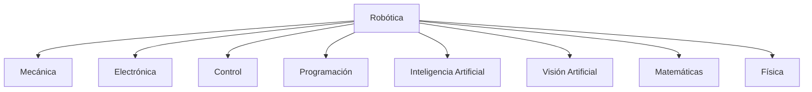
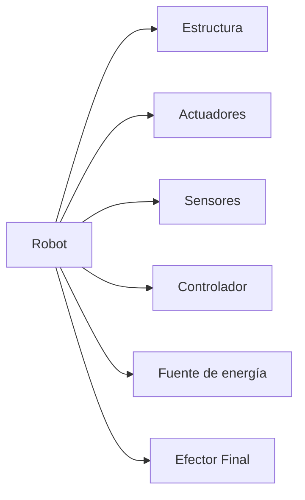

> "La robótica es la disciplina que combina ingeniería, matemáticas, informática y electrónica para diseñar máquinas capaces de interactuar con el mundo físico de forma autónoma o semiautónoma."

---

## Objetivos del capítulo

Al finalizar este capítulo el estudiante será capaz de:

- Comprender qué es la robótica y qué la distingue de otras tecnologías.
- Conocer las disciplinas que la conforman y los componentes de un robot.
- Diferenciar un robot de una máquina automática convencional.
- Identificar las principales aplicaciones de los robots modernos.

---

## ¿Qué es la robótica?

La robótica es una disciplina multidisciplinaria que integra ingeniería y ciencias computacionales para diseñar, construir, controlar y programar máquinas capaces de ejecutar tareas de manera automática. Pero un robot no es simplemente una máquina que se mueve: para considerarse como tal, debe poseer cierto grado de percepción, capacidad de decisión y la posibilidad de ser reprogramado para realizar distintas tareas.

Hoy la robótica es uno de los pilares de la automatización industrial, la manufactura inteligente, la medicina moderna, la exploración espacial y la inteligencia artificial aplicada.

La **Federación Internacional de Robótica (IFR)** define un robot industrial como *"una máquina manipuladora automática, reprogramable, multifuncional, con tres o más ejes, capaz de posicionar materiales, piezas, herramientas o dispositivos especiales mediante movimientos programados"*. Esta definición resalta las tres características que distinguen a un robot de una máquina automática cualquiera: es **reprogramable**, **multifuncional** y ejecuta **movimientos controlados**.

### ¿Qué no es un robot?

Es común pensar que cualquier máquina automática es un robot, pero no es así. Una banda transportadora, una prensa hidráulica, un semáforo o una bomba de agua automática funcionan de forma automática, pero no pueden adaptarse a su entorno ni ejecutar múltiples tareas mediante programación. Esa flexibilidad es justamente lo que separa la robótica de la simple automatización.

| Automatización | Robótica |
|----------------|----------|
| Diseñada para una sola tarea | Diseñada para múltiples tareas |
| Difícil de modificar | Fácilmente reprogramable |
| Movimiento limitado | Gran libertad de movimiento |
| Baja flexibilidad | Alta flexibilidad |
| Generalmente sin sensores complejos | Integra múltiples sensores |

---

## Disciplinas que conforman la robótica

La robótica no pertenece a una sola rama de la ingeniería: surge de la integración de varias áreas del conocimiento, cada una aportando una pieza esencial para que un robot funcione.

La **ingeniería mecánica** diseña el cuerpo físico del robot: eslabones, articulaciones, chasis, reductores y transmisiones. La **ingeniería electrónica** se ocupa de los sistemas eléctricos, como drivers, sensores, tarjetas y fuentes de alimentación. La **ingeniería de control** logra que los movimientos sean precisos, mediante técnicas como el control PID o el control predictivo. Las **ciencias de la computación** desarrollan el software que dirige al robot —sistemas operativos como ROS, algoritmos y planificación de trayectorias—, y la **inteligencia artificial** le permite aprender, reconocer objetos, tomar decisiones y navegar. A todo esto lo sostienen las **matemáticas** y la **física**, que dan el lenguaje para describir el movimiento y las fuerzas.

---

## Componentes generales de un robot

Aunque existen robots muy distintos entre sí, casi todos comparten los mismos bloques funcionales.

La **estructura mecánica** es el esqueleto del robot: base, brazos, articulaciones y eslabones. Los **actuadores** son los que producen el movimiento, normalmente motores (DC, servomotores, paso a paso o brushless) o actuadores hidráulicos y neumáticos. Los **sensores** le permiten percibir su entorno y su propio estado, desde cámaras y LIDAR hasta encoders e IMU. El **controlador** es el cerebro que procesa la información y decide qué hacer; puede ser desde un PLC o microcontrolador hasta una computadora industrial o una NVIDIA Jetson. Finalmente, el **efector final** es la herramienta con la que el robot actúa sobre el mundo: una pinza, una ventosa, un soldador o una pistola de pintura, según la tarea.

---

## Aplicaciones de la robótica

Hoy hay robots trabajando en prácticamente todos los sectores. En la **industria** realizan soldadura, pintura, ensamblaje, empaque e inspección. En la **medicina** asisten cirugías, apoyan la rehabilitación y operan en prótesis inteligentes. En la **agricultura** recolectan frutas, detectan enfermedades de los cultivos y aplican fertilizantes de forma selectiva. Y en la **exploración espacial** encontramos los rovers de Marte, los brazos robóticos de las estaciones espaciales y los satélites de mantenimiento.

Esta variedad de aplicaciones, junto con su capacidad de adaptarse y reprogramarse, es lo que convierte a la robótica en una de las tecnologías centrales de la Industria 4.0.
