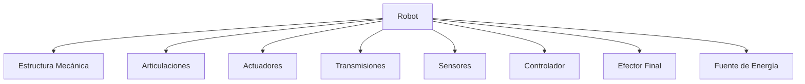
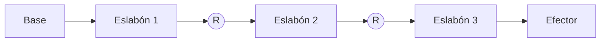

---

## Objetivos del capítulo

Al finalizar este capítulo el estudiante será capaz de:

- Identificar los componentes mecánicos y electrónicos de un robot.
- Distinguir los tipos de articulaciones y su variable asociada.
- Comprender qué es una cadena cinemática y un grado de libertad.
- Relacionar la morfología del robot con su modelado matemático.

---

## ¿Qué es la morfología de un robot?

La morfología describe cómo está construido un robot y cómo se relacionan todos sus componentes. Igual que el cuerpo humano combina huesos, articulaciones y músculos, un robot integra una serie de elementos que trabajan juntos para producir movimientos controlados: estructura mecánica, eslabones, articulaciones, actuadores, transmisiones, sensores, controlador y efector final. Comprender esta organización es indispensable antes de analizar la cinemática y la dinámica.

---

## Eslabones y articulaciones

La estructura mecánica es el esqueleto del robot. Está formada por piezas rígidas llamadas **eslabones**, unidas por **articulaciones** que permiten el movimiento relativo entre ellas. Un buen diseño busca rigidez, precisión, resistencia y bajo peso, y para ello se emplean materiales como acero, aluminio, titanio, fibra de carbono y polímeros de ingeniería.

Un **eslabón** es un elemento rígido que conecta dos articulaciones consecutivas —el equivalente a los huesos del brazo—. Cada uno tiene propiedades propias: longitud, masa, centro de gravedad e inercia. En el método de Denavit-Hartenberg, a cada eslabón se le asociará un sistema de referencia.

Una **articulación**, por su parte, es el punto donde dos eslabones tienen movimiento relativo, y su tipo determina qué movimiento podrá realizar el robot.

---

## Tipos de articulaciones

Las dos articulaciones fundamentales en robótica son la rotacional y la prismática. La **articulación rotacional** (o revoluta, símbolo **R**) permite un giro y es la más usada en robots industriales —el hombro, el codo o la muñeca son ejemplos—; su variable asociada es un ángulo $\theta$. La **articulación prismática** (símbolo **P**) permite un desplazamiento lineal, como en los cilindros neumáticos o los robots cartesianos, y su variable es una distancia $d$.

Existen otras articulaciones menos frecuentes en manipuladores industriales —helicoidales, esféricas, universales o cilíndricas—, reservadas para robots especializados o mecanismos más complejos.

---

## Cadena cinemática

Una cadena cinemática es el conjunto de eslabones y articulaciones que transmiten el movimiento desde la base hasta el efector final.

Hay dos tipos. En una **cadena abierta** existe un único camino entre la base y el efector; es el caso de los brazos industriales y los robots SCARA. En una **cadena cerrada** hay múltiples caminos cinemáticos —como en el robot Delta o las plataformas Stewart—, lo que aporta mayor rigidez y precisión a cambio de un análisis matemático más complejo.

Dos partes de la cadena tienen nombre propio. La **base** es el punto fijo del manipulador, desde el cual se establece el sistema de coordenadas principal, que en el método DH se denota $\{0\}$; todas las posiciones se calculan respecto a él. La **muñeca** comprende las últimas articulaciones y su función es orientar el efector: suele tener tres grados de libertad —giro (yaw), inclinación (pitch) y rotación (roll)—, lo que permite apuntar la herramienta en cualquier dirección.

---

## Efectores finales

El efector final es el componente que interactúa directamente con el entorno, y puede intercambiarse según la aplicación. Los más comunes son las **pinzas mecánicas** (para piezas rígidas), las **ventosas** (para vidrio, cartón o láminas), las **herramientas** montadas como taladros, fresadoras o soldadores, y a veces los propios **sensores**, como cámaras o escáneres usados para inspección.

---

## Actuadores, transmisiones y sensores

Los **actuadores** generan el movimiento, transformando energía eléctrica, hidráulica o neumática en movimiento mecánico. Los **motores eléctricos** (DC, brushless, servomotores y paso a paso) son los más usados por su precisión, fácil control y bajo mantenimiento. Los **actuadores hidráulicos** usan aceite a presión y entregan grandes fuerzas, a costa de más mantenimiento y posibles fugas. Los **neumáticos**, con aire comprimido, sirven para movimientos rápidos y sencillos.

Como los motores rara vez se conectan directo a las articulaciones, se usan **sistemas de transmisión**: engranajes, tornillos de bolas, correas dentadas, cadenas y reductores planetarios o armónicos.

Los **sensores** permiten al robot conocer su estado y su entorno. Los **internos** miden variables del propio robot (encoders, tacómetros, sensores de corriente y temperatura), mientras que los **externos** captan información del exterior (cámaras, LIDAR, ultrasonido, infrarrojos, IMU y sensores de fuerza). Todo lo coordina el **controlador**, que lee los sensores, calcula trayectorias, ejecuta los algoritmos de control, coordina los motores y detecta fallos. La energía puede provenir de corriente alterna o continua, baterías, sistemas hidráulicos o aire comprimido.

---

## Grados de libertad

Un **grado de libertad (GDL)** es un movimiento independiente que puede realizar un mecanismo. Tanto una articulación rotacional como una prismática aportan 1 GDL cada una. Un brazo industrial típico tiene 6 GDL, justo los necesarios para controlar por completo la **posición** y la **orientación** del efector en el espacio. Así, una cadena con tres articulaciones aporta 3 GDL, y cada articulación añadida suma uno más.

---

## Relación con Denavit-Hartenberg

Cada articulación del robot se representará con un sistema de coordenadas, y entre dos eslabones consecutivos se definirán cuatro parámetros: θ, d, a y α. Estos describen por completo la relación entre un eslabón y el siguiente. Por eso, comprender la morfología es el primer paso antes de construir una tabla de Denavit-Hartenberg.

---

## Resumen del capítulo

Estudiamos los componentes de un robot manipulador —eslabones, articulaciones, actuadores, transmisiones, sensores, controlador y efector final— y los conceptos de cadena cinemática y grados de libertad. Todo ello es la base para el análisis cinemático y para asignar los sistemas de referencia del método de Denavit-Hartenberg.

---

### Conceptos clave

- Morfología
- Eslabón
- Articulación
- Cadena cinemática
- Grado de libertad
- Actuador
- Transmisión
- Sensor
- Efector final

---

### Avance del siguiente capítulo

En el próximo capítulo estudiaremos en profundidad los **grados de libertad** y el **espacio de trabajo** del robot: cómo cada articulación contribuye al movimiento y cómo se determina el volumen que el efector puede alcanzar.
