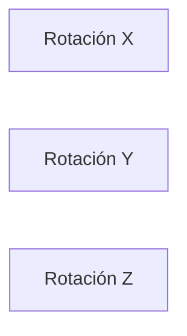

---

## Objetivos del capítulo

Al finalizar este capítulo el estudiante será capaz de:

- Distinguir posición de orientación.
- Construir y aplicar la matriz de rotación en 2D.
- Conocer las matrices de rotación alrededor de X, Y y Z en 3D.
- Comprender las propiedades de las matrices de rotación y por qué el orden importa.

---

## Posición no es lo mismo que orientación

Hasta ahora describíamos la **posición** de un objeto con coordenadas, pero eso no basta. Imagina un robot que sostiene un destornillador: puede estar en exactamente el mismo punto del espacio y, sin embargo, apuntar en direcciones completamente distintas. La posición responde a *¿dónde está el objeto?* y la **orientación** a *¿cómo está girado?* En robótica siempre necesitamos ambas. Este capítulo trata de cómo representar matemáticamente la orientación.

Una **rotación** consiste en girar un objeto alrededor de un eje: la distancia al origen no cambia, solo cambia la orientación.

---

## Rotación en dos dimensiones

Empecemos por el caso más simple: un punto que gira un ángulo $\theta$ alrededor del origen. Si parte de $(x, y)$ y llega a $(x', y')$, la trigonometría da:

$$
x'=x\cos\theta-y\sin\theta
\qquad
y'=x\sin\theta+y\cos\theta
$$

Escrito en forma matricial, esto define la **matriz de rotación 2D**:

$$
R(\theta)=
\begin{bmatrix}
\cos\theta&-\sin\theta\\
\sin\theta&\cos\theta
\end{bmatrix}
$$

Por ejemplo, para rotar $P=(1, 0)$ un ángulo de 90° (donde $\cos 90°=0$ y $\sin 90°=1$), la matriz queda $\begin{bmatrix}0&-1\\1&0\end{bmatrix}$, y al multiplicar obtenemos $P'=(0, 1)$: el vector que apuntaba a la derecha ahora apunta hacia arriba, justo como esperábamos.

---

## Propiedades de las matrices de rotación

Las matrices de rotación tienen propiedades muy especiales que las hacen ideales para la robótica. **Preservan distancias** (un objeto no cambia de tamaño al girar) y **preservan ángulos** (los ángulos entre vectores se mantienen). Son **ortogonales**, lo que significa que:

$$
R^TR=I \qquad\Rightarrow\qquad R^{-1}=R^T
$$

Esta última igualdad es enormemente útil: invertir una rotación es tan simple como transponerla. Además, toda matriz de rotación válida cumple $|R|=1$; si su determinante es distinto de 1, no representa una rotación pura.

---

## Rotaciones en tres dimensiones

En el espacio, el giro puede hacerse alrededor de tres ejes distintos. Cada matriz mantiene fijo su eje y modifica los otros dos.

La **rotación alrededor de X** deja fijo ese eje y gira Y y Z:

$$
R_x(\theta)=
\begin{bmatrix}
1&0&0\\
0&\cos\theta&-\sin\theta\\
0&\sin\theta&\cos\theta
\end{bmatrix}
$$

La **rotación alrededor de Y** deja fijo Y y gira X y Z:

$$
R_y(\theta)=
\begin{bmatrix}
\cos\theta&0&\sin\theta\\
0&1&0\\
-\sin\theta&0&\cos\theta
\end{bmatrix}
$$

Y la **rotación alrededor de Z**, la más usada en robótica, deja fijo Z y gira X e Y:

$$
R_z(\theta)=
\begin{bmatrix}
\cos\theta&-\sin\theta&0\\
\sin\theta&\cos\theta&0\\
0&0&1
\end{bmatrix}
$$

Todas siguen la regla de la mano derecha: si el pulgar apunta en la dirección positiva del eje, el cierre natural de los dedos indica el sentido positivo del giro.

---

## El orden de las rotaciones importa

Cuando un robot encadena varias rotaciones, el orden no es indiferente. Si primero gira con $R_x$ y luego con $R_z$, la orientación final es $R = R_z R_x$ (la última rotación se escribe a la izquierda). Y, en general, las rotaciones **no conmutan**:

$$
R_x R_y \neq R_y R_x
$$

Girar primero alrededor de X y luego de Y da un resultado distinto que hacerlo al revés. Esta propiedad es fundamental para entender las cadenas cinemáticas.

---

## Qué significan las columnas

Cada columna de una matriz de rotación representa la dirección de uno de los ejes del sistema rotado, expresada respecto al sistema original: la primera columna es el nuevo eje X', la segunda el Y' y la tercera el Z'. Esta interpretación será esencial en el método de Denavit-Hartenberg.

Por ejemplo, si una herramienta de soldadura debe inclinarse 45° alrededor del eje Y, su orientación queda completamente descrita por:

$$
R_y(45°)=
\begin{bmatrix}
0.707&0&0.707\\
0&1&0\\
-0.707&0&0.707
\end{bmatrix}
$$

Las matrices de rotación aparecen por todas partes en robótica: en la cinemática directa e inversa, los jacobianos, la planeación de trayectorias, el control y la visión artificial.

---

## Resumen del capítulo

Vimos cómo representar la orientación mediante matrices de rotación, desde el caso 2D hasta las tres rotaciones fundamentales en 3D. Estudiamos sus propiedades —preservan distancias y ángulos, son ortogonales, tienen determinante 1— y por qué el orden de las rotaciones importa. Cada columna describe un eje del sistema rotado, idea clave para los capítulos siguientes.

---

### Conceptos clave

- Orientación
- Rotación
- Matriz de rotación
- Ortogonalidad
- No conmutatividad
- Regla de la mano derecha

---

### Avance del siguiente capítulo

En el próximo capítulo uniremos posición y orientación en una sola estructura: la **transformación homogénea**, una matriz 4×4 que describe simultáneamente dónde está y cómo está orientado un objeto. Es el corazón del método de Denavit-Hartenberg.
