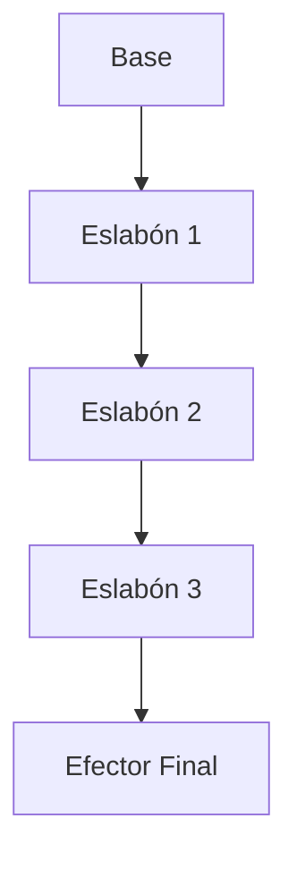

---

## Objetivos del capítulo

Al finalizar este capítulo el estudiante será capaz de:

- Encadenar transformaciones homogéneas para modelar un robot completo.
- Usar la notación de marcos y la regla de cancelación de índices.
- Calcular transformaciones relativas entre sistemas intermedios.
- Distinguir premultiplicación de postmultiplicación.

---

## Un robot es una cadena de transformaciones

Una sola transformación homogénea describe la posición y orientación de un sistema de referencia, pero un robot rara vez tiene un único movimiento: un manipulador está formado por varios eslabones unidos por articulaciones, y cada articulación introduce una transformación. Por eso la posición del efector no depende de una matriz, sino de la **composición** de muchas transformaciones consecutivas. Este principio es la base matemática de toda la cinemática.

Si conocemos ${}^{0}T_{1}$ (cómo se ubica el marco $\{1\}$ respecto al $\{0\}$) y ${}^{1}T_{2}$, la transformación del $\{0\}$ al $\{2\}$ es simplemente el producto:

$$
{}^{0}T_{2} = {}^{0}T_{1}\;{}^{1}T_{2}
$$

Probablemente sea la ecuación más usada de toda la robótica: al multiplicar las matrices vamos "recorriendo" la cadena cinemática eslabón por eslabón.

---

## Notación y regla de cancelación

Una transformación ${}^{A}T_{B}$ se interpreta como "el sistema B expresado respecto al sistema A": el superíndice indica el marco de referencia y el subíndice el marco que se describe. Una ayuda visual muy útil es la **regla de cancelación**: cuando se multiplican transformaciones, el índice repetido "desaparece".

$$
{}^{0}T_{1}\;{}^{1}T_{2}\;{}^{2}T_{3} = {}^{0}T_{3}
$$

Para transformar un punto conocido en el sistema $\{2\}$ y expresarlo respecto a la base, se aplica la transformación correspondiente: ${}^{0}P = {}^{0}T_{2}\;{}^{2}P$. La regla fundamental es que las matrices deben multiplicarse **en el orden físico de la cadena**, nunca reordenarse arbitrariamente.

---

## El orden importa: premultiplicar y postmultiplicar

La composición de transformaciones no es conmutativa: $T_1 T_2 \neq T_2 T_1$. La razón es intuitiva: no es lo mismo girar un objeto y luego trasladarlo que trasladarlo primero y después girarlo; la posición final será distinta.

Esto da lugar a dos formas de aplicar una nueva transformación. La **premultiplicación** ($T_{\text{nuevo}}\,T$) aplica la transformación respecto al sistema **global**. La **postmultiplicación** ($T\,T_{\text{nuevo}}$) la aplica respecto al sistema **local**. Esta distinción es muy útil al estudiar robots móviles y manipuladores.

---

## La cadena cinemática completa

La mayoría de los manipuladores industriales tienen una estructura en serie:



Cada enlace aporta una transformación, y la del efector respecto a la base es el producto de todas:

$$
{}^{0}T_{n} = {}^{0}T_{1}\,{}^{1}T_{2}\cdots{}^{n-1}T_{n}
$$

Esta expresión es la base de la cinemática directa. Algunos robots no tienen una cadena simple sino estructuras ramificadas (árboles cinemáticos), como los humanoides o los manipuladores cooperativos, donde cada rama tiene su propia cadena de transformaciones.

---

## Transformaciones relativas

A veces queremos la transformación entre dos sistemas intermedios, por ejemplo ${}^{2}T_{4}$, conociendo solo ${}^{0}T_{2}$ y ${}^{0}T_{4}$. Se obtiene invirtiendo y multiplicando:

$$
{}^{2}T_{4} = ({}^{0}T_{2})^{-1}\;{}^{0}T_{4}
$$

Esta operación es constante en calibración y visión artificial. De hecho, el sistema **TF (Transform Frames)** de ROS funciona exactamente con estas reglas: cada nodo publica transformaciones entre marcos, y el árbol completo permite conocer en todo momento la posición relativa de sensores, herramientas y actuadores.

Conviene evitar errores frecuentes: multiplicar en un orden distinto al de la cadena, confundir el marco en que están expresadas las coordenadas, interpretar una transformación activa como pasiva, o mezclar unidades (metros y milímetros) dentro de una misma cadena.

---

## Ejemplo en Python

Combinar una traslación y una rotación es tan simple como multiplicar sus matrices:

```python
import numpy as np

T1 = np.array([
    [1, 0, 0, 100],
    [0, 1, 0,   0],
    [0, 0, 1,   0],
    [0, 0, 0,   1]
])

T2 = np.array([
    [0, -1, 0, 0],
    [1,  0, 0, 0],
    [0,  0, 1, 0],
    [0,  0, 0, 1]
])

T = T1 @ T2
print(T)
```

Para un brazo de tres articulaciones con matrices $T_1, T_2, T_3$, la posición del efector respecto a la base es $T = T_1 T_2 T_3$; si se añade una herramienta, basta con sumar su transformación al final de la cadena.

---

## Resumen del capítulo

Estudiamos cómo encadenar transformaciones homogéneas para modelar robots complejos: la notación entre marcos, la regla de cancelación de índices, la composición de transformaciones, las transformaciones relativas y la diferencia entre premultiplicar y postmultiplicar. Es el fundamento directo de la cinemática.

---

### Conceptos clave

- Composición de transformaciones
- Cambio de referencia
- Cadena cinemática
- Premultiplicación
- Postmultiplicación
- Transformación relativa
- Árbol cinemático

---

### Ejercicios propuestos

1. Dadas dos transformaciones ${}^{0}T_{1}$ y ${}^{1}T_{2}$, calcule ${}^{0}T_{2}$ mediante multiplicación matricial.
2. Explique con un ejemplo por qué $T_1 T_2 \neq T_2 T_1$.
3. Dadas ${}^{0}T_{2}$ y ${}^{0}T_{4}$, obtenga la transformación relativa ${}^{2}T_{4}$.
4. Implemente en Python una función que reciba una lista de matrices homogéneas y devuelva la transformación total del efector respecto a la base.

---

### Avance del siguiente capítulo

En el próximo capítulo comenzaremos el estudio formal de la **cinemática directa**: cómo determinar la posición y orientación del efector a partir de los valores de las articulaciones, usando todas las herramientas desarrolladas hasta aquí y preparando el terreno para el método de Denavit-Hartenberg.

## PARTE III
## Cinemática de Manipuladores Robóticos

---
